# Analisis de redes sociales en YouTube

**Estructura de participacion, comunidades de audiencia y sentimiento**

CC3084 - Data Science · Laboratorio 6  
Universidad del Valle de Guatemala  
Facultad de Ingenieria · Departamento de Ciencias de la Computacion  
Semestre II, 2026  

*Documento generado por el pipeline el 06 de September de 2026. Todas las cifras provienen de `results/metrics/` y `results/tables/`; ninguna esta escrita a mano.*

---


## Resumen ejecutivo

Se analizaron 293 videos de 97 canales de YouTube y 406 comentarios principales publicados por 332 autores distintos. Los 406 comentarios se asociaron a un video mediante `video_id` sin excepciones (100.0%), pero cubren solo 19 de los 293 videos del catalogo (6.5%). Esa asimetria de cobertura condiciona todo el analisis y se trata explicitamente en cada seccion: los conteos de comentarios son *observados en la muestra*, no totales de YouTube.

**Participacion muy concentrada por contenido y muy repartida por persona.** Los tres videos mas comentados acumulan 63.0% de los comentarios y el canal lider 63.0% (Gini de 0.6596 por video y 0.6644 por canal). En el extremo opuesto, el Gini por autor es de solo 0.1643: 286 de 332 autores (86.1%) publicaron un unico comentario.

**La red de co-participacion esta fragmentada.** La red bipartita autor-video tiene 351 nodos y 343 aristas, con la suma de pesos igual a los 406 comentarios. Solo 9 autores (2.7%) comentaron en mas de un video, y son el unico mecanismo que conecta contenidos entre si: la proyeccion video-video tiene 11 aristas de 171 posibles (densidad 0.064327) y deja 9 de 19 videos aislados. La cohesion global por nodos es 0 en las tres redes porque estan desconectadas; en la componente mayor de cada una es 1, es decir, un solo nodo bien elegido las parte.

**Comunidades pocas pero interpretables.** Louvain ponderado sobre la proyeccion video-video (semilla 42, resolucion 1.0) devuelve 12 comunidades con modularidad ponderada Q = 0.4053, de las cuales 9 son singletons y 3 tienen mas de un video. Las tres no triviales se separan por tema y por emisor: critica al Congreso y a la corrupcion, comunicacion del Ejecutivo, y regulacion de monopolios y movilidad urbana.

**Puentes escasos y verificados.** De los 332 autores, 7 son puentes en sentido estricto: al eliminarlos de la red bipartita aumenta el numero de componentes de la proyeccion video-video. Solo 9 autores (2.7%) tienen intermediacion positiva.

**Sentimiento predominantemente critico.** Con `pysentimiento/robertuito-sentiment-analysis`, 61.6% de los comentarios se clasifica como negativo, 19.0% como neutro y 19.5% como positivo (polaridad neta -42.1 puntos porcentuales, confianza mediana 0.8685). La composicion difiere entre canales de forma significativa (chi-cuadrado = 82.0701, gl = 8, p = 0.0, V de Cramer = 0.3244): el video institucional mas comentado de la Municipalidad concentra respaldo, mientras que el periodismo de investigacion concentra critica.

**Visibilidad y participacion se ordenan igual, pero no coinciden.** Entre los 19 videos con comentarios recolectados, visualizaciones y comentarios observados correlacionan con rho de Spearman = 0.8115 (p = 2e-05). Aun asi el video mas visto (304 089 vistas) recibio 25 comentarios observados, frente a los 161 del mas comentado, que tiene 11 775 vistas.

> Ninguna cifra de este informe puede extrapolarse a YouTube ni a la poblacion de Guatemala. Los comentarios provienen de una seleccion de videos recuperados por consultas de busqueda especificas, en un momento determinado, y el conjunto no incluye respuestas ni permite saber quien respondio a quien.

---


## 1. Introduccion y objetivo

El laboratorio estudia la estructura de participacion de los usuarios de YouTube a partir de dos conjuntos de datos: un catalogo de videos con sus metadatos de canal, categoria y visibilidad, y un conjunto de comentarios principales publicados en una seleccion de esos videos. El objetivo es describir quien participa, en que contenidos, con que estructura de red, sobre que temas y con que polaridad, distinguiendo en todo momento lo que los datos permiten afirmar de lo que solo permiten conjeturar.

El analisis se organiza en torno a una decision conceptual que atraviesa el informe: **los datos no contienen relaciones explicitas entre autores**. La variable `reply_count` indica cuantas respuestas recibio un comentario, pero no identifica a quien las escribio. Por lo tanto no existe una red de interaccion directa entre usuarios, y construirla seria una invencion. Lo que si puede construirse, y es lo que se construye, es una red de **co-participacion**: dos personas quedan vinculadas si comentaron el mismo video, lo que significa que coincidieron en un espacio de discusion, no que se hayan hablado.


### 1.1 Preguntas que guian el analisis

- Que contenidos y que emisores concentran la participacion observada.
- Si existe audiencia compartida entre videos y canales, y de que magnitud.
- Quienes sostienen las conexiones entre contenidos que de otro modo quedarian separados, y como verificarlo en lugar de suponerlo.
- Que agrupamientos de contenido emergen de la audiencia compartida, y como se caracterizan por tema y por polaridad.
- Si la visibilidad (visualizaciones) predice la participacion observada.
- Que conclusiones quedan limitadas por el procedimiento de recoleccion.


### 1.2 Datos de partida y verificacion de integridad

Los dos archivos se copiaron a `data/raw/` y se tratan como inmutables durante todo el analisis. Sus sumas MD5 quedan registradas en `results/metrics/load.json` para poder comprobar que no se alteraron: `d338be279d181215…` para el catalogo de videos y `c45c1dcc72e33971…` para los comentarios.

**Tabla 1. Dimensiones observadas frente a las declaradas en el enunciado**

| Archivo | Filas obs. | Cols. obs. | Filas esp. | Cols. esp. | Coincide |
|---|---|---|---|---|---|
| youtube_videos.csv | 293 | 20 | 293 | 20 | si |
| youtube_comments.csv | 406 | 17 | 406 | 17 | si |

Las dimensiones coinciden exactamente con las declaradas. Dos detalles tecnicos de la carga que afectan el resultado: ambos archivos traen marca de orden de bytes (BOM), por lo que se leen con `utf-8-sig (los dos archivos traen BOM)` — sin eso, el nombre de la primera columna quedaria como `\ufeffvideo_id` y el join fallaria por completo; y todas las columnas se cargan como texto (str en todas las columnas; conversion posterior explicita), porque si pandas infiere tipos convierte identificadores con apariencia numerica y puede recortar ceros a la izquierda.


## 2. Datos y unidades de observacion


### 2.1 Unidad de observacion y llave primaria

**Tabla 2. Unidad de observacion y llaves de cada conjunto**

| Conjunto | Unidad de observacion | Llave primaria | Verificacion |
|---|---|---|---|
| youtube_videos.csv | Un video de YouTube | video_id | 293 valores unicos, 0 duplicados, 0 nulos |
| youtube_comments.csv | Un comentario principal | comment_id | 406 valores unicos, 0 duplicados, 0 nulos |

En el conjunto de comentarios, `video_id` es llave **foranea**, no primaria: se repite porque un video recibe muchos comentarios (387 repeticiones sobre 406 filas). Del mismo modo, `channel_id` se repite en el catalogo de videos porque un canal publica varios videos. Confundir cualquiera de las dos con una llave primaria produciria agregados erroneos.


### 2.2 Relacion conceptual entre canal, video, comentario, autor, categoria y consulta

La jerarquia de los datos tiene cuatro niveles y dos etiquetas transversales. Es importante fijarla antes de agregar cualquier cosa, porque cada nivel tiene su propio denominador:

- **Canal** (`channel_id`): la cuenta que publica contenido. Es el emisor. Hay 97 canales en el catalogo, de los cuales 8 tienen comentarios recolectados (8.2%).
- **Video** (`video_id`): una pieza de contenido publicada por un canal. Relacion uno a muchos: un canal tiene varios videos, un video tiene un solo canal. Hay 293 videos.
- **Comentario** (`comment_id`): un mensaje publicado en un video. Relacion uno a muchos con el video. Es la unidad de texto y de sentimiento. Hay 406 comentarios.
- **Autor del comentario** (`author_channel_id`): la cuenta que escribio el comentario. Relacion muchos a muchos con los videos: un autor puede comentar varios videos y un video recibe comentarios de varios autores. Es esta relacion muchos a muchos la que hace posible una red bipartita. Hay 332 autores.
- **Categoria** (`category`): etiqueta tematica que YouTube asigna al video. Es un atributo del video, no del comentario. Hay 11 categorias distintas.
- **Consulta de busqueda** (`source_query`, `source_group`): describe **como se encontro** el registro durante la recoleccion. No es un atributo del contenido sino del muestreo, y por eso se usa para evaluar cobertura y sesgo, nunca como etiqueta tematica definitiva.

> **`channel_id` y `author_channel_id` no son la misma cosa y no son intercambiables.** `channel_id` identifica al canal *dueno del video comentado*; `author_channel_id` identifica a la *persona que escribio el comentario*. Ambos tienen el mismo formato (`UC…`), lo que los hace facilmente confundibles. Se verifico que ningun comentario observado fue escrito por el canal dueno del video (0 coincidencias entre las dos columnas en las 406 filas), de modo que en esta muestra los dos conjuntos de cuentas son disjuntos.


### 2.3 Variables relevantes por conjunto

**Tabla 3. Variables usadas en el analisis y su funcion**

| Variable | Conjunto | Funcion en el analisis |
|---|---|---|
| video_id | ambos | Llave del join; nodo de tipo video en la red bipartita |
| comment_id | comentarios | Llave primaria; unidad de sentimiento |
| channel_id | ambos | Nodo de canal; agregacion por emisor |
| author_channel_id | comentarios | Nodo de tipo autor en la red bipartita |
| text | comentarios | Fuente de texto_original y texto_limpio |
| view_count | videos | Medida de visibilidad para el contraste con participacion |
| like_count_text | comentarios | Aprobacion recibida por el comentario (requiere parseo) |
| reply_count | comentarios | Intensidad de conversacion del comentario; NO una arista |
| category | videos | Caracterizacion tematica de las comunidades |
| source_query / source_group | ambos | Diagnostico de cobertura y sesgo de muestreo |
| keywords / title / description | videos | Caracterizacion tematica desde el emisor |
| publish_date | videos | Unica fecha absoluta disponible (ISO 8601) |


## 3. Integracion de los datos

La integracion se hizo con un **LEFT JOIN comentarios -> videos por video_id**, de cardinalidad *1 video : N comentarios (uno a muchos)*. La direccion del join no es arbitraria: la pregunta del inciso 1.4 es cuantos comentarios logran asociarse a un video, asi que ninguna fila de comentarios puede desaparecer en el proceso. Un inner join habria respondido la pregunta ocultando su propia respuesta.

**Tabla 4. Resultado de la integracion por video_id**

| Metrica | Valor |
|---|---|
| Comentarios en el conjunto | 406 |
| Comentarios que encontraron su video | 406 |
| Comentarios sin video correspondiente | 0 |
| Porcentaje asociado | 100.0% |
| video_id distintos en comentarios | 19 |
| Videos del catalogo con al menos un comentario observado | 19 de 293 (6.5%) |
| Videos del catalogo sin comentario observado | 274 |

**Los 406 comentarios se asociaron a un video sin excepciones.** No hay comentarios huerfanos: el conjunto de `video_id` presentes en los comentarios es un subconjunto propio del catalogo de videos. Esto confirma que los dos archivos provienen de la misma recoleccion y que la llave esta bien formada.

> El hallazgo importante del join no es el 100.0% de exito, sino su contraparte: **274 de los 293 videos del catalogo no tienen ningun comentario en este conjunto de datos.** Eso *no* significa que no recibieran comentarios en YouTube. Significa que no se recolectaron. La diferencia entre «sin comentario observado» y «sin comentarios» es la distincion metodologica mas importante de todo el laboratorio, y se mantiene explicita en cada tabla y cada figura.


### 3.1 Consistencia de las variables redundantes tras el join

El conjunto de comentarios repite cuatro variables que tambien estan en el catalogo de videos (`video_title`, `channel_name`, `channel_id`, y las de muestreo). Se verificaron una por una en lugar de sobrescribirlas en silencio. De 17 chequeos automaticos, 15 se cumplen.

**Tabla 5. Chequeos de consistencia entre identificadores, nombres y handles**

| Ambito | Chequeo | Resultado | Cumple |
|---|---|---|---|
| videos | channel_id <-> channel_name es 1:1 | 1 y 1 | si |
| videos | channel_id <-> channel_handle es 1:1 | 1 y 1 | si |
| videos | owner_handle == channel_handle | 0 diferencias | si |
| videos | publish_date == upload_date | 0 diferencias | si |
| videos | video_url contiene video_id | 0 | si |
| comentarios | author_channel_id <-> author_name es 1:1 | 1 y 1 | si |
| comentarios | author_channel_id <-> author_handle es 1:1 | 1 y 1 | si |
| comentarios | channel_id <-> channel_name es 1:1 | 1 y 1 | si |
| comentarios | channel_id != author_channel_id | 0 | si |
| join | video_title == title | 0 diferencias | si |
| join | channel_id (comments) == channel_id (videos) | 0 diferencias | si |
| join | channel_name (comments) == channel_name (videos) | 0 diferencias | si |
| join | source_query (comments) == source_query (videos) | 188 de 406 difieren | si |
| join | source_group (comments) == source_group (videos) | 188 de 406 difieren | si |
| comentarios | author_handle sin percent-encoding | 14 registros codificados | NO |
| comentarios | author_handle_norm == author_name normalizado | 0 diferencias | si |
| videos | channel_handle sin percent-encoding | 13 registros codificados | NO |

Las variables `video_title`, `channel_id` y `channel_name` del conjunto de comentarios coinciden al 100 % con las del catalogo tras el join, de modo que son estrictamente redundantes. Se conservan con sufijo `_c` y los analisis usan la version del catalogo de videos, que es la fuente autoritativa para atributos de video.


#### Dos hallazgos de los chequeos que no se cumplen

Los dos chequeos que no se cumplen no son fallos del pipeline sino **anomalias reales de los datos**, detectadas por el diagnostico y corregidas:

- **`author_handle` viene codificado para URL en 14 registros** (9 autores distintos): el archivo guarda `/@ErmeP%C3%A9rez-q4s` mientras que `author_name` guarda `@ErmePérez-q4s`. Sin decodificar el percent-encoding, el mismo autor parece tener dos etiquetas visibles distintas y cualquier comparacion entre ambas columnas falla. Se corrige en la columna derivada `author_handle_norm`; el campo original se conserva intacto. Tras decodificar, las dos etiquetas coinciden en los 406 registros.
- **`channel_handle` presenta la misma anomalia en 13 registros** del catalogo de videos. Se corrige igual, en `channel_handle_norm`.

Un tercer chequeo merece comentario porque su resultado *no* es un error. `source_query` y `source_group` difieren entre los dos archivos en 188 de 406 filas. La razon es de diseno: la version del comentario describe mediante que consulta se obtuvo *el comentario*, y la del video mediante que consulta se encontro *el video*. Un video puede haberse localizado con la consulta tematica `guatemala noticias` y sus comentarios haberse extraido despues en un barrido del canal `@quorumgt/videos`. Ambas versiones se conservan con sufijos explicitos porque documentan dos etapas distintas del muestreo.

---


## 4. Calidad, limpieza y preprocesamiento


### 4.1 Diagnostico inicial de calidad

El diagnostico se ejecuta sobre los datos **crudos**, antes de cualquier transformacion, y produce un perfil por variable con tipo inferido, faltantes, celdas en blanco, cardinalidad y constancia. Las tablas completas estan en `results/tables/data_quality_videos.csv` y `results/tables/data_quality_comments.csv`; aqui se resume lo relevante.


#### Dimensiones, duplicados y llaves

**Tabla 6. Duplicados y unicidad de las llaves candidatas**

| Conjunto | Filas | Cols. | Filas duplicadas | Llave | Unicos | Duplicados | Es unica |
|---|---|---|---|---|---|---|---|
| youtube_videos | 293 | 20 | 0 | video_id | 293 | 0 | si |
|  |  |  |  | channel_id | 97 | 196 | no |
| youtube_comments | 406 | 17 | 0 | video_id | 19 | 387 | no |
|  |  |  |  | comment_id | 406 | 0 | si |
|  |  |  |  | channel_id | 8 | 398 | no |
|  |  |  |  | author_channel_id | 332 | 74 | no |

No hay filas duplicadas completas en ninguno de los dos archivos, y las dos llaves primarias declaradas (`video_id` y `comment_id`) son efectivamente unicas y sin nulos. `channel_id`, `video_id` (en comentarios) y `author_channel_id` se repiten como corresponde a su papel de llave foranea o de agrupacion.


#### Valores faltantes

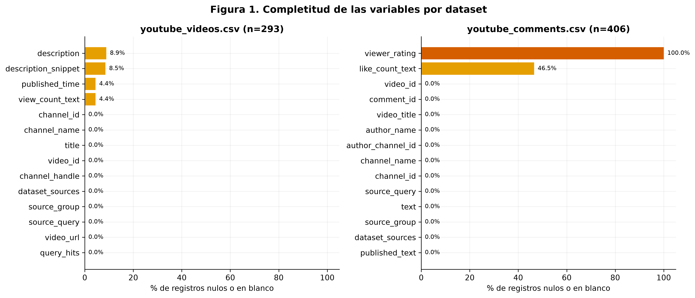

*Solo 4 variables de videos tienen faltantes (<9%). En comentarios, viewer_rating esta vacia al 100% y like_count_text aparece en blanco en 189 registros (46.6%), que se interpretan como 0 me gusta.*

**Tabla 7. Variables con valores faltantes**

| Conjunto | Variable | Nulos | % nulos | Tratamiento |
|---|---|---|---|---|
| videos | published_time | 13 | 4.4% | No se usa como fecha; se prefiere publish_date (0 nulos) |
| videos | view_count_text | 13 | 4.4% | Respaldo de view_count, que no tiene nulos |
| videos | description_snippet | 25 | 8.5% | Fragmento de description; los conteos usan los no nulos |
| videos | description | 26 | 8.9% | Analisis de texto de video sobre los no nulos, reportando el n |
| comentarios | viewer_rating | 406 | 100.0% | Excluida del analisis: vacia al 100 % |

El catalogo de videos tiene faltantes en cuatro variables, todas por debajo del 9 %. Es importante que `view_count` **no** este entre ellas: tiene 0 nulos, mientras que `view_count_text` tiene 13. Eso confirma la recomendacion del enunciado de usar `view_count` para los calculos cuantitativos y reservar `view_count_text` como respaldo. En el conjunto de comentarios el unico faltante es `viewer_rating`, vacia en las 406 filas.


#### Variables constantes y sin varianza

Dos variables del conjunto de comentarios no aportan informacion: **`is_pinned`** toma un unico valor (`False`) en los 406 registros, y **`viewer_rating`** esta completamente vacia. Una variable de varianza cero no puede explicar ni segmentar nada, asi que ninguna de las dos entra en el analisis. En el catalogo de videos no hay variables constantes en sentido estricto, pero si dos **redundantes**: `upload_date` es identica a `publish_date` y `owner_handle` es identico a `channel_handle` en el 100 % de los registros.


#### Valores atipicos

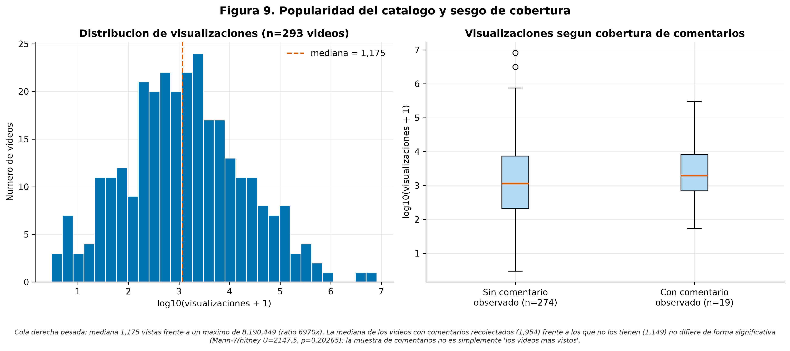

*Cola derecha pesada: mediana 1,175 vistas frente a un maximo de 8,190,449 (ratio 6970x). La mediana de los videos con comentarios recolectados (1,954) frente a los que no los tienen (1,149) no difiere de forma significativa (Mann-Whitney U=2147.5, p=0.20265): la muestra de comentarios no es simplemente 'los videos mas vistos'.*

**Tabla 8. Diagnostico de atipicos en las variables cuantitativas**

| Variable | n | Mediana | Media | p90 | Max | Asimetria | Atipicos IQR | Max/mediana |
|---|---|---|---|---|---|---|---|---|
| view_count_num | 293 | 1 175.0 | 60 430.1 | 51 318.8 | 8 190 449 | 14.26 | 49 (16.7 %) | 6 970.6 |
| like_count | 406 | 1.0 | 5.7 | 7.0 | 405 | 9.88 | 48 (11.8 %) | 405.0 |
| reply_count_num | 406 | 0.0 | 0.1 | 0.0 | 7 | 7.21 | 30 (7.4 %) | n/d |
| len_original | 406 | 96.5 | 139.2 | 285.5 | 1 525 | 3.98 | 21 (5.2 %) | 15.8 |
| tokens_original | 406 | 16.0 | 24.1 | 49.0 | 282 | 4.19 | 22 (5.4 %) | 17.6 |
| n_emojis | 406 | 0.0 | 0.5 | 1.0 | 18 | 5.62 | 61 (15.0 %) | n/d |

**No se elimino ningun valor atipico.** La decision es deliberada y se sostiene en la forma de las distribuciones. Los conteos de popularidad en redes sociales siguen leyes de potencia: la asimetria de `view_count` es de 14.3 y su maximo es 6 970.6 veces la mediana. Bajo el criterio de rango intercuartil, 49 videos (16.7 %) serian atipicos; pero un video con 8,2 millones de visualizaciones no es un error de captura, es un video que se hizo viral. Recortar la cola derecha eliminaria precisamente el fenomeno que se quiere estudiar y sesgaria a la baja toda medida de concentracion.

Se aplico el mismo criterio a `like_count` (maximo de 405.0 en un comentario, frente a una mediana de 1.0) y a la longitud del texto (maximo de 1 525.0 caracteres). Los valores se reportan y se discuten como plausibles; los analisis que podrian verse afectados por la cola usan estadisticos robustos (mediana, percentiles, Spearman) en lugar de la media y Pearson.

---


### 4.2 Variables problematicas o de uso delicado

**Tabla 9. Clasificacion de las variables que requieren precauciones**

| Conjunto | Variable | Clasificacion | Evidencia | Tratamiento |
|---|---|---|---|---|
| comments | viewer_rating | Inutilizable | Vacia en los 406 registros (406 nulos). | Se excluye de todo analisis. Se conserva en el archivo crudo. |
| comments | is_pinned | Inutilizable (constante) | Valor unico ['False'] en los 406 registros. | Varianza cero: no puede explicar ni segmentar nada. Se convierte a booleano y se documenta. |
| comments | reply_count | Uso delicado | Cuenta respuestas recibidas pero no identifica a quien respondio. | Prohibido usarla como arista. Se usa solo como atributo de intensidad del comentario. |
| comments | published_text | Uso delicado | Tiempo relativo al momento de recoleccion ('hace 2 anos'), redondeado p… | No se convierte a fecha absoluta. Se deriva published_days_approx solo para ordenar. |
| comments | like_count_text | Requiere conversion | Texto; 189 registros en blanco (un espacio). | Parser explicito; blanco -> 0 con bandera like_count_blank, porque YouTube oculta el contador c… |
| comments | video_title / channel_name / … | Redundante | Derivables del join por video_id; verificadas consistentes al 100%. | Se conservan con sufijo _c y se prefiere la version de videos. |
| comments | author_name / author_handle | Uso delicado | Etiquetas visibles mutables; no son identificadores. Ademas 14 author_h… | Solo para etiquetas de figuras. El nodo es author_channel_id. Se decodifica el percent-encoding… |
| videos | published_time | Uso delicado | Tiempo relativo; 13 nulos. | No se usa como fecha. Se prefiere publish_date (ISO 8601, sin nulos). |
| videos | view_count_text | Requiere conversion | Texto con separador de miles y sufijo 'vistas'; 13 nulos. | Se parsea a view_count_text_num y se usa solo como respaldo de view_count. |
| videos | upload_date | Redundante | Identica a publish_date en el 100% de los registros. | Se conserva; los analisis temporales usan publish_date. |
| videos | owner_handle | Redundante | Identica a channel_handle en el 100% de los registros. | Se conserva; las etiquetas usan channel_handle. |
| videos | query_hits / keywords / datas… | Requiere parseo | Listas serializadas como texto (JSON o separadas por '\|'). | Se convierten a listas reales antes de contar. |
| videos | source_query / source_group | Uso delicado | Describen el muestreo, no el tema del video. | Se usan para caracterizar cobertura, nunca como etiqueta tematica definitiva. |
| videos | description / description_sni… | Faltantes | 26 y 25 nulos respectivamente. | Los conteos de texto de video se calculan sobre los no nulos y se reporta el n. |
| videos | channel_name | Uso delicado | Nombre visible mutable y potencialmente repetible. | El nodo de canal es channel_id; channel_name solo etiqueta. |

Tres casos de esa tabla merecen el enfasis que la rubrica pide. El primero es **`reply_count`**: es una variable perfectamente utilizable como atributo de intensidad de un comentario, y a la vez es la variable cuyo mal uso invalidaria todo el analisis de red. Indica cuantas respuestas recibio un comentario, no quien las escribio; usarla como arista construiria vinculos entre personas que los datos no respaldan. En este trabajo aparece unicamente como atributo agregado de nodos y aristas, y el pipeline verifica en cada corrida que la suma de pesos de la red bipartita coincida con el numero de comentarios y no con el de respuestas.

El segundo es **`published_text`** (y su equivalente `published_time` en videos): es un tiempo relativo al momento de recoleccion («hace 2 años»), redondeado por YouTube. No se convierte a fecha absoluta porque no se conoce la fecha de recoleccion con precision y porque el redondeo destruye la resolucion. Se deriva unicamente `published_days_approx` para poder ordenar por antiguedad, y se declara explicitamente como aproximacion.

El tercero es **`source_query`**: describe el procedimiento de muestreo, no el tema del video. Un video recuperado por la consulta `guatemala lluvias` puede tratar de trafico, y de hecho la seccion 7 muestra que la concordancia entre consulta y comunidad detectada es baja una vez corregida por azar. Se usa para diagnosticar cobertura y sesgo, nunca como etiqueta tematica.


### 4.3 Normalizacion de identificadores y nombres

La regla que gobierna esta seccion es que **un identificador nunca se sustituye por un nombre visible**. `channel_id`, `video_id`, `comment_id` y `author_channel_id` son los identificadores del analisis; los nombres y handles se usan solo como etiquetas de figuras y tablas.

**Tabla 10. Reglas de normalizacion aplicadas**

| Tipo de campo | Transformacion | Justificacion |
|---|---|---|
| Identificadores (`*_id`) | NFKC + recorte de espacios. **Sin** cambio de mayusculas/minusculas. | Los IDs de YouTube distinguen mayusculas (`UCq0Cm-3SKthEySQc2JZBi1A`). Bajarlos a minusculas colapsaria identificadores distintos. |
| Nombres visibles | NFKC + colapso de espacios, en columna derivada `*_norm`. Original intacto. | NFKC unifica variantes Unicode de compatibilidad sin destruir el contenido legible. No se quitan acentos ni se baja el case. |
| Handles | Decodificacion de percent-encoding + quita `/` inicial y sufijo de ruta + garantiza `@`, en `*_norm`. | El mismo canal aparece como `/@quorumgt`, `@quorumgt` y `@quorumgt/videos`; y los no-ASCII vienen codificados para URL. |
| Llaves de comparacion | `normalize_key`: minusculas, sin acentos, espacios colapsados. Solo para auditar. | Permite comparar `más`/`mas` al verificar consistencia, sin que ese valor reemplace nunca al original ni a un ID. |


### 4.4 Conversion de los conteos almacenados como texto

Dos variables llegan como texto y deben convertirse: `view_count_text` en videos (`"29,736 vistas"`) y `like_count_text` en comentarios. El parser esta en `src/text_processing.py::parse_count` y su tratamiento es el siguiente:

**Tabla 11. Reglas del parser de conteos y su resultado**

| Caso de entrada | Regla aplicada | Ejemplo | Salida |
|---|---|---|---|
| Separador de miles (`,` o `.` o espacio) | Se elimina | "29,736 vistas" | 29736 |
| Sufijo del texto (`vistas`, `views`) | Se ignora tras capturar el numero | "2,390 vistas" | 2390 |
| Abreviatura K / M / B | Multiplica por 1e3 / 1e6 / 1e9 | "1.5K" | 1500 |
| Abreviatura en espanol (`mil`, `millones`) | Multiplica igual | "1,5 mil" | 1500 |
| Decimal con sufijo | El ultimo separador se lee como decimal | "2.3M vistas" | 2300000 |
| Cadena vacia o solo espacios | Devuelve nulo, **no** cero | " " | nulo |
| Cadena no numerica | Devuelve nulo, **no** cero | "abc" | nulo |

El caso que exige una decision es el de `like_count_text`: **189 de 406 comentarios (46.5%) traen un unico espacio en blanco**. El parser devuelve nulo para ellos, porque inventar un cero dentro de una funcion de conversion seria mezclar parseo con imputacion. La imputacion se hace despues, de forma explicita y con bandera de auditoria (`like_count_blank`), y la justificacion es empirica: el minimo valor no vacio observado es **1**, es decir, no existe ningun comentario que declare cero «me gusta» de forma explicita. YouTube oculta el contador cuando vale cero, asi que blanco equivale a cero. Se conservan las tres columnas: el texto original, el valor parseado con nulos y el valor imputado con su bandera.

---


### 4.5 Las dos versiones del texto

Se crearon `texto_original` y `texto_limpio` con propositos deliberadamente distintos, y la separacion no es cosmetica: usar la version equivocada cambia el resultado.

**Tabla 12. Proposito de cada version del texto**

| Version | Contenido | Se usa para | Por que |
|---|---|---|---|
| `texto_original` | Copia fiel del comentario, sin ninguna alteracion | Auditoria y **analisis de sentimiento** | Mayusculas, signos de exclamacion, emojis y negaciones son senal de polaridad. «NO me gusta» y «me gusta» son identicos sin stopwords, y opuestos en sentimiento. |
| `texto_limpio` | Bolsa de palabras lematizada, sin stopwords ni puntuacion | Frecuencias, bigramas, TF-IDF y caracterizacion tematica | Para contar contenido conviene colapsar flexiones y eliminar el ruido funcional; ahi si es correcto destruir informacion de forma. |


#### 4.5.1 Decisiones de limpieza de texto_limpio, una por una

**Tabla 13. Decisiones documentadas del inciso 2.6**

| Elemento | Decision | Justificacion y evidencia |
|---|---|---|
| Minusculas | Se aplican, junto con eliminacion de acentos | Unifica `más`/`mas` y `Diputado`/`diputado`, que de otro modo se cuentan como terminos distintos. El case se pierde solo en esta version. |
| URL | Se eliminan del texto tematico; se extraen a una columna aparte | Solo 1 comentario contiene una URL, pero un dominio partido en tokens contamina el vocabulario sin aportar tema. |
| Hashtags | Se extraen primero; se conserva la palabra y se elimina el `#` | El `#` es marca sintactica; la palabra es contenido tematico legitimo. Aparecen en 1 comentario. |
| Menciones | Se extraen aparte y se **eliminan** del texto tematico | Una mencion identifica una cuenta, no un tema. Aparecen en 5 comentarios. |
| Puntuacion | Se elimina por completo | No aporta al conteo de contenido. Su senal se preserva en `texto_original`, que es lo que consume el modelo de sentimiento. |
| Numeros | Se eliminan los tokens puramente numericos | Presentes en algunos comentarios como cifras sueltas; sin unidad ni contexto no identifican tema. |
| Stopwords en espanol | Se eliminan (NLTK + spaCy + lista de dominio) | 313 stopwords de NLTK, las de spaCy y una lista de ruido conversacional de YouTube (`jaja`, `q`, `xq`, `pq`, `tmb`). Sin ellas, los rankings de frecuencia se llenan de articulos y de risa. |
| Lematizacion | Se aplica con `es_core_news_sm` de spaCy | Colapsa `diputados`/`diputado` y `pagan`/`pagar`, que se refieren al mismo concepto. Se eligio spaCy sobre un stemmer porque un stemmer produce raices no legibles (`diput`) que arruinan la interpretacion de los rankings. |
| Emojis | Se eliminan del texto tematico; se extraen y cuentan aparte | Hay 199 emojis en 61 comentarios. En la bolsa de palabras no son terminos; en el analisis de sentimiento **si se conservan** y se traducen a su descripcion en espanol, porque el modelo fue entrenado con esa representacion. |
| Atajos de emoji textualizados | Se eliminan del texto tematico | Hallazgo del diagnostico: el CSV crudo contiene 4 atajos ya convertidos a texto por el recolector (`:hand-purple-blue-peace:`) en 2 comentarios. Sin tratarlos producian los bigramas «hand purple» y «purple blue» entre los mas frecuentes de una comunidad: vocabulario creado por la recoleccion, no por los usuarios. |
| Repeticiones de caracteres | Se acortan a dos (`holaaaa` → `holaa`) | Reduce variantes ortograficas de la misma palabra. |


### 4.6 Efecto cuantificado de la limpieza

**Tabla 14. Efecto de la limpieza sobre el texto (inciso 2.7)**

| Metrica | Antes | Despues |
|---|---|---|
| Comentarios | 406 | 406 |
| Registros eliminados | — | 0 |
| Textos vacios | 0 | 10 |
| Duplicados exactos de texto | 2 | 14 (5 excluyendo los vacios) |
| Longitud media (caracteres) | 139.2 | 72.4 |
| Longitud mediana (caracteres) | 96.5 | 52.0 |
| Tokens medios por comentario | 24.06 | 9.39 |
| Reduccion total de caracteres | — | 48.0% |
| Reduccion total de tokens | — | 61.0% |
| Textos modificados | — | 405 (99.8%) |
| Textos sin modificacion | — | 1 |

La limpieza reduce el corpus en 61.0% de sus tokens y 48.0% de sus caracteres, lo que es el orden de magnitud esperado al quitar stopwords de espanol. 405 de 406 textos cambian; el unico que no cambia es un comentario de una sola palabra de contenido que ya estaba en minusculas y sin puntuacion.

**No se elimino ningun comentario.** 10 textos quedan vacios tras la limpieza tematica, es decir, estaban compuestos solo de stopwords, emojis o interjecciones. Se conservan en el conjunto porque su `texto_original` sigue siendo valido para el analisis de sentimiento y, sobre todo, porque su autor sigue siendo un participante real de la red: excluirlos borraria aristas legitimas de co-participacion y sesgaria la estructura hacia los comentarios largos. Los 5 duplicados de `texto_limpio` no vacios corresponden a comentarios distintos que, tras lematizar y quitar stopwords, comparten la misma bolsa de palabras; tampoco se eliminan, por la misma razon.

---


## 5. Analisis exploratorio


### 5.1 Descriptivos minimos

**Tabla 15. Conteos basicos de los dos universos**

| Concepto | Valor | Denominador correcto |
|---|---|---|
| Videos en el catalogo | 293 | Universo de videos recolectados |
| Canales en el catalogo | 97 | — |
| Categorias de YouTube | 11 | — |
| Consultas de recoleccion (videos) | 21 | — |
| Comentarios observados | 406 | Solo de los videos con comentarios recolectados |
| Autores unicos | 332 | — |
| Videos con comentario observado | 19 | 6.5% del catalogo |
| Videos sin comentario observado | 274 | **No** equivale a «sin comentarios en YouTube» |
| Canales con comentario observado | 8 | 8.2% de los canales |
| Comentarios por autor (global) | 1.223 | — |

> Todas las metricas «por video» de esta seccion se calculan sobre los 19 videos con comentarios recolectados, no sobre los 293 del catalogo. Incluir los 274 restantes con valor cero produciria una mediana de 0 comentarios por video y confundiria la falta de datos con la falta de participacion.


#### Videos por canal

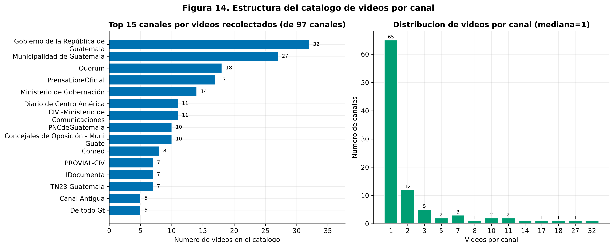

*65 de 97 canales aportan un unico video. El catalogo se construyo mezclando busquedas por tema con barridos de canales especificos, lo que produce esta mezcla de canales muy representados y canales con un solo video.*

**Tabla 16. Distribucion de videos por canal (catalogo completo)**

| Estadistico | Valor |
|---|---|
| n | 97 |
| Suma | 293 |
| Minimo | 1 |
| Percentil 25 | 1.0 |
| Mediana | 1.0 |
| Media | 3.02 |
| Percentil 75 | 2.0 |
| Percentil 90 | 7.4 |
| Maximo | 32 |
| Desv. estandar | 5.14 |
| Asimetria | 3.679 |
| Gini | 0.5741 |
| Canales con un solo video | 65 |

El catalogo no es una muestra homogenea de canales: 65 de los 97 canales aportan un unico video, mientras que el maximo es de 32 videos. Esa mezcla es consecuencia directa del procedimiento de recoleccion, que combino busquedas por tema (que devuelven un video de muchos canales distintos) con barridos de canales especificos (que devuelven muchos videos del mismo canal).


#### Comentarios y autores unicos por video

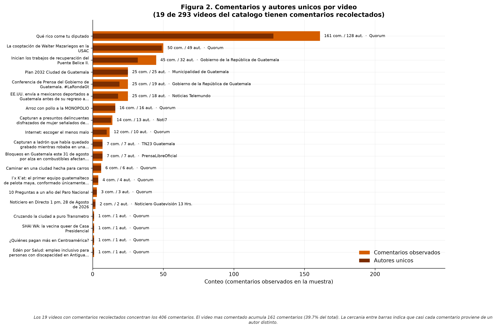

*Los 19 videos con comentarios recolectados concentran los 406 comentarios. El video mas comentado acumula 161 comentarios (39.7% del total). La cercania entre barras indica que casi cada comentario proviene de un autor distinto.*

**Tabla 17. Comentarios y autores por video observado**

| Estadistico | Comentarios por video | Autores unicos por video |
|---|---|---|
| n | 19 | 19 |
| Suma | 406 | 343 |
| Minimo | 1 | 1 |
| Percentil 25 | 2.5 | 2.5 |
| Mediana | 7.0 | 7.0 |
| Media | 21.37 | 18.05 |
| Percentil 75 | 25.0 | 18.5 |
| Percentil 90 | 46.0 | 35.4 |
| Maximo | 161 | 128 |
| Desv. estandar | 36.82 | 29.46 |
| Asimetria | 3.352 | 3.222 |
| Gini | 0.6596 | 0.6402 |

La cifra mas informativa de esta tabla es la cercania entre las dos columnas. La mediana de comentarios por video es 7 y la de autores unicos es 7; el video mas comentado tiene 161 comentarios de 128 autores distintos. Es decir, **cada comentario proviene practicamente de una persona diferente**. La participacion observada es amplia y superficial, no un intercambio sostenido entre pocos usuarios.


#### Visualizaciones

**Tabla 18. Visualizaciones: catalogo completo frente a videos observados**

| Estadistico | Catalogo (n=293) | Con comentario observado (n=19) |
|---|---|---|
| n | 293 | 19 |
| Suma | 17 706 015 | 380 876 |
| Minimo | 2 | 52 |
| Percentil 25 | 215 | 695 |
| Mediana | 1 175 | 1 954 |
| Media | 60 430.09 | 20 046.11 |
| Percentil 75 | 7 465 | 8 424 |
| Percentil 90 | 51 319 | 12 260 |
| Maximo | 8 190 449 | 304 089 |
| Desv. estandar | 515 798.31 | 68 934.23 |
| Asimetria | 14.258 | 4.327 |
| Gini | 0.9493 | 0.8533 |

La distribucion tiene cola derecha extrema: mediana de 1 175 visualizaciones frente a un maximo de 8 190 449, con asimetria de 14.26 y Gini de 0.9493. Los dos videos mas vistos concentran 46.3% y 68.3% (top 3) de todas las visualizaciones del catalogo.

La comparacion entre las dos columnas responde una pregunta importante sobre el muestreo: **¿se recolectaron comentarios de los videos mas vistos?** La mediana de los videos con comentarios recolectados es de 1 954 visualizaciones frente a 1 150 de los demas, una diferencia que **no** es estadisticamente significativa (Mann-Whitney U = 2 148, p = 0.20265). Sus posiciones en el ranking de visualizaciones van del puesto 9 al 255 de 293. La cobertura de comentarios no se explica por popularidad, sino por el procedimiento de recoleccion.


#### «Me gusta» y respuestas

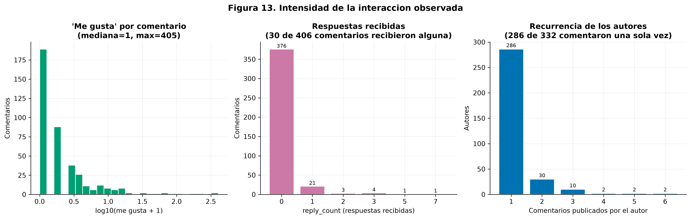

*El 46.6% de los comentarios no muestra 'me gusta' y solo 30 recibieron respuesta. 286 de 332 autores (86.1%) comentaron una unica vez: la participacion es mayoritariamente puntual, no conversacional.*

**Tabla 19. Aprobacion y respuestas recibidas por los comentarios**

| Metrica | Valor |
|---|---|
| Suma de «me gusta» | 2 325 |
| «Me gusta» mediana por comentario | 1 |
| «Me gusta» media por comentario | 5.73 |
| «Me gusta» maximo en un comentario | 405 |
| Gini de «me gusta» | 0.8957 |
| Comentarios con cero «me gusta» | 189 (46.5%) |
| Suma de respuestas (`reply_count`) | 51 |
| Comentarios que recibieron alguna respuesta | 30 (7.4%) |
| Valores observados de `reply_count` | 0, 1, 2, 3, 5, 7 |

La interaccion secundaria es escasa. El 46.5% de los comentarios no muestra ningun «me gusta», y solo 30 de 406 (7.4%) recibieron alguna respuesta, con un total de 51 respuestas en todo el conjunto. **Esas respuestas no estan en los datos**: se sabe que existen y cuantas son, pero no su texto ni su autor. Es la evidencia directa de por que no puede construirse una red de interaccion entre usuarios.


#### Recurrencia de los autores

**Tabla 20. Distribucion de autores por numero de comentarios**

| Comentarios publicados | Numero de autores | % de autores |
|---|---|---|
| 1 | 286 | 86.1% |
| 2 | 30 | 9.0% |
| 3 | 10 | 3.0% |
| 4 | 2 | 0.6% |
| 5 | 2 | 0.6% |
| 6 | 2 | 0.6% |

286 de 332 autores (86.1%) aparecen una sola vez, y el maximo es de 6 comentarios. Mas relevante para la red: solo 9 autores (2.7%) comentaron en mas de un video y 4 en mas de un canal, con un maximo de 3 videos distintos. Estos numeros anticipan la seccion 10: la red estara fragmentada porque casi nadie conecta contenidos.

---


#### Categorias y consultas de recoleccion

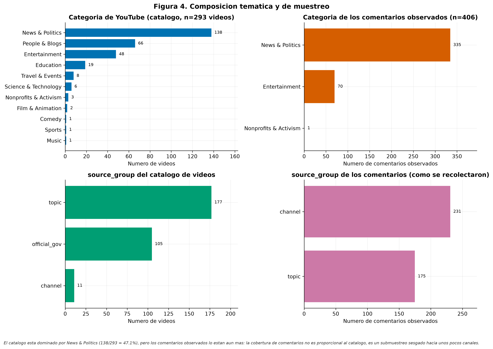

*El catalogo esta dominado por News & Politics (138/293 = 47.1%), pero los comentarios observados lo estan aun mas: la cobertura de comentarios no es proporcional al catalogo, es un submuestreo sesgado hacia unos pocos canales.*

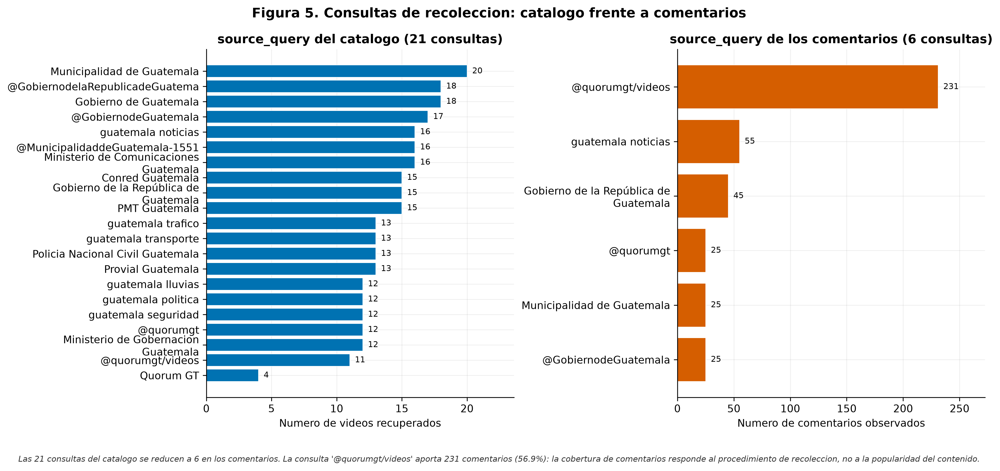

*Las 21 consultas del catalogo se reducen a 6 en los comentarios. La consulta '@quorumgt/videos' aporta 231 comentarios (56.9%): la cobertura de comentarios responde al procedimiento de recoleccion, no a la popularidad del contenido.*

El catalogo esta dominado por News & Politics (138 de 293 videos, 47,1 %), seguido de People & Blogs (66) y Entertainment (48). Pero la distribucion de los **comentarios** esta aun mas sesgada que la del catalogo, y en una direccion distinta: el grueso de los comentarios recolectados corresponde a videos de News & Politics de unos pocos canales. La comparacion lado a lado de la figura 4 muestra que la cobertura de comentarios **no es proporcional al catalogo**: es un submuestreo concentrado, no una muestra reducida representativa.

La figura 5 lo hace explicito desde el lado del muestreo: de las 21 consultas que construyeron el catalogo, solo 6 aparecen en los comentarios, y una sola de ellas (`@quorumgt/videos`) aporta 231 de los 406 comentarios (56,9 %). La estructura de participacion que se describe en las secciones siguientes esta condicionada por esa decision de recoleccion.


#### Hashtags

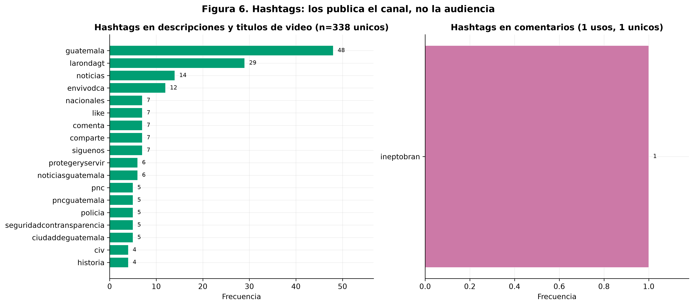

*Los hashtags viven en el contenido publicado por los canales (588 usos) y practicamente no en los comentarios (1 usos en 1 hashtags unicos sobre 406 comentarios). El etiquetado tematico es una practica del emisor, no de la audiencia en esta muestra.*

**Tabla 21. Hashtags mas frecuentes en el contenido publicado por los canales**

| Hashtag | Frecuencia |
|---|---|
| #guatemala | 48 |
| #larondagt | 29 |
| #noticias | 14 |
| #envivodca | 12 |
| #nacionales | 7 |
| #like | 7 |
| #comenta | 7 |
| #comparte | 7 |
| #siguenos | 7 |
| #protegeryservir | 6 |
| #noticiasguatemala | 6 |
| #pnc | 5 |

Los hashtags son una practica del **emisor**, no de la audiencia. En titulos y descripciones de video hay 588 usos de 338 hashtags distintos, mientras que en los 406 comentarios hay 1 usos de 1 hashtags. Este desequilibrio hace que los hashtags sean utiles para caracterizar el contenido publicado, pero inservibles para caracterizar la conversacion: para eso se usan las palabras y bigramas de los comentarios.


#### Palabras y bigramas frecuentes en los comentarios

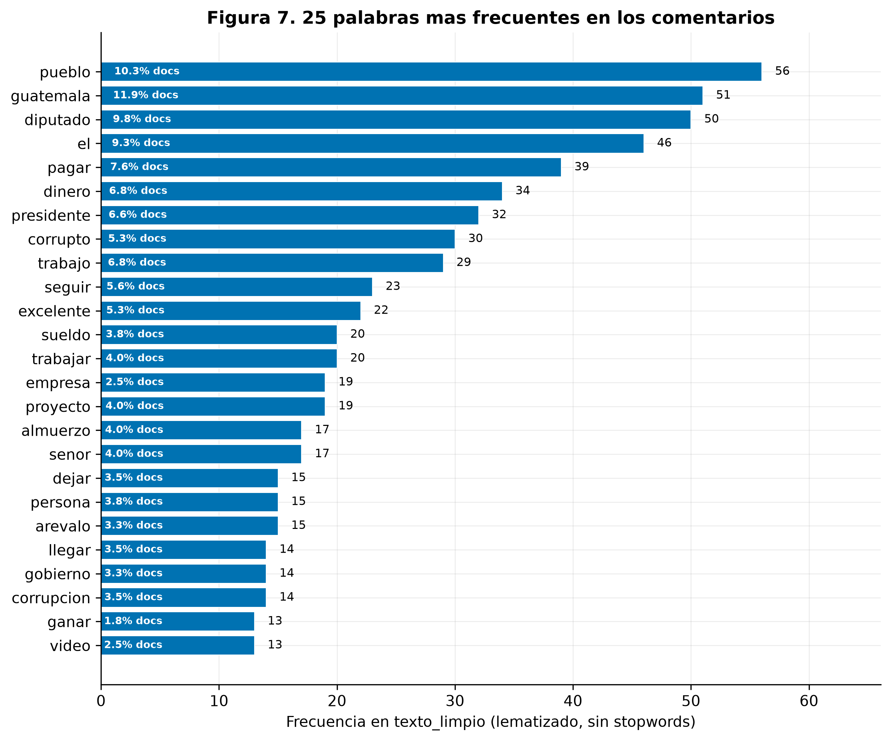

*Vocabulario politico-institucional: el termino mas frecuente aparece 56 veces en 10.3% de los comentarios. Ningun termino domina, lo que indica una conversacion tematicamente dispersa dentro de un mismo marco de referencia.*

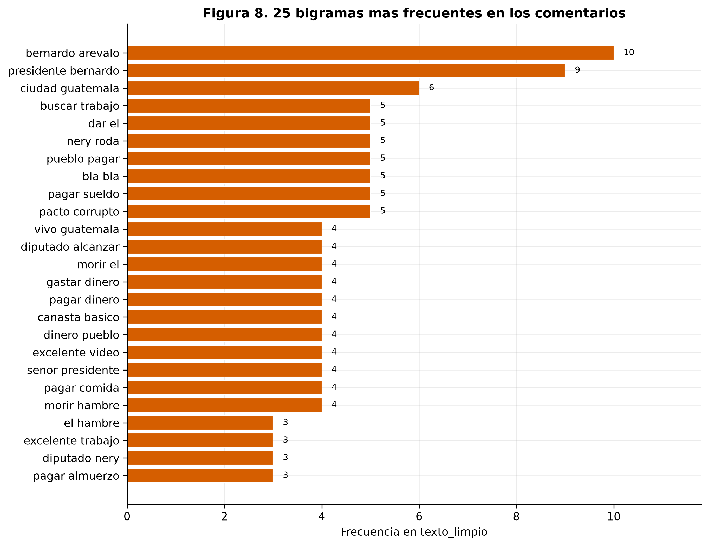

*El bigrama mas frecuente ('bernardo arevalo') aparece 10 veces. Las frecuencias bajas de los bigramas confirman que no existen consignas repetidas ni copy-paste masivo: los comentarios son redacciones individuales.*

**Tabla 22. 12 palabras y 12 bigramas mas frecuentes en texto_limpio**

| # | Palabra | Frec. | % docs | Bigrama | Frec. | % docs |
|---|---|---|---|---|---|---|
| 1 | pueblo | 56 | 10.3% | bernardo arevalo | 10 | 2.0% |
| 2 | guatemala | 51 | 11.9% | presidente bernardo | 9 | 1.8% |
| 3 | diputado | 50 | 9.8% | ciudad guatemala | 6 | 1.5% |
| 4 | el | 46 | 9.3% | buscar trabajo | 5 | 1.3% |
| 5 | pagar | 39 | 7.6% | dar el | 5 | 1.3% |
| 6 | dinero | 34 | 6.8% | nery roda | 5 | 1.3% |
| 7 | presidente | 32 | 6.6% | pueblo pagar | 5 | 1.3% |
| 8 | corrupto | 30 | 5.3% | bla bla | 5 | 0.5% |
| 9 | trabajo | 29 | 6.8% | pagar sueldo | 5 | 1.3% |
| 10 | seguir | 23 | 5.6% | pacto corrupto | 5 | 1.0% |
| 11 | excelente | 22 | 5.3% | vivo guatemala | 4 | 1.0% |
| 12 | sueldo | 20 | 3.8% | diputado alcanzar | 4 | 1.0% |

El vocabulario es politico-institucional y esta encabezado por «pueblo» (56 apariciones, presente en 10.3% de los comentarios). Ningun termino domina el corpus: el mas frecuente aparece en menos de una quinta parte de los comentarios, de modo que la conversacion es tematicamente dispersa dentro de un marco de referencia comun.

Los bigramas son mas informativos que las palabras aisladas y confirman la ausencia de coordinacion: el bigrama mas frecuente («bernardo arevalo») aparece 10 veces en 406 comentarios. No hay consignas repetidas ni texto copiado en masa; cada comentario es una redaccion individual. Ese dato importa para descartar actividad automatizada como explicacion de la concentracion.

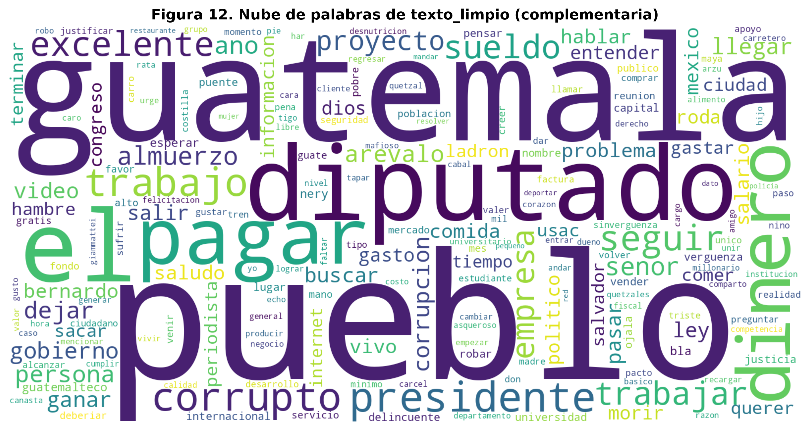

*Figura complementaria. No sustituye a los rankings cuantitativos de las figuras 7 y 8: el tamano de la nube no es comparable entre terminos con precision y no permite leer frecuencias.*

---


### 5.2 Concentracion de la participacion

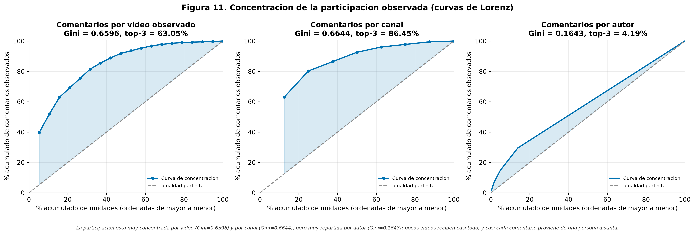

*La participacion esta muy concentrada por video (Gini=0.6596) y por canal (Gini=0.6644), pero muy repartida por autor (Gini=0.1643): pocos videos reciben casi todo, y casi cada comentario proviene de una persona distinta.*

**Tabla 23. Concentracion de la participacion observada**

| Distribucion | Unidades | Gini | Top 1 | Top 3 | Top 5 | Top 10 | Unidades para el 50 % |
|---|---|---|---|---|---|---|---|
| Comentarios por video observado | 19 | 0.6596 | 39.7% | 63.0% | 75.4% | 93.6% | 2 (10.5%) |
| Comentarios por canal | 8 | 0.6644 | 63.0% | 86.5% | 96.1% | 100.0% | 1 (12.5%) |
| Comentarios por autor | 332 | 0.1643 | 1.5% | 4.2% | 6.4% | 10.3% | 129 (38.9%) |
| Autores unicos por video | 19 | 0.6402 | 37.3% | 60.9% | 73.8% | 92.4% | 2 (10.5%) |
| Visualizaciones por video (catalogo) | 293 | 0.9493 | 46.3% | 68.3% | 73.5% | 82.0% | 2 (0.7%) |
| Videos por canal (catalogo) | 97 | 0.5741 | 10.9% | 26.3% | 36.9% | 53.9% | 9 (9.3%) |
| «Me gusta» por comentario | 406 | 0.8957 | 17.4% | 40.6% | 53.7% | 67.2% | 5 (1.2%) |

La estructura de la concentracion tiene dos caras opuestas y esa oposicion es el hallazgo. **Por contenido y por emisor esta muy concentrada**: los dos videos mas comentados acumulan la mitad de los comentarios (2 unidades para el 50 %), los tres primeros 63.0% y los cinco primeros 75.4%, con un Gini de 0.6596. Por canal la concentracion es aun mayor: un solo canal reune 63.0% de los comentarios.

**Por persona, en cambio, la participacion esta casi perfectamente repartida**: el Gini por autor es de solo 0.1643, el autor mas activo aporta 1.5% de los comentarios y hacen falta 129 autores (38.9% del total) para acumular la mitad. La curva de Lorenz del tercer panel de la figura 11 es casi la diagonal.

> La lectura conjunta es que **la concentracion de esta muestra es de atencion, no de voz**. Unos pocos contenidos capturan casi toda la participacion, pero dentro de ellos la participacion se distribuye entre muchas personas que hablan una sola vez. No hay un grupo pequeno de usuarios dominando la conversacion; hay un grupo pequeno de videos que la concentra.


#### Los videos y canales que concentran la participacion

**Tabla 24. Top 10 videos por comentarios observados**

| # | Video | Canal | Com. | Aut. | % del total | % acum. | Vistas |
|---|---|---|---|---|---|---|---|
| 1 | Qué rico come tu diputado | Quorum | 161 | 128 | 39.7% | 39.7% | 11 775 |
| 2 | La cooptación de Walter Mazariegos en l… | Quorum | 50 | 49 | 12.3% | 52.0% | 10 156 |
| 3 | Inician los trabajos de recuperación de… | Gobierno de la Repúbl… | 45 | 32 | 11.1% | 63.1% | 11 670 |
| 4 | Plan 2032 Ciudad de Guatemala | Municipalidad de Guat… | 25 | 25 | 6.2% | 69.2% | 304 089 |
| 5 | Conferencia de Prensa del Gobierno de G… | Gobierno de la Repúbl… | 25 | 19 | 6.2% | 75.4% | 3 628 |
| 6 | EE.UU. envía a mexicanos deportados a G… | Noticias Telemundo | 25 | 18 | 6.2% | 81.5% | 14 200 |
| 7 | Arroz con pollo a la MONOPOLIO | Quorum | 16 | 16 | 3.9% | 85.5% | 1 954 |
| 8 | Capturan a presuntos delincuentes disfr… | Noti7 | 14 | 13 | 3.5% | 88.9% | 6 692 |
| 9 | Internet: escoger el menos malo | Quorum | 12 | 10 | 3.0% | 91.9% | 717 |
| 10 | Capturan a ladrón que había quedado gra… | TN23 Guatemala | 7 | 7 | 1.7% | 93.6% | 4 616 |

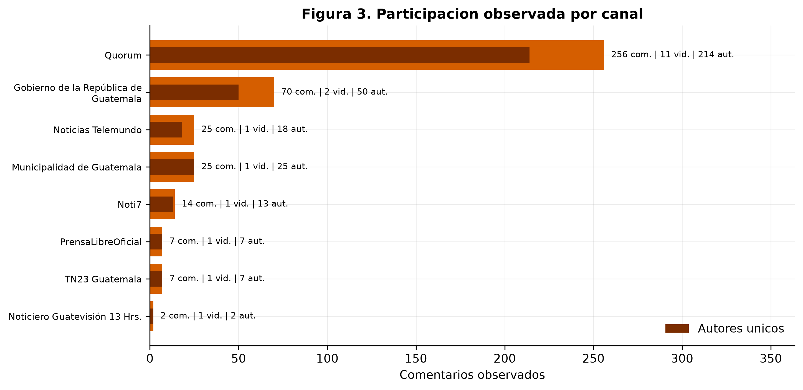

*Solo 8 de 97 canales del catalogo tienen comentarios recolectados. El canal lider aporta 256 comentarios (63.1%) distribuidos en 11 videos.*

**Tabla 25. Canales por participacion observada**

| # | Canal | Com. | % total | % acum. | Videos con com. | Videos en catalogo | Autores |
|---|---|---|---|---|---|---|---|
| 1 | Quorum | 256 | 63.0% | 63.0% | 11 | 18 | 214 |
| 2 | Gobierno de la República de Guate… | 70 | 17.2% | 80.3% | 2 | 32 | 50 |
| 3 | Noticias Telemundo | 25 | 6.2% | 86.5% | 1 | 2 | 18 |
| 4 | Municipalidad de Guatemala | 25 | 6.2% | 92.6% | 1 | 27 | 25 |
| 5 | Noti7 | 14 | 3.5% | 96.1% | 1 | 3 | 13 |
| 6 | PrensaLibreOficial | 7 | 1.7% | 97.8% | 1 | 17 | 7 |
| 7 | TN23 Guatemala | 7 | 1.7% | 99.5% | 1 | 7 | 7 |
| 8 | Noticiero Guatevisión 13 Hrs. | 2 | 0.5% | 100.0% | 1 | 2 | 2 |

El video mas comentado es «Qué rico come tu diputado» de Quorum, con 161 comentarios de 128 autores distintos (39.7% de todos los comentarios del conjunto). El canal lider es Quorum, con 256 comentarios (63.0%) repartidos en 11 videos. Conviene notar que ese canal tiene 18 videos en el catalogo: su peso en los comentarios se debe a que fue objeto de un barrido especifico de canal durante la recoleccion, no necesariamente a que genere mas conversacion que los demas.

---


### 5.3 Popularidad frente a participacion

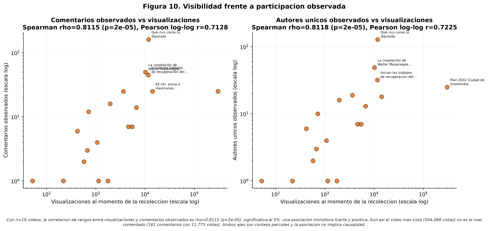

*Con n=19 videos, la correlacion de rangos entre visualizaciones y comentarios observados es rho=0.8115 (p=2e-05), significativa al 5%: una asociacion monotona fuerte y positiva. Aun asi el video mas visto (304,089 vistas) no es el mas comentado (161 comentarios con 11,775 vistas). Ambos ejes son conteos parciales y la asociacion no implica causalidad.*

**Tabla 26. Correlaciones entre visibilidad y participacion observada**

| Par de variables | n | Spearman rho | p | Pearson log-log r | Kendall tau | Signif. 5 % |
|---|---|---|---|---|---|---|
| Visualizaciones vs comentarios observados | 19 | 0.8115 | 2e-05 | 0.7128 | 0.6208 | si |
| Visualizaciones vs autores unicos | 19 | 0.8118 | 2e-05 | 0.7225 | 0.6210 | si |
| Comentarios vs autores unicos | 19 | 0.9982 | 0.0 | 0.9971 | 0.9908 | si |
| Visualizaciones vs «me gusta» totales | 19 | 0.7756 | 0.0001 | 0.8191 | 0.6287 | si |

**Spearman es la medida principal y Pearson solo un complemento.** La razon es la forma de los datos: las visualizaciones tienen asimetria de 14.26 y los comentarios observados de 3.35, con n = 19. Con esa asimetria y esa n, un coeficiente de Pearson sobre los valores brutos estaria dominado por uno o dos videos; una correlacion de rangos no. Se reporta ademas Pearson sobre `log1p` de ambas variables, que es defendible porque linealiza relaciones de potencia, y Kendall tau, mas robusto aun con n pequena. Los tres coinciden en signo y magnitud.

La asociacion entre visualizaciones y comentarios observados es **fuerte, positiva y significativa**: rho = 0.8115 (p = 2e-05). Practicamente identica para autores unicos (rho = 0.8118). Y la relacion entre comentarios y autores unicos es casi perfecta (rho = 0.9982), lo que vuelve a indicar que el numero de comentarios y el numero de personas son casi la misma cantidad en esta muestra.

El orden coincide, pero el detalle no. El video mas visto del conjunto observado (Plan 2032 Ciudad de Guatemala, 304 089 visualizaciones) recibio 25 comentarios observados, mientras que el mas comentado (Qué rico come tu diputado) acumula 161 comentarios con 11 775 visualizaciones, un orden de magnitud menos de audiencia. La visibilidad ordena la participacion, pero no la determina.

> **Tres advertencias sobre esta correlacion.** Primera: correlacion no es causalidad, y aqui la direccion causal es ambigua en ambos sentidos (mas visualizaciones dan mas oportunidades de comentar, pero un video con mucha discusion tambien recibe mas recomendaciones del algoritmo). Segunda: el conteo de comentarios proviene de la muestra recolectada, no del total real de YouTube, asi que el eje vertical mide cobertura de recoleccion tanto como participacion. Tercera: las visualizaciones son un corte al momento de la recoleccion y siguen creciendo; dos videos publicados en fechas distintas no son comparables sin ajustar por antiguedad, y esa correccion no es posible con fechas relativas.

---


## 6. Preguntas obligatorias del inciso 3.5

Las seis preguntas se responden por separado y con evidencia cuantitativa. Algunas requieren resultados de las secciones 8 a 12 (redes, comunidades, centralidad y sentimiento); en esos casos se anticipa la cifra y se remite a la seccion donde se deriva.


### 6.1 ¿Que videos y canales concentran la mayor participacion observada?

**Videos.** «Qué rico come tu diputado» del canal Quorum concentra 161 comentarios de 128 autores, es decir 39.7% de todos los comentarios del conjunto. Los tres videos mas comentados suman 63.0% y los cinco primeros 75.4%. Bastan 2 videos para acumular la mitad de la participacion (Gini = 0.6596).

**Canales.** Quorum reune 256 comentarios (63.0%) de 214 autores distintos, repartidos en 11 videos. Los tres primeros canales acumulan 86.5% y bastan 2 canales para el 80 % (Gini = 0.6644).

**Matiz necesario.** La concentracion por contenido conviene contrastarla con la del autor: el Gini por autor es de solo 0.1643. La participacion se concentra en pocos videos y pocos canales, pero se reparte entre muchisimas personas. Ademas, parte de esta concentracion es un artefacto del muestreo: el canal lider fue objeto de un barrido especifico de canal (`@quorumgt/videos`), lo que garantiza que aporte muchos comentarios independientemente de su volumen real de conversacion.


### 6.2 ¿Existen audiencias compartidas entre videos, canales o temas?

**Si, pero de forma marginal.** Solo 9 de 332 autores (2.71%) comentaron en mas de un video, y 4 en mas de un canal. Esos autores generan 11 de las 171 conexiones posibles entre videos (densidad 0.064327), y 9 de 19 videos quedan sin ninguna audiencia compartida observada.

**Tabla 27. Magnitud de la audiencia compartida observada**

| Metrica | Valor |
|---|---|
| Autores totales | 332 |
| Autores que comentaron en mas de un video | 9 (2.7%) |
| Autores que comentaron en mas de un canal | 4 |
| Aristas en la proyeccion video-video | 11 de 171 posibles |
| Densidad de la proyeccion video-video | 0.0643 |
| Peso maximo de una arista (autores compartidos) | 2 |
| Aristas con mas de un autor compartido | 2 |
| Videos sin audiencia compartida observada | 9 (47.4%) |
| Aristas en la proyeccion autor-autor | 10 732 |
| Componentes de la proyeccion video-video | 10, 1, 1, 1, 1, 1, 1, 1, 1, 1 |

El contraste entre las dos proyecciones es ilustrativo. La de autores tiene 10 732 aristas, un numero enorme, pero eso no indica audiencias entrelazadas: son las cliques que la proyeccion crea mecanicamente dentro de cada video (si 128 personas comentan el mismo video, la proyeccion las une a todas entre si). La cifra que si informa sobre audiencia compartida es la de la proyeccion video-video: 11 aristas, todas de peso 1 o 2, y 9 videos sin ninguna conexion.

En cuanto a temas, la audiencia compartida se da casi enteramente **dentro** del mismo campo tematico. Las tres comunidades detectadas (seccion 11) agrupan videos de politica nacional, comunicacion de gobierno y regulacion economica; los cruces entre esos bloques son los que sostienen los 7 autores puente.


### 6.3 ¿Que autores funcionan como puentes entre contenidos que de otra forma permanecerian separados?

**Criterio.** Un autor es puente si al eliminarlo de la red bipartita aumenta el numero de componentes de la proyeccion video-video. Es una prueba de eliminacion verificada, no un ranking de grado.

De los 332 autores, 9 comentaron en mas de un video, 4 en mas de un canal, 2 en mas de una comunidad, y **7 superan la prueba de eliminacion**. Solo 9 autores (2.7%) tienen intermediacion positiva en la proyeccion autor-autor: el resto pertenece a una unica clique de video y no esta en el camino entre nada.

**Tabla 28. Autores puente verificados por prueba de eliminacion**

| Handle | Com. | Videos | Canales | Comunidades | Δ componentes | Aristas perdidas | Canales que conecta |
|---|---|---|---|---|---|---|---|
| @hashojea7348 | 4 | 3 | 1 | 1 | +1 | 2 | Quorum |
| @inge_vergueta | 3 | 3 | 1 | 2 | +1 | 2 | Quorum |
| @virgiliogarcia3039 | 3 | 2 | 2 | 2 | +1 | 1 | Gobierno de la República de Guatemala \|\| Quor… |
| @MarcosCarillo-b1r | 2 | 2 | 2 | 1 | +1 | 1 | Quorum \|\| TN23 Guatemala |
| @franciscoflores3120 | 2 | 2 | 2 | 1 | +1 | 1 | Gobierno de la República de Guatemala \|\| Noti7 |
| @moisesvaldez4043 | 2 | 2 | 2 | 1 | +1 | 1 | PrensaLibreOficial \|\| Quorum |
| @josegil3813 | 2 | 2 | 1 | 1 | +1 | 1 | Gobierno de la República de Guatemala |

La tabla se lee asi: al retirar a ese autor de la red bipartita y recalcular la proyeccion video-video, el numero de componentes conexas **aumenta** en la cantidad indicada. Es decir, esa persona era el unico vinculo observado entre dos grupos de contenido. Es una propiedad estructural verificada, no una lectura de un ranking.

> **Que significa y que no significa ser «puente» aqui.** Significa que esa cuenta publico comentarios observados en videos que ninguna otra cuenta recolectada comento a la vez. No significa que difunda informacion entre comunidades, ni que tenga influencia, ni que conozca a nadie. Y su condicion de puente es fragil por construccion: depende de que no se hayan recolectado otros comentarios que sostendrian la misma conexion. Con una recoleccion mas completa, es probable que varios de estos puentes dejaran de ser unicos.

---


### 6.4 ¿Que temas y sentimientos caracterizan a las principales comunidades de participacion?

Louvain ponderado sobre la proyeccion video-video devuelve 12 comunidades (Q = 0.4053), de las cuales 9 son singletons. Las tres no triviales, que son todas las que existen, se caracterizan asi:

**Tabla 29. Caracterizacion tematica y afectiva de las tres comunidades**

| Com. | Videos | Com. obs. | Autores | Canales | Terminos TF-IDF distintivos | % NEG | % NEU | % POS | Polaridad neta |
|---|---|---|---|---|---|---|---|---|---|
| C0 | 4 | 225 | 187 | PrensaLibreOficial \|\| Quorum … | diputado, pueblo, sueldo, almuerzo, corrupt… | 76.0% | 15.1% | 8.9% | -67.1 |
| C1 | 3 | 84 | 62 | Gobierno de la República de G… | presidente, presidente bernardo, terminar, … | 45.2% | 30.9% | 23.8% | -21.4 |
| C2 | 3 | 34 | 29 | Quorum | empresa, internet, tigo, libre, competencia… | 50.0% | 20.6% | 29.4% | -20.6 |

**C0 — Critica al Congreso y a la corrupcion institucional** (4 videos, 225 comentarios, 187 autores). Sus terminos distintivos son *diputado, pueblo, sueldo, almuerzo, corrupto, ganar, pagar, salario* y sus bigramas incluyen «pueblo pagar», «pagar sueldo» y «pacto corrupto». Es la comunidad mas negativa del conjunto (76.0% NEG, polaridad neta -67.1) y agrupa periodismo de investigacion con noticias de sucesos.

**C1 — Comunicacion del Ejecutivo** (3 videos, 84 comentarios, 62 autores). Terminos distintivos: *presidente, presidente bernardo, terminar, puente, bernardo arevalo, senor, arevalo, tren*, con «presidente bernardo» y «bernardo arevalo» como bigramas dominantes. Es la menos negativa de las tres (45.2% NEG frente a 23.8% POS, polaridad neta -21.4): conviven el apoyo explicito («apoyo presidente») con la impaciencia («bla bla»).

**C2 — Regulacion economica y movilidad urbana** (3 videos, 34 comentarios, 29 autores). Terminos distintivos: *empresa, internet, tigo, libre, competencia, cliente, recargar, excelente*, con «ley competencia» y «libre mercado». Es la comunidad mas pequena y la de vocabulario mas especifico; su polaridad neta es -20.6 con 29.4% de comentarios positivos, la proporcion mas alta de las tres.

La diferencia de composicion de sentimiento entre comunidades es estadisticamente significativa: chi-cuadrado = 100.3471, gl = 8, p = 0.0, V de Cramer = 0.3573, sobre las 5 comunidades con n ≥ 10. Parte de las frecuencias esperadas es menor que 5, por lo que el valor p es aproximado.


### 6.5 ¿La visibilidad medida mediante visualizaciones coincide con la participacion observada?

Coinciden en el orden pero no en el detalle. Sobre los 19 videos con comentarios recolectados la correlacion de rangos es rho=0.8115 (p=2e-05), fuerte y significativa. Sin embargo el video mas visto (304,089 vistas) recibio solo 25 comentarios observados, mientras que el mas comentado (161) tiene 11,775 vistas: la visibilidad ordena la participacion pero no la determina.

Hay que anadir dos precisiones. Primera: el Gini de visualizaciones del catalogo (0.9493) es mucho mayor que el de comentarios por video (0.6596), es decir, la visibilidad esta mas concentrada que la participacion. Segunda: los videos con comentarios recolectados no son los mas vistos del catalogo (Mann-Whitney p = 0.20265), de modo que la relacion observada entre visibilidad y participacion se estima sobre un subconjunto que no fue elegido por popularidad. Eso es bueno para la validez interna de la comparacion y malo para su generalizacion.


### 6.6 ¿Que conclusiones estan limitadas por el procedimiento de recoleccion y la cobertura de los datos?

Esta pregunta se responde en detalle en la seccion 16. En terminos de las conclusiones concretas de este informe, las mas afectadas son:

- **Cualquier afirmacion sobre volumen de participacion.** Solo 6.5% de los videos tiene comentarios recolectados y no necesariamente todos los de cada video. La frase «este video recibio 161 comentarios» debe leerse siempre como «se recolectaron 161 comentarios de este video».
- **La estructura de la red.** Una sola consulta (`@quorumgt/videos`) aporta 231 de los 406 comentarios. La fragmentacion medida, el numero de componentes y la identidad de los puentes son propiedades de la muestra tanto como del fenomeno.
- **Todo aislamiento.** Un video sin audiencia compartida en estos datos puede tenerla en YouTube; solo se sabe que no se observo.
- **Cualquier reconstruccion de conversacion.** El conjunto contiene unicamente comentarios principales: reply_count indica que hubo 51 respuestas en total, pero ninguna de ellas esta en los datos ni se sabe quien las escribio.
- **Toda comparacion temporal.** `published_text` y `published_time` son relativos y redondeados por YouTube; no hay fecha absoluta de comentario.
- **Toda cifra de popularidad o aprobacion.** `view_count`, `like_count` y `reply_count` son cortes al momento de la recoleccion, no totales finales.

---


## 7. Preguntas adicionales del inciso 3.6

Las cinco preguntas de esta seccion surgieron de hallazgos concretos del analisis exploratorio y de la red, no de una lista generica. Cada una se motiva con el hallazgo que la origina y se responde con una prueba estadistica.


### 7.1 ¿Los autores recurrentes participan dentro de un solo canal o atraviesan canales?

*Por que surge:* El EDA mostro que 46 autores publicaron mas de un comentario pero solo 9 lo hicieron en mas de un video. La pregunta es si la recurrencia es fidelidad a un canal o movilidad entre canales.

**Respuesta.** La recurrencia es abrumadoramente intra-video. De 46 autores con mas de un comentario, 37 (80.4%) los publicaron todos en el mismo video y 42 (91.3%) dentro de un solo canal. Solo 4 autores atraviesan canales, con un maximo de 2 canales distintos. En esta muestra 'comentar mas' significa insistir en el mismo hilo, no seguir a varios emisores.

**Evidencia de la pregunta 7.1**

| Metrica | Valor |
|---|---|
| N autores recurrentes | 46 |
| % autores recurrentes | 13.860 |
| Recurrentes en un solo video | 37 |
| % recurrentes en un solo video | 80.430 |
| Recurrentes en un solo canal | 42 |
| % recurrentes en un solo canal | 91.300 |
| Recurrentes multicanal | 4 |
| Max canales por autor | 2 |


### 7.2 ¿Los videos con mas respuestas tienen tambien mayor diversidad de autores?

*Por que surge:* reply_count no permite construir aristas, pero si mide cuanta conversacion genero cada comentario. Si mas respuestas vinieran con mas autores distintos, la conversacion seria colectiva; si no, seria un puado de hilos aislados.

**Respuesta.** El numero absoluto de respuestas crece con el numero de autores (rho=0.697, p=0.00092), pero la *diversidad* relativa (autores unicos por comentario) se relaciona negativamente con el volumen (rho=-0.731, p=0.00037): en los videos mas comentados hay proporcionalmente mas autores que repiten. Aun asi la diversidad media es 0.933, muy cerca de 1: casi cada comentario proviene de una persona distinta.

**Evidencia de la pregunta 7.2**

| Metrica | Valor |
|---|---|
| N | 19 |
| Spearman respuestas vs autores | rho = 0.6965, p = 0.00092, significativo |
| Spearman respuestas vs diversidad | rho = -0.6626, p = 0.00199, significativo |
| Spearman comentarios vs diversidad | rho = -0.7315, p = 0.00037, significativo |
| Total respuestas | 51 |
| Videos con respuestas | 9 |
| Diversidad media | 0.933 |
| Diversidad min | 0.711 |


### 7.3 ¿Que consultas de recoleccion recuperaron contenido perteneciente a multiples comunidades, y hasta que punto la consulta determina la comunidad?

*Por que surge:* source_query describe el muestreo, no el tema. Si cada comunidad correspondiera exactamente a una consulta, las 'comunidades' serian un artefacto del procedimiento de recoleccion y no una estructura de audiencia.

**Respuesta.** De las 7 consultas que recuperaron videos con comentarios, 4 aparecen en mas de una comunidad. La concordancia entre consulta y comunidad es NMI=0.639 pero ARI=0.083. El ARI, que corrige por azar, es bajo: la particion en comunidades NO es una relectura de la consulta de recoleccion. El NMI resulta alto solo porque la particion tiene 9 singletons, y una particion muy fragmentada comparte informacion con casi cualquier etiquetado. La conclusion es que las comunidades responden a audiencia compartida y no al muestreo, aunque el muestreo determina que agrupamientos pueden llegar a observarse.

**Evidencia de la pregunta 7.3**

| Metrica | Valor |
|---|---|
| N consultas con videos comentados | 7 |
| N consultas en varias comunidades | 4 |
| Nmi consulta vs comunidad | 0.639 |
| Ari consulta vs comunidad | 0.083 |


### 7.4 ¿El sentimiento del comentario se asocia con su longitud y con los 'me gusta' que recibe?

*Por que surge:* El 61.6% de los comentarios se clasifico como negativo. Vale preguntar si la negatividad viene acompanada de textos mas largos (mas argumentacion) y de mas o menos aprobacion de otros usuarios.

**Respuesta.** Si, en las dos direcciones. Los comentarios negativos son los mas largos (mediana 132 caracteres frente a 76 de los positivos y 41 de los neutros; Kruskal-Wallis H=73.9, p=0.0), pero reciben menos aprobacion: mediana de 0 'me gusta' frente a 2 de los positivos (H=27.6, p=1e-06). La critica se argumenta mas y se premia menos en esta muestra.

**Evidencia de la pregunta 7.4**

| Metrica | Valor |
|---|---|
| Longitud mediana por clase | NEG: 132.5, NEU: 41.0, POS: 76.0 |
| Kruskal-wallis longitud | H = 73.9042, p = 0.0, significativo |
| Me gusta mediana por clase | NEG: 0.0, NEU: 1.0, POS: 2.0 |
| Me gusta medio por clase | NEG: 1.7, NEU: 7.4, POS: 17.0 |
| Kruskal-wallis me gusta | H = 27.5768, p = 1e-06, significativo |
| Spearman probpos vs me gusta | rho = 0.2197, p = 8e-06, significativo |
| N por clase | NEG: 250.0, NEU: 77.0, POS: 79.0 |


### 7.5 ¿Las visualizaciones de un video predicen su posicion en la red de audiencia compartida?

*Por que surge:* Un video muy visto podria atraer audiencia de muchos otros contenidos y quedar central en la proyeccion video-video. Si no ocurre, el papel estructural de un video no se deduce de su popularidad.

**Respuesta.** No de forma significativa. Con n=19, la correlacion de rangos entre visualizaciones y grado en la proyeccion es rho=0.289 (p=0.2307) y con betweenness rho=0.314 (p=0.1906). El video mas visto de la muestra (Plan 2032 Ciudad de Guatemala, 304,089 vistas) tiene grado 0, mientras que el mas central es Qué rico come tu diputado. El numero de comentarios observados si predice el grado (rho=0.678, p=0.0014): la posicion estructural depende de la participacion recolectada, no de la visibilidad.

**Evidencia de la pregunta 7.5**

| Metrica | Valor |
|---|---|
| N | 19 |
| Spearman views vs degree | rho = 0.2887, p = 0.23067, no significativo |
| Spearman views vs betweenness | rho = 0.3139, p = 0.19059, no significativo |
| Spearman comentarios vs degree | rho = 0.6781, p = 0.00142, significativo |

---


## 8. Construccion de la red bipartita autor-video


### 8.1 Definicion de la red

La red es **bipartita y no dirigida**. Tiene dos conjuntos de nodos que no se mezclan y toda arista cruza de un conjunto al otro:

**Tabla 30. Definicion formal de la red bipartita**

| Elemento | Definicion |
|---|---|
| Nodos tipo A (autor) | Un nodo por cada `author_channel_id` distinto. 332 nodos. |
| Nodos tipo B (video) | Un nodo por cada `video_id` con comentarios observados. 19 nodos. |
| Arista | Existe entre un autor y un video si ese autor publico al menos un comentario observado en ese video. No dirigida. |
| Peso de la arista | Numero de comentarios observados de ese autor en ese video. Un solo par autor-video genera **una** arista de peso k, nunca k aristas paralelas. |
| Prefijo de los identificadores | `A:` y `V:` en el grafo, para que un `author_channel_id` y un `video_id` no puedan colisionar. Las tablas exportadas incluyen `raw_id` sin prefijo. |


### 8.2 Significado preciso de una arista

> **Una arista autor-video significa exclusivamente que esa cuenta publico uno o mas comentarios observados en ese video, y su peso es cuantos.**
> >
> > No significa amistad. No significa que hubo una respuesta. No significa que hubo conversacion. No significa acuerdo con el contenido del video ni con otros comentaristas. No significa aprobacion.
> >
> > La co-participacion es coincidencia en un espacio de comentarios, y nada mas. Dos personas que comentaron el mismo video pueden no haberse leido nunca, y de hecho en un video con 128 comentaristas eso es lo mas probable.

**`reply_count` no se usa en ningun momento para construir aristas.** La variable indica cuantas respuestas recibio un comentario, pero no identifica a sus autores, asi que no puede sostener un vinculo entre personas. Aparece unicamente como atributo agregado de nodos y aristas. El pipeline verifica en cada corrida que la suma de pesos de la red sea igual al numero de comentarios (406) y no al numero de respuestas, lo que hace imposible haber usado la variable equivocada sin que la validacion falle.


### 8.3 Dimensiones e invariantes verificadas

**Tabla 31. Dimensiones de la red bipartita**

| Metrica | Valor |
|---|---|
| Nodos totales | 351 |
| Nodos de tipo autor | 332 |
| Nodos de tipo video | 19 |
| Aristas | 343 |
| Suma de los pesos | 406 |
| Comentarios usados | 406 |
| Peso maximo de una arista | 6 |
| Aristas con peso mayor que 1 | 40 |

**Tabla 32. Invariantes comprobadas automaticamente en cada ejecucion**

| Invariante | Resultado |
|---|---|
| La suma de los pesos es igual al numero de comentarios | CUMPLE |
| Hay exactamente una arista por par autor-video | CUMPLE |
| Todo nodo autor proviene de un author_channel_id | CUMPLE |
| Todo nodo video proviene de un video_id | CUMPLE |
| Toda arista une un autor con un video (bipartita) | CUMPLE |
| El grafo es no dirigido | CUMPLE |
| No hay bucles | CUMPLE |
| Todos los extremos de las aristas existen en la tabla de nodos | CUMPLE |
| reply_count no se uso para crear ninguna arista | CUMPLE |

Las 9 invariantes se comprueban en cada corrida y el pipeline aborta si alguna falla, de modo que no es posible publicar resultados con una red mal construida. La mas importante es la primera: **la suma de los pesos (406) es exactamente igual al numero de comentarios (406)**, lo que demuestra que ningun comentario se perdio ni se conto dos veces. La segunda garantiza que hay una sola arista por par autor-video. De las 343 aristas, 40 tienen peso mayor que 1, con un maximo de 6: son los casos de autores que comentaron varias veces el mismo video.


### 8.4 Tablas de nodos y de aristas

Se entregan en `results/networks/bipartite_nodes.csv` (351 filas, 21 columnas) y `results/networks/bipartite_edges.csv` (343 filas, 13 columnas), y ademas en formato GraphML (`bipartite.graphml`) para poder abrirlas en Gephi. Los atributos son:

**Tabla 33. Atributos de la tabla de nodos**

| Columna | Contenido |
|---|---|
| node_id | Identificador en el grafo, con prefijo `A:` o `V:` |
| raw_id | `author_channel_id` o `video_id` original, sin modificar |
| node_type / bipartite_set | `author` (0) o `video` (1) |
| display_name | Nombre del autor o titulo del video (solo etiqueta) |
| handle | Handle normalizado y decodificado (solo etiqueta) |
| channel_id / channel_name | Canal dueno del video (vacio en nodos de autor) |
| category / source_query / source_group | Metadatos del video |
| view_count | Visualizaciones del video al momento de la recoleccion |
| degree / strength | Grado y grado ponderado en la red bipartita |
| n_comentarios_observados | Comentarios del autor, o recibidos por el video |
| n_videos_comentados / n_canales_comentados | Amplitud de participacion del autor |
| n_autores_observados | Autores distintos que comentaron el video |
| me_gusta_recibidos / respuestas_recibidas | Agregados de interaccion |
| largo_medio_comentario | Longitud media de los comentarios del autor |

**Tabla 34. Atributos de la tabla de aristas**

| Columna | Contenido |
|---|---|
| source / target | Nodo autor y nodo video (el orden es convencional: la red es no dirigida) |
| source_type / target_type | Siempre `author` y `video` |
| source_raw_id / target_raw_id | Identificadores originales |
| weight | **Numero de comentarios observados del autor en el video** |
| significado_peso | Texto que documenta la semantica del peso en el propio archivo |
| me_gusta_en_esos_comentarios | Suma de «me gusta» de esos comentarios |
| respuestas_recibidas_en_esos_comentarios | Suma de `reply_count` de esos comentarios (atributo, no relacion) |
| comment_ids | Los `comment_id` que sostienen la arista, para trazabilidad |
| source_label / target_label | Etiquetas legibles |


### 8.5 Visualizacion de la red completa

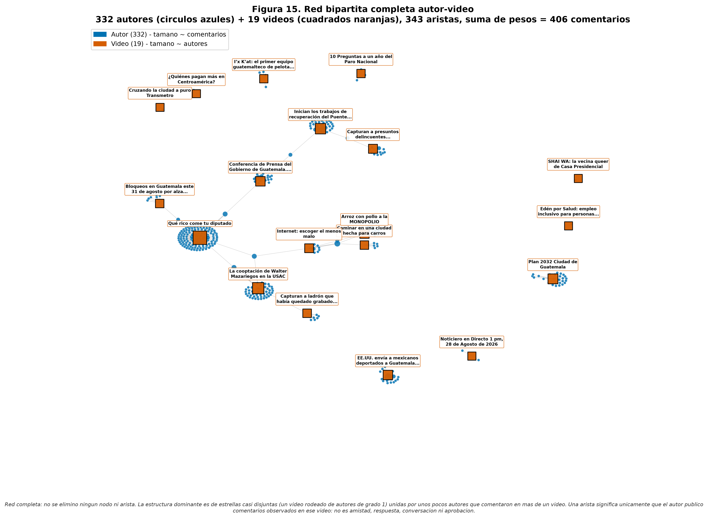

*Red completa: no se elimino ningun nodo ni arista. La estructura dominante es de estrellas casi disjuntas (un video rodeado de autores de grado 1) unidas por unos pocos autores que comentaron en mas de un video. Una arista significa unicamente que el autor publico comentarios observados en ese video: no es amistad, respuesta, conversacion ni aprobacion.*

**La figura contiene la red completa: no se elimino ningun nodo ni ninguna arista.** Lo que se ajusto es la presentacion (transparencia de aristas, tamano de nodos proporcional al grado, etiquetas solo en los 19 nodos de video), pero la estructura es integra. La forma dominante es un conjunto de **estrellas casi disjuntas**: cada video aparece rodeado de una corona de autores de grado 1, y las estrellas se tocan solo a traves de unos pocos autores de grado 2 o 3. Nueve de las estrellas estan completamente separadas del resto.

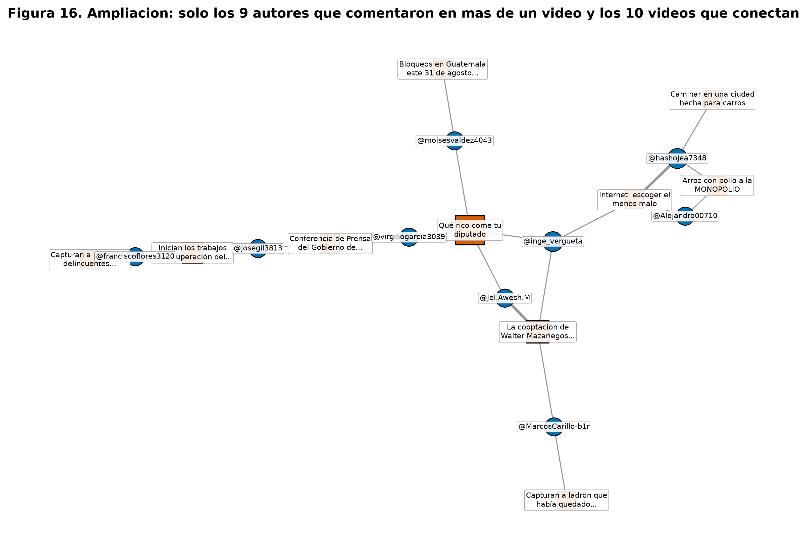

*Vista ampliada COMPLEMENTARIA de la figura 15 (no la sustituye). Estos 9 autores son el unico mecanismo por el que los videos de la muestra quedan conectados entre si: el resto de autores tiene grado 1 y no aporta conexion entre contenidos.*

La segunda figura es una **ampliacion complementaria**, no un reemplazo: muestra solo los autores de grado mayor que 1 y los videos que conectan, para que se puedan leer las etiquetas. Deja ver con claridad que el nucleo conectado de toda la red se sostiene sobre nueve personas.

---


## 9. Proyecciones de la red


### 9.1 Definicion y construccion

Las dos proyecciones se obtienen con `bipartite.weighted_projected_graph` de networkx, cuyo peso es el numero de vecinos comunes en la red bipartita. Eso coincide exactamente con lo que pide el enunciado:

**Tabla 35. Las dos proyecciones**

| Proyeccion | Nodos | Arista entre dos nodos si... | Peso de la arista |
|---|---|---|---|
| Autor-autor | 332 autores | ambos comentaron el mismo video (al menos uno) | **numero de videos compartidos** |
| Video-video | 19 videos | comparten al menos un autor | **numero de autores compartidos** |

Una nota sobre el peso: la proyeccion **ignora deliberadamente** el peso de la red bipartita. Dos autores que coinciden en un video comparten *un* video, sin importar si uno comento una vez y el otro seis. Es la definicion del enunciado y es la correcta para lo que se quiere medir (solapamiento de participacion, no volumen).


### 9.2 Verificacion independiente de los pesos

Los pesos de las dos proyecciones se recalcularon desde el dataframe de comentarios, sin usar networkx, mediante interseccion de conjuntos (los videos de cada autor y los autores de cada video), y se compararon uno por uno:

**Tabla 36. Resultado de la verificacion de pesos**

| Chequeo | Resultado |
|---|---|
| Aristas en la proyeccion autor-autor | 10 732 |
| Pesos incorrectos en autor-autor | 0 |
| Aristas en la proyeccion video-video | 11 |
| Pesos incorrectos en video-video | 0 |
| Peso maximo en autor-autor | 2 |
| Peso maximo en video-video | 2 |
| Existe una clique por cada video observado | si |

Los 10 732 pesos de la proyeccion de autores y los 11 de la de videos coinciden con el recalculo independiente. El chequeo de cliques confirma la propiedad estructural esperada: la audiencia de cada video forma un subgrafo completo en la proyeccion de autores.


### 9.3 Que fenomeno representa cada proyeccion

**Tabla 37. Comparacion de las dos proyecciones**

| Dimension | Autor-autor | Video-video |
|---|---|---|
| Nodos | 332 | 19 |
| Aristas | 10 732 | 11 |
| Densidad | 0.1953 | 0.0643 |
| Grado medio | 64.65 | 1.16 |
| Transitividad | 0.9840 | 0.3158 |
| Componentes | 10 | 10 |
| Nodos aislados | 4 | 9 |
| Fenomeno que representa | Co-participacion de audiencias **dentro** de un video | Solapamiento de audiencia **entre** contenidos |
| Que NO representa | Amistad, conversacion, interaccion directa ni acuerdo | Similitud tematica ni relacion editorial entre los videos |

La diferencia de escala es engañosa si se lee sin cuidado. La proyeccion de autores tiene 10 732 aristas y una transitividad de 0.984, valores que sugieren una red densamente entrelazada. **No lo es.** Esa densidad es un artefacto mecanico de la proyeccion: si 128 personas comentan el mismo video, la proyeccion las une a todas entre si y genera 8 128 aristas de un solo golpe, con transitividad 1 dentro de ese bloque. Lo que la proyeccion de autores mide, entonces, es *que tan grandes son las audiencias*, no que tan conectadas estan las personas.

La proyeccion de videos es la que informa sobre audiencia compartida real, y su lectura es la opuesta: 11 aristas sobre 171 posibles, densidad 0.0643, 9 videos aislados y pesos que solo llegan a 2. El solapamiento de publico entre contenidos es minimo.


### 9.4 Visualizacion de las dos proyecciones completas

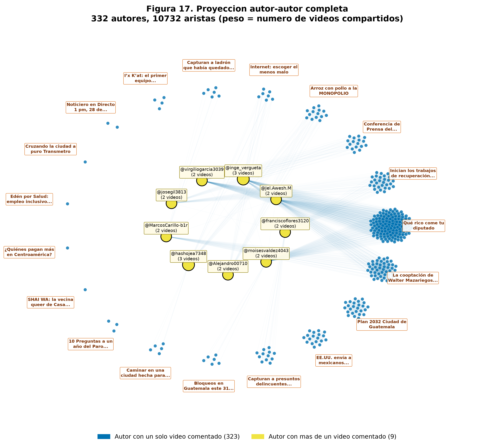

*Red completa. Los 10732 vinculos forman una clique por cada video observado: cada bloque denso es la audiencia de un video, no un grupo de amigos. Los 9 autores resaltados son los unicos que pertenecen a mas de un bloque y por tanto los unicos que pueden unir audiencias distintas.*

La proyeccion de autores se dispuso con un trazado construido a partir de su estructura conocida (un disco por audiencia de video, y los autores multivideo en un anillo interior) porque un trazado de fuerzas colapsa las 10 732 aristas de clique en una mancha ilegible. **No se elimino ningun nodo ni arista**: solo cambia la asignacion de coordenadas. Cada disco es la audiencia de un video; los nueve nodos amarillos del centro son los unicos autores que pertenecen a mas de un disco.

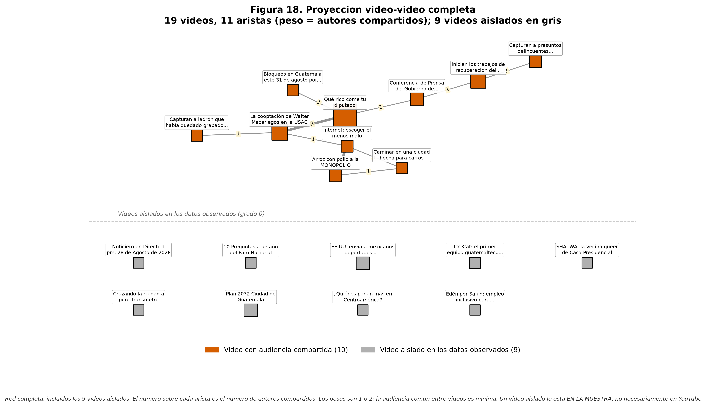

*Red completa, incluidos los 9 videos aislados. El numero sobre cada arista es el numero de autores compartidos. Los pesos son 1 o 2: la audiencia comun entre videos es minima. Un video aislado lo esta EN LA MUESTRA, no necesariamente en YouTube.*

**Tabla 38. Todas las aristas de la proyeccion video-video**

| Video A | Video B | Autores compartidos |
|---|---|---|
| La cooptación de Walter Mazariegos en l… | Qué rico come tu diputado | 2 |
| Internet: escoger el menos malo | Arroz con pollo a la MONOPOLIO | 2 |
| Capturan a presuntos delincuentes disfr… | Inician los trabajos de recuperación de… | 1 |
| Inician los trabajos de recuperación de… | Conferencia de Prensa del Gobierno de G… | 1 |
| Conferencia de Prensa del Gobierno de G… | Qué rico come tu diputado | 1 |
| Caminar en una ciudad hecha para carros | Internet: escoger el menos malo | 1 |
| Caminar en una ciudad hecha para carros | Arroz con pollo a la MONOPOLIO | 1 |
| Bloqueos en Guatemala este 31 de agosto… | Qué rico come tu diputado | 1 |
| Capturan a ladrón que había quedado gra… | La cooptación de Walter Mazariegos en l… | 1 |
| La cooptación de Walter Mazariegos en l… | Internet: escoger el menos malo | 1 |
| Qué rico come tu diputado | Internet: escoger el menos malo | 1 |

La proyeccion de videos cabe entera en una tabla: son 11 aristas. Dos de ellas tienen peso 2 y el resto peso 1, es decir, **la mayoria de las conexiones entre contenidos las sostiene una sola persona**. Los 9 videos en gris de la figura no tienen ninguna conexion; se muestran igual, separados por una linea, porque su ausencia de vinculos es un resultado y no un motivo para excluirlos.

---


## 10. Topologia y fragmentacion


### 10.1 Metricas estructurales de las tres redes

**Tabla 39. Metricas topologicas comparadas**

| Metrica | Bipartita autor-video | Proy. autor-autor | Proy. video-video |
|---|---|---|---|
| Tipo de red | bipartita | unimodal | unimodal |
| Nodos | 351 | 332 | 19 |
| Aristas | 343 | 10 732 | 11 |
| Suma de pesos | 406 | 10 734 | 13 |
| Densidad | 0.00558 | 0.19532 | 0.06433 |
| Grado medio | 1.954 | 64.651 | 1.158 |
| Grado mediano | 1 | 48 | 1 |
| Grado maximo | 128 | 183 | 4 |
| Fuerza media | 2.313 | 64.663 | 1.368 |
| Fuerza maxima | 161 | 184 | 5 |
| Componentes conexas | 10 | 10 | 10 |
| Tamano de la componente mayor | 286 | 276 | 10 |
| % de nodos en la componente mayor | 81.48 | 83.13 | 52.63 |
| Nodos aislados | 0 | 4 | 9 |
| Transitividad global | 0.000000 | 0.984025 | 0.315789 |
| Clustering medio | 0.000000 | 0.972049 | 0.149123 |
| Clustering medio ponderado | 0.000000 | 0.486240 | 0.093941 |
| Asortatividad de grado | -0.4283 | 0.9166 | -0.0621 |
| Diametro (componente mayor) | 12 | 6 | 5 |
| Longitud media de camino (comp. mayor) | 4.7152 | 2.3565 | 2.4889 |
| κ global (cohesion) | 0 | 0 | 0 |
| κ en la componente mayor | 1 | 1 | 1 |
| Densidad bipartita (\|A\|·\|B\|) | 0.05437 | no aplica | no aplica |
| Clustering bipartito de Latapy | 0.8920 | no aplica | no aplica |


#### Densidad: por que la bipartita necesita su propia formula

La densidad estandar de un grafo compara las aristas observadas con n(n−1)/2, que es el maximo en un grafo simple. **En una red bipartita ese maximo es imposible de alcanzar** porque no puede haber aristas dentro de un mismo conjunto: el maximo real es |A|·|B| = 332 · 19 = 6 308. Por eso la densidad estandar de 0.00558 subestima gravemente la conectividad, y la cifra correcta es la densidad bipartita de 0.05437. Aun asi es baja: se materializa poco mas del 5 % de los emparejamientos autor-video posibles.


#### Transitividad: cero por construccion en la bipartita

La transitividad global de la red bipartita es exactamente 0.0, y eso **no es un hallazgo empirico sino una propiedad matematica**: un triangulo exige tres nodos mutuamente adyacentes, y en una red bipartita toda arista cruza de un conjunto al otro, asi que el tercer vertice nunca puede cerrarse. Reportar ese cero como «falta de cohesion local» seria un error de interpretacion.

La metrica interpretable para una red bipartita es el **clustering bipartito de Latapy**, que mide el solapamiento de vecindarios en lugar de triangulos. Su valor medio es 0.8920, un valor alto: los autores que comparten un video tienden a compartir tambien su vecindario completo, que es exactamente lo que se espera de una estructura de estrellas.

En las proyecciones la transitividad si es informativa. La de autores tiene 0.9840, practicamente 1, porque esta compuesta de cliques. La de videos tiene 0.3158: hay algunos triangulos de videos que comparten audiencia entre si, pero la mayoria de las conexiones son cadenas abiertas.


### 10.2 Cohesion: definicion operacional

> **Definicion.** En este informe *cohesion* significa **conectividad por nodos (κ)**: el numero minimo de nodos que hay que eliminar para desconectar el grafo. Si el grafo ya esta desconectado, κ = 0 por definicion. Como las tres redes lo estan, se reporta ademas κ calculada **sobre la componente conexa mayor**, que es la cifra interpretable en una red fragmentada, junto con la conectividad por aristas (teorema de Menger) y el clustering medio como medida de cohesion local.

**Tabla 40. Medidas de cohesion de las tres redes**

| Medida | Bipartita | Proy. autor-autor | Proy. video-video |
|---|---|---|---|
| Grafo conexo | no | no | no |
| κ global (conectividad por nodos) | 0 | 0 | 0 |
| κ en la componente mayor | 1 | 1 | 1 |
| Conectividad por aristas en la componente mayor | 1 | 5 | 1 |
| Puntos de articulacion en la componente mayor | 17 | 7 | 5 |
| Puentes (aristas) en la componente mayor | 279 | 0 | 5 |
| Clustering medio (cohesion local) | 0.0000 | 0.9720 | 0.1491 |
| Diametro de la componente mayor | 12 | 6 | 5 |
| Longitud media de camino en la componente mayor | 4.715 | 2.357 | 2.489 |

**La cohesion es minima en las tres redes.** κ global es 0 porque ninguna es conexa, y κ en la componente mayor es 1 en las tres: existe **un solo nodo** cuya eliminacion parte la componente principal. La componente mayor de la bipartita tiene 17 nodos con esa propiedad, la de autores 7 y la de videos 5.

Un contraste ilustrativo: en la proyeccion de autores, κ por nodos es 1 pero la conectividad por aristas es 5. Es decir, hay que cortar cinco vinculos para partirla, pero basta retirar a una persona. Esa asimetria es la firma de una red sostenida por individuos concretos y no por una malla redundante de relaciones.


### 10.3 Distribucion de grados

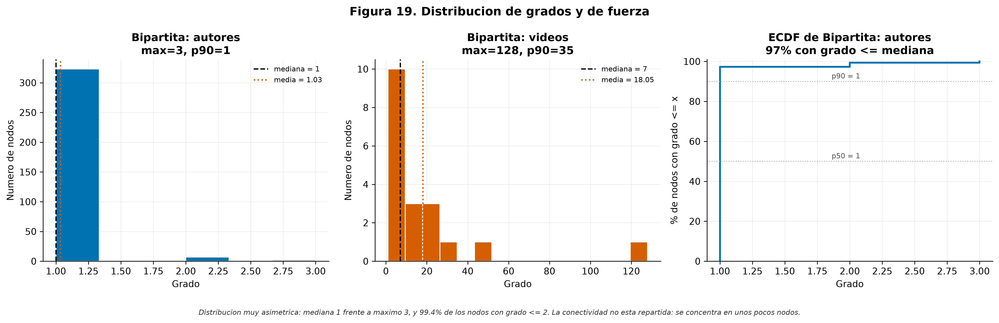

*Distribucion muy asimetrica: mediana 1 frente a maximo 3, y 99.4% de los nodos con grado <= 2. La conectividad no esta repartida: se concentra en unos pocos nodos.*

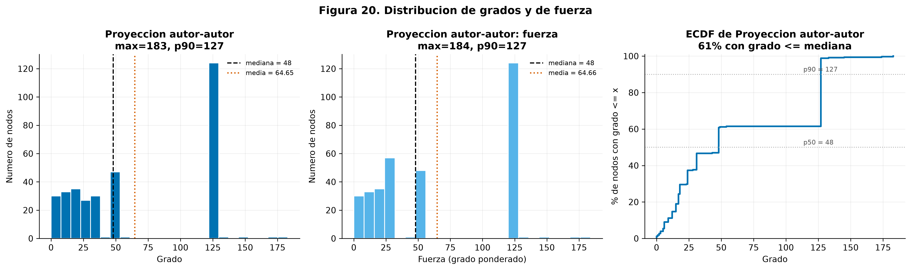

*Distribucion muy asimetrica: mediana 48 frente a maximo 183, y 2.7% de los nodos con grado <= 2. La conectividad no esta repartida: se concentra en unos pocos nodos.*

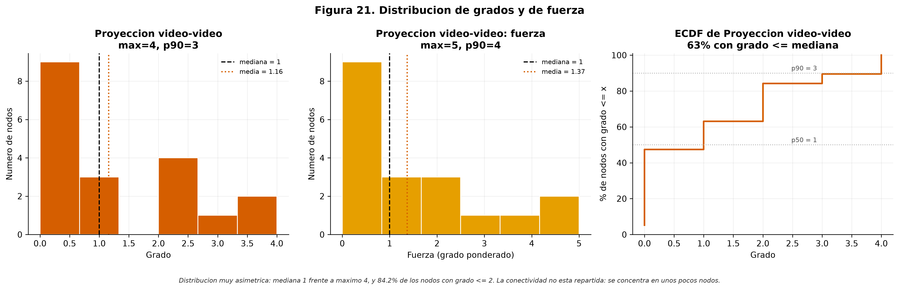

*Distribucion muy asimetrica: mediana 1 frente a maximo 4, y 84.2% de los nodos con grado <= 2. La conectividad no esta repartida: se concentra en unos pocos nodos.*

**Tabla 41. Distribucion de grados: mediana frente a maximo**

| Red | Grado medio | Mediana | p75 | p90 | p99 | Max | Gini del grado | % con grado 1 | % con grado ≤ 2 |
|---|---|---|---|---|---|---|---|---|---|
| Bipartita | 1.95 | 1 | 1 | 1 | 22.0 | 128 | 0.4784 | 93.2% | 95.4% |
| Proy. autor-autor | 64.65 | 48 | 127 | 127 | 131.1 | 183 | 0.4303 | 0.6% | 2.7% |
| Proy. video-video | 1.16 | 1 | 2 | 3 | 4.0 | 4 | 0.6124 | 15.8% | 84.2% |

**El promedio de la red bipartita miente.** Su grado medio es 1.95, un numero que sugiere que un nodo tipico tiene dos vecinos. La mediana es 1 y el 93.2% de los nodos tiene grado exactamente 1, mientras que el maximo es 128. La media esta arrastrada por los nodos de video, que tienen un grado promedio de 18.1 frente a 1.03 de los autores. Por eso el histograma y la ECDF de la figura 19 son necesarios: muestran una distribucion en L, no una campana.

La respuesta a la pregunta del inciso 6.1 («¿la mayoria tiene pocas conexiones o estan concentradas en unos pocos?») es inequivoca: **estan concentradas**. El Gini del grado en la bipartita es 0.4784 y en la proyeccion de videos 0.6124. La asortatividad de grado de la bipartita es -0.4283, claramente negativa, lo que confirma la estructura de estrella: los nodos de grado alto (videos) se conectan con nodos de grado bajo (autores de un solo comentario), no entre si.

En la proyeccion de autores el patron se invierte: la asortatividad es 0.9166, fuertemente positiva. Tambien es un artefacto de las cliques: todos los miembros de la audiencia de un video tienen el mismo grado, asi que se conectan con nodos de grado identico al propio.


### 10.4 Fragmentacion, nodos perifericos y aislados

**Tabla 42. Componentes conexas de las tres redes**

| Red | N.º de componentes | Tamano de la mayor | % de nodos en la mayor | Tamanos de todas las componentes |
|---|---|---|---|---|
| Bipartita | 10 | 286 | 81.5% | 286, 26, 19, 5, 4, 3, 2, 2, 2, 2 |
| Proy. autor-autor | 10 | 276 | 83.1% | 276, 25, 18, 4, 3, 2, 1, 1, 1, 1 |
| Proy. video-video | 10 | 10 | 52.6% | 10, 1, 1, 1, 1, 1, 1, 1, 1, 1 |

Las tres redes tienen el mismo numero de componentes (10), y no es coincidencia: la particion en componentes de la bipartita determina la de sus proyecciones. La componente mayor de la bipartita reune 286 nodos (81.5%), y las nueve restantes son estrellas aisladas de entre 2 y 26 nodos, es decir, videos cuya audiencia recolectada no coincide con la de ningun otro video de la muestra.

**Tabla 43. Nodos perifericos y aislados**

| Metrica | Valor |
|---|---|
| Autores con grado 1 en la bipartita (comentaron un solo video) | 323 (97.3%) |
| Videos aislados en la proyeccion video-video | 9 (47.4%) |
| Autores aislados en la proyeccion autor-autor | 4 |
| Componentes pequenas (≤ 5 nodos) en la proyeccion de autores | 7 |
| Nodos aislados en la bipartita | 0 |

Los 4 autores aislados en la proyeccion de autores son un caso interesante: son personas que comentaron un video del que **son el unico comentarista recolectado**, de modo que no comparten audiencia con nadie. En la bipartita no estan aislados (tienen su arista al video); en la proyeccion si.

**Tabla 44. Videos sin audiencia compartida observada**

| Video | Canal | Comentarios obs. | Autores obs. |
|---|---|---|---|
| EE.UU. envía a mexicanos deportados a Guate… | Noticias Telemundo | 25 | 18 |
| Plan 2032 Ciudad de Guatemala | Municipalidad de Guatem… | 25 | 25 |
| I’x K’at: el primer equipo guatemalteco de … | Quorum | 4 | 4 |
| 10 Preguntas a un año del Paro Nacional | Quorum | 3 | 3 |
| Noticiero en Directo 1 pm, 28 de Agosto de … | Noticiero Guatevisión 1… | 2 | 2 |
| SHAI WA: la vecina queer de Casa Presidenci… | Quorum | 1 | 1 |
| Cruzando la ciudad a puro Transmetro | Quorum | 1 | 1 |
| ¿Quiénes pagan más en Centroamérica? | Quorum | 1 | 1 |
| Edén por Salud: empleo inclusivo para perso… | Quorum | 1 | 1 |

> **Aislamiento observado no es aislamiento real.** Un nodo aislado en estas redes esta aislado EN LOS DATOS OBSERVADOS, no en YouTube. Solo se recolectaron comentarios de 19 videos y no necesariamente todos los comentarios de cada uno, asi que la ausencia de un vinculo puede deberse a la cobertura del muestreo y no a la ausencia de audiencia compartida real.
> >
> > El caso mas claro de la tabla 44 es «Plan 2032 Ciudad de Guatemala»: tiene 25 comentarios de 25 autores distintos y 304 089 visualizaciones, es el video mas visto de toda la muestra, y sin embargo aparece completamente aislado. La razon no es que su publico sea ajeno al resto: es que ninguno de esos 25 autores aparece tambien en otro de los 19 videos con comentarios recolectados. Con 274 videos sin comentarios recolectados, la probabilidad de detectar solapamiento es estructuralmente baja.


### 10.5 Interpretacion de los hallazgos estructurales

Los numeros de esta seccion apuntan todos en la misma direccion y admiten una lectura unica. **La participacion observada en YouTube no forma una comunidad conversacional: forma un conjunto de audiencias paralelas.**

- **No hay red conversacional porque no hay reincidencia.** El 93.2% de los nodos tiene grado 1, y de los 332 autores solo 9 comentaron en mas de un video. Sin reincidencia entre contenidos no puede existir una estructura de red rica: la topologia esta determinada por ese hecho.
- **La estructura de estrella es el hallazgo, no un defecto.** Asortatividad -0.428, transitividad 0 y clustering bipartito 0.892 describen consistentemente videos-hub rodeados de comentaristas de una sola aparicion. Es como se ve el consumo de contenido, no la sociabilidad.
- **La red es extremadamente fragil.** κ = 1 en la componente mayor de las tres redes y 17 puntos de articulacion en la bipartita significan que la conectividad depende de individuos concretos. En una red social robusta habria caminos redundantes; aqui la eliminacion de una persona parte el grafo.
- **La fragmentacion es en parte real y en parte de muestreo, y hay que separarlas.** Es real que la mayoria de la gente comenta un solo video: eso se observa directamente. Es de muestreo que 9 de 19 videos aparezcan aislados: con cobertura de comentarios en 274 videos mas, muchas de esas conexiones podrian materializarse.
- **El diametro de 12 y la longitud media de camino de 4.72 en la bipartita describen una cadena larga, no un mundo pequeno.** En redes sociales densas la longitud media de camino es de 4 a 6 con millones de nodos; aqui es casi 5 con 286. La informacion, si circulara por estos vinculos, tendria que recorrer muchos pasos.

---


## 11. Comunidades


### 11.1 Eleccion de la red y justificacion

**La deteccion de comunidades se hace sobre la proyeccion video-video ponderada.** Las tres razones son:

- **Es la unica red cuyas comunidades tienen una interpretacion sustantiva.** Una comunidad en esta red es un grupo de videos que comparten publico, y puede caracterizarse simultaneamente por titulo, canal, categoria, consulta de recoleccion, palabras de sus comentarios y distribucion de sentimiento.
- **La red bipartita no admite modularidad estandar.** La formulacion clasica de modularidad compara las aristas dentro de una comunidad con las esperadas bajo un modelo de configuracion que asume que cualquier par de nodos puede conectarse. En una red bipartita eso es falso, y aplicar la formula sin adaptarla produce un numero sin significado.
- **Las comunidades de la proyeccion autor-autor no aportan informacion nueva.** Esto no se afirma por intuicion: se comprobo. Ver el contraste mas abajo.

**Tabla 45. Comprobacion de que las comunidades de autores son triviales**

| Metrica | Valor | Lectura |
|---|---|---|
| Comunidades de Louvain en la proyeccion autor-autor | 14 | — |
| Grupos de la etiqueta trivial «en que video comento» | 19 | — |
| NMI entre ambas particiones | 0.9005 | Muy alto |
| ARI entre ambas particiones | 0.8869 | Muy alto (corregido por azar) |
| Modularidad ponderada de la particion de autores | 0.3949 | — |

Con NMI = 0.900 y ARI = 0.887 respecto de la etiqueta trivial «en que video comento este autor», las comunidades de la proyeccion de autores son esencialmente una relectura de la particion por video. Es lo esperado, porque la proyeccion crea una clique por video: Louvain no puede sino recuperarlas. Se reportan de todos modos como analisis complementario, pero el analisis principal es el de la proyeccion de videos.


### 11.2 Algoritmo, supuestos y tratamiento de los pesos

**Tabla 46. Configuracion del algoritmo de comunidades**

| Parametro | Valor |
|---|---|
| Algoritmo | Louvain (networkx.algorithms.community.louvain_communities) |
| Libreria y version | networkx 3.6.1 |
| Atributo de peso | `weight` = autores compartidos |
| Resolucion | 1.0 |
| Semilla | 42 |

**Supuestos de Louvain que conviene tener presentes.** Optimiza modularidad mediante agregacion voraz en dos fases, lo que implica: (a) las comunidades son **no solapadas**, cada video pertenece a exactamente una, supuesto discutible para audiencias que podrian solaparse; (b) el resultado depende del orden de recorrido, por lo que la semilla se fija en 42; (c) sufre el **limite de resolucion**, es decir, no detecta comunidades sustancialmente menores que √(2m), lo que en una red de 11 aristas es una limitacion severa; (d) la modularidad tiene un maximo alto por azar en redes dispersas, asi que su valor absoluto no debe leerse como evidencia de estructura fuerte.

**Tratamiento de los pesos.** El peso de la proyeccion video-video es el numero de autores compartidos, es decir, una **intensidad**: mas peso significa vinculo mas fuerte. Esa es precisamente la semantica que la modularidad ponderada espera, asi que el peso se pasa directamente sin transformar. (En el analisis de centralidad de la seccion 12 la situacion es distinta y si requiere invertirlo.) Se reportan las dos modularidades: ponderada Q = 0.4053 y no ponderada Q = 0.3760.


### 11.3 Resultado: numero, tamanos y calidad

**Tabla 47. Resultado de la deteccion de comunidades**

| Metrica | Proy. video-video (principal) | Proy. autor-autor (complementaria) |
|---|---|---|
| Comunidades detectadas | 12 | 14 |
| Tamanos | 4, 3, 3, 1, 1, 1, 1, 1, 1, 1, 1, 1 | 126, 61, 55, 28, 25, 18, 6, 4, 3, 2, 1, 1, 1, 1 |
| Modularidad ponderada | 0.4053 | 0.3949 |
| Modularidad no ponderada | 0.3760 | 0.3947 |
| Comunidades singleton | 9 | 4 |
| % de nodos en singletons | 47.4% | 1.2% |
| Comunidades no triviales (> 1 nodo) | 3 | 10 |
| Comunidad mayor | 4 | 126 |
| Tamano medio | 1.58 | 23.71 |

> **Los 9 singletons se reportan explicitamente y no se descartan.** Representan el 47.4% de los videos: contenidos cuya audiencia recolectada no coincide con la de ningun otro video de la muestra. Ocultarlos inflaria artificialmente la cobertura de las comunidades «reales», que es del 52.6%. Aparecen en la figura 22, en la tabla 49 y en `results/tables/community_summary.csv`.


#### Robustez de la particion

**Tabla 48. Comparacion con otros algoritmos de deteccion**

| Algoritmo | Comunidades | Tamanos | Q ponderada | NMI con Louvain |
|---|---|---|---|---|
| Louvain (principal) | 12 | 4, 3, 3, 1, 1, 1, 1, 1, 1, 1, 1, 1 | 0.4053 | 1.0 (referencia) |
| Greedy modularity (CNM) | 12 | 4, 3, 3, 1, 1, 1, 1, 1, 1, 1, 1, 1 | 0.4053 | 1.0000 |
| Label propagation asincrona | 11 | 8, 2, 1, 1, 1, 1, 1, 1, 1, 1, 1 | no aplica | 0.8813 |
| Componentes conexas (referencia estructural) | 10 | 10, 1, 1, 1, 1, 1, 1, 1, 1, 1 | no aplica | — |

Louvain y greedy modularity devuelven **exactamente la misma particion** (NMI = 1.00), y label propagation coincide en gran medida (NMI = 0.8813), diferenciandose solo en que fusiona la componente conexa entera en un unico grupo. La coincidencia entre dos algoritmos independientes indica que la particion no es un artefacto de Louvain. La comparacion con las componentes conexas es igual de informativa: la componente mayor de 10 videos se subdivide en tres comunidades, de modo que Louvain **si** encuentra estructura interna y no se limita a devolver las componentes.


### 11.4 Visualizacion de todas las comunidades

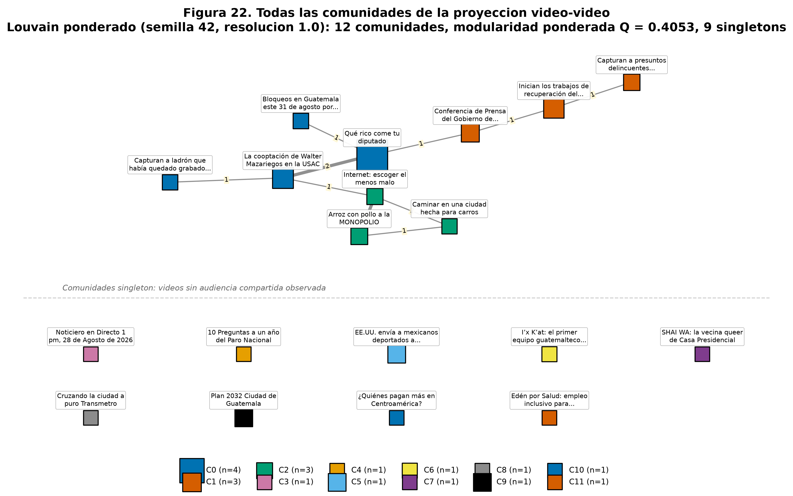

*Se muestran las 12 comunidades, incluidos los 9 singletons (videos sin audiencia compartida observada). Q = 0.4053 indica una particion mejor que el azar, pero sobre una red muy dispersa: la modularidad de un grafo casi desconectado se obtiene facilmente y no debe leerse como comunidades tematicas robustas.*

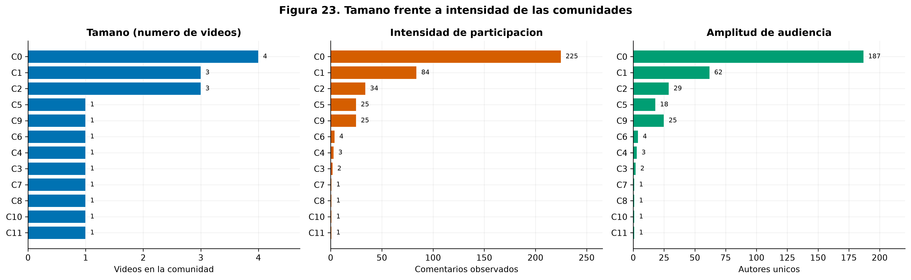

*El tamano de una comunidad en numero de videos no predice su intensidad de participacion: la comunidad con mas comentarios (225) tiene 4 videos, mientras que otras con mas videos acumulan mucho menos.*

La figura 22 muestra las 12 comunidades, singletons incluidos, con el numero de autores compartidos sobre cada arista. La figura 23 contrasta tamano con intensidad y revela que **no son la misma cosa**: la comunidad con mas videos (4) es tambien la de mas comentarios (225), pero varias comunidades singleton acumulan mas comentarios que C2, que tiene tres videos.


### 11.5 Caracterizacion de las tres comunidades principales

Se analizan en detalle las tres comunidades no triviales, que son todas las que existen: las nueve restantes son singletons (videos sin audiencia compartida observada) y se reportan pero no admiten una caracterizacion de comunidad.


#### Comunidad C0

**Tabla 49. Perfil completo de C0**

| Dimension | Valor |
|---|---|
| Videos | 4 |
| Titulos | Bloqueos en Guatemala este 31 de agosto por alza en combustibles afectan rutas principales \|\| Capturan a ladrón que había quedado grabado mientras robaba en una parroquia de Retalhuleu \|\| La cooptación de Walter Mazariegos en la USAC \|\| Qué rico come tu diputado |
| Canales | 3 — PrensaLibreOficial \|\| Quorum \|\| TN23 Guatemala |
| Categorias de YouTube | News & Politics |
| Consultas de recoleccion | @quorumgt \|\| Quorum GT \|\| guatemala noticias |
| Comentarios observados | 225 (55.4% del total) |
| Autores unicos | 187 |
| Autores en mas de un video de la comunidad | 4 |
| Intensidad: comentarios por video | 56.25 |
| Intensidad: comentarios por autor | 1.203 |
| «Me gusta» acumulados / medianos | 450 / 1 |
| Respuestas acumuladas | 5 |
| Visualizaciones totales / medianas | 32 016 / 7 812 |
| Aristas internas / peso interno | 3 / 4 |
| Densidad interna | 0.5000 |
| Longitud mediana del comentario | 102 caracteres |
| Terminos distintivos (TF-IDF de los comentarios) | diputado, pueblo, sueldo, almuerzo, corrupto, ganar, pagar, salario, comida, gasto |
| Keywords y titulos distintivos (TF-IDF del contenido publicado) | usac, noticias guatemala, mazariegos, noticias, combustibles, walter mazariegos |
| Palabras mas frecuentes | pueblo (54), diputado (50), pagar (35), el (31), dinero (28), corrupto (26), trabajo (23), sueldo (20) |
| Bigramas mas frecuentes | nery roda (5), pueblo pagar (5), pagar sueldo (5), pacto corrupto (5), diputado alcanzar (4), buscar trabajo (4) |
| Hashtags en los comentarios | ninguno |
| Sentimiento | NEG 76.0% · NEU 15.1% · POS 8.9% (n = 225, polaridad neta -67.1, confianza media 0.827) |
| Comparable estadisticamente (n ≥ 10) | si |


#### Comunidad C1

**Tabla 50. Perfil completo de C1**

| Dimension | Valor |
|---|---|
| Videos | 3 |
| Titulos | Capturan a presuntos delincuentes disfrazados de mujer señalados de cometer asalto \|\| Conferencia de Prensa del Gobierno de Guatemala. #LaRondaGt \|\| Inician los trabajos de recuperación del Puente Belice II. |
| Canales | 2 — Gobierno de la República de Guatemala \|\| Noti7 |
| Categorias de YouTube | Entertainment \|\| News & Politics |
| Consultas de recoleccion | @GobiernodeGuatemala \|\| Gobierno de la República de Guatemala \|\| guatemala noticias |
| Comentarios observados | 84 (20.7% del total) |
| Autores unicos | 62 |
| Autores en mas de un video de la comunidad | 2 |
| Intensidad: comentarios por video | 28.00 |
| Intensidad: comentarios por autor | 1.355 |
| «Me gusta» acumulados / medianos | 122 / 1 |
| Respuestas acumuladas | 16 |
| Visualizaciones totales / medianas | 21 990 / 6 692 |
| Aristas internas / peso interno | 2 / 2 |
| Densidad interna | 0.6667 |
| Longitud mediana del comentario | 86 caracteres |
| Terminos distintivos (TF-IDF de los comentarios) | presidente, presidente bernardo, terminar, puente, bernardo arevalo, senor, arevalo, tren, senor presidente, salvador |
| Keywords y titulos distintivos (TF-IDF del contenido publicado) | disfrazados, noticias, del, de, belice, belice ii |
| Palabras mas frecuentes | presidente (27), guatemala (16), arevalo (12), proyecto (9), ano (9), bernardo (9), gobierno (9), terminar (9) |
| Bigramas mas frecuentes | presidente bernardo (9), bernardo arevalo (9), senor presidente (4), bla bla (4), apoyo presidente (3), tren maya (3) |
| Hashtags en los comentarios | ninguno |
| Sentimiento | NEG 45.2% · NEU 30.9% · POS 23.8% (n = 84, polaridad neta -21.4, confianza media 0.764) |
| Comparable estadisticamente (n ≥ 10) | si |


#### Comunidad C2

**Tabla 51. Perfil completo de C2**

| Dimension | Valor |
|---|---|
| Videos | 3 |
| Titulos | Arroz con pollo a la MONOPOLIO \|\| Caminar en una ciudad hecha para carros \|\| Internet: escoger el menos malo |
| Canales | 1 — Quorum |
| Categorias de YouTube | News & Politics |
| Consultas de recoleccion | @quorumgt/videos |
| Comentarios observados | 34 (8.4% del total) |
| Autores unicos | 29 |
| Autores en mas de un video de la comunidad | 2 |
| Intensidad: comentarios por video | 11.33 |
| Intensidad: comentarios por autor | 1.172 |
| «Me gusta» acumulados / medianos | 17 / 0 |
| Respuestas acumuladas | 1 |
| Visualizaciones totales / medianas | 3 093 / 717 |
| Aristas internas / peso interno | 3 / 4 |
| Densidad interna | 1.0000 |
| Longitud mediana del comentario | 128 caracteres |
| Terminos distintivos (TF-IDF de los comentarios) | empresa, internet, tigo, libre, competencia, cliente, recargar, excelente, servicio, informacion |
| Keywords y titulos distintivos (TF-IDF del contenido publicado) | internet, arroz, caminar, arroz con, telefonía, telefonía caminar |
| Palabras mas frecuentes | excelente (11), empresa (9), internet (7), ley (7), video (5), informacion (5), seguir (5), servicio (5) |
| Bigramas mas frecuentes | ley competencia (3), libre mercado (3), competencia seguir (2), asignado paquete (2), dar el (2), ley libre (2) |
| Hashtags en los comentarios | ineptobran(1) |
| Sentimiento | NEG 50.0% · NEU 20.6% · POS 29.4% (n = 34, polaridad neta -20.6, confianza media 0.836) |
| Comparable estadisticamente (n ≥ 10) | si |


#### Lectura conjunta de las tres comunidades

Las tres comunidades se ordenan a lo largo de un eje reconocible: **la relacion del comentarista con el poder institucional**. C0 agrupa contenido que fiscaliza al Congreso y a la justicia, y es la mas negativa; C1 agrupa la comunicacion directa del Ejecutivo y es la mas mixta, con apoyo explicito conviviendo con impaciencia; C2 agrupa contenido sobre regulacion economica y movilidad urbana, temas donde la critica se dirige a empresas mas que a funcionarios, y es la de mayor proporcion de comentarios positivos.

La etiqueta tematica de cada comunidad se sostiene en evidencia convergente y no en una impresion: los terminos TF-IDF de los comentarios, los bigramas, las keywords del contenido publicado y los titulos de los videos apuntan al mismo campo semantico en los tres casos. Cuando esa convergencia no existe, la etiqueta no se pone: los nueve singletons se describen por su contenido individual, sin asignarles un tema de comunidad que no puede sostenerse con un solo video.


### 11.6 Las comunidades singleton

**Tabla 52. Los nueve videos que forman comunidades de un solo elemento**

| Com. | Video | Canal | Com. obs. | Autores | % NEG | % NEU | % POS |
|---|---|---|---|---|---|---|---|
| C5 | EE.UU. envía a mexicanos deportados a… | Noticias Telemundo | 25 | 18 | 72.0% | 20.0% | 8.0% |
| C9 | Plan 2032 Ciudad de Guatemala | Municipalidad de Guat… | 25 | 25 | 8.0% | 12.0% | 80.0% |
| C6 | I’x K’at: el primer equipo guatemalte… | Quorum | 4 | 4 | 25.0% | 0.0% | 75.0% |
| C4 | 10 Preguntas a un año del Paro Nacion… | Quorum | 3 | 3 | 33.3% | 0.0% | 66.7% |
| C3 | Noticiero en Directo 1 pm, 28 de Agos… | Noticiero Guatevisión… | 2 | 2 | 50.0% | 50.0% | 0.0% |
| C7 | SHAI WA: la vecina queer de Casa Pres… | Quorum | 1 | 1 | 0.0% | 0.0% | 100.0% |
| C8 | Cruzando la ciudad a puro Transmetro | Quorum | 1 | 1 | 100.0% | 0.0% | 0.0% |
| C10 | ¿Quiénes pagan más en Centroamérica? | Quorum | 1 | 1 | 0.0% | 0.0% | 100.0% |
| C11 | Edén por Salud: empleo inclusivo para… | Quorum | 1 | 1 | 0.0% | 100.0% | 0.0% |

Dos de estos singletons son notables. **«Plan 2032 Ciudad de Guatemala»** (25 comentarios, 25 autores) es el video mas visto de toda la muestra y el unico con polaridad claramente positiva; su aislamiento estructural conviviendo con su altisima visibilidad es la mejor ilustracion de que la posicion en la red no se deriva de la popularidad. **«EE.UU. envia a mexicanos deportados a Guatemala»** (25 comentarios, 18 autores, canal Noticias Telemundo) es el unico contenido de un medio internacional y tambien queda aislado, lo que es consistente con que su audiencia sea distinta de la del resto del corpus.

---


## 12. Nodos centrales y participantes puente


### 12.1 Medidas elegidas y por que

**Tabla 53. Medidas de centralidad calculadas y su justificacion**

| Medida | Que mide y por que se usa aqui |
|---|---|
| Grado | Numero de vecinos: alcance directo dentro de la red. |
| Fuerza (grado ponderado) | Grado ponderado: intensidad total del vinculo, no solo su numero. |
| Betweenness | Fraccion de caminos mas cortos que pasan por el nodo. Es la medida pertinente para 'puente' porque premia estar entre grupos, no tener muchos vecinos. Se calcula con distance = 1/weight. |
| Closeness (Wasserman-Faust) | Cercania con correccion de Wasserman-Faust, necesaria porque las redes estan desconectadas y la formula clasica seria indefinida. |
| Harmonic centrality | Suma de reciprocos de distancias: bien definida con distancias infinitas, por lo que es la alternativa robusta a closeness en grafos fragmentados. |
| PageRank | Prestigio recursivo ponderado: un nodo importa si esta vinculado a nodos importantes. Alpha = 0.85. |
| Eigenvector | Version espectral del prestigio; se reporta para contrastar con PageRank, del que suele diferir en grafos desconectados. |
| Numero de k-core | Profundidad del nodo en la jerarquia de nucleos: perifericidad. |
| Puntos de articulacion | Nodos cuya eliminacion aumenta el numero de componentes. Es una propiedad estructural verificable, no un ranking. |

> **El punto tecnico que decide si los resultados son correctos o no.** En las proyecciones weight es intensidad (mas compartido = mas fuerte) pero networkx trata weight como distancia en los algoritmos de camino mas corto. Se define distance = 1/weight para que un vinculo fuerte cuente como cercano.
> >
> > Concretamente: dos videos que comparten 2 autores estan **mas** relacionados que dos que comparten 1, pero si se le pasa `weight=2` a un algoritmo de camino mas corto, el algoritmo entiende que estan al **doble de distancia**. El resultado seria el inverso del correcto. Por eso se construye `distance = 1/weight` y esa es la que se usa en betweenness, closeness y harmonic; el peso sin transformar se usa en fuerza, PageRank y eigenvector, donde la semantica de intensidad es la correcta.

**Tratamiento de los grafos desconectados.** Las tres redes tienen 10 componentes, lo que rompe la definicion clasica de closeness (la distancia a un nodo inalcanzable es infinita y su inverso indefinido). Se resolvio de tres formas complementarias: betweenness de networkx suma por componente de manera nativa; closeness se calcula con la correccion de Wasserman-Faust (`wf_improved=True`), que escala por el tamano de la componente alcanzable; y se agrega harmonic centrality, que suma reciprocos de distancias y por tanto esta bien definida con distancias infinitas. Cada nodo lleva ademas su identificador de componente y el tamano de esta, para que ningun ranking se lea entre componentes distintas sin advertirlo.

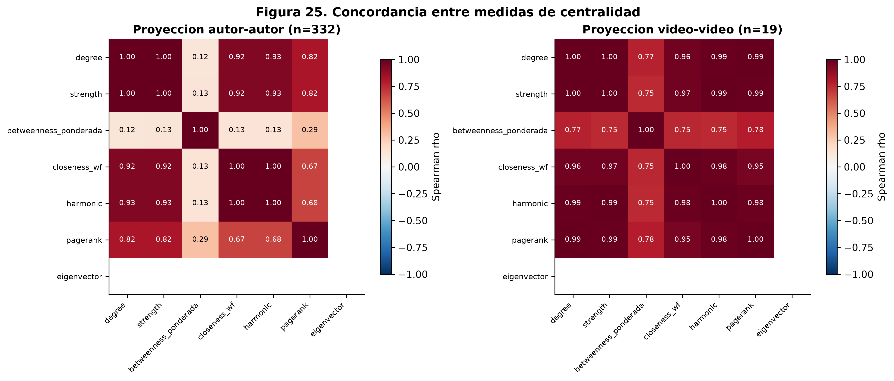

*Correlacion de rangos entre medidas. Grado, fuerza, PageRank y eigenvector miden casi lo mismo en estas redes, mientras que betweenness se separa: identifica una propiedad distinta (estar en el camino entre grupos) y es la medida pertinente para detectar puentes.*

La matriz de correlacion de rangos justifica calcular varias medidas en lugar de una. Grado, fuerza, PageRank y eigenvector correlacionan casi perfectamente entre si: en estas redes miden lo mismo, y usar una u otra no cambia el ranking. **Betweenness se separa claramente del bloque**, lo que confirma que captura una propiedad distinta —estar en el camino entre grupos— y que es la medida pertinente para identificar puentes. Es la evidencia de por que un ranking de grado no basta para llamar «puente» a un nodo.


### 12.2 Autores: recurrencia, diversidad e intermediacion

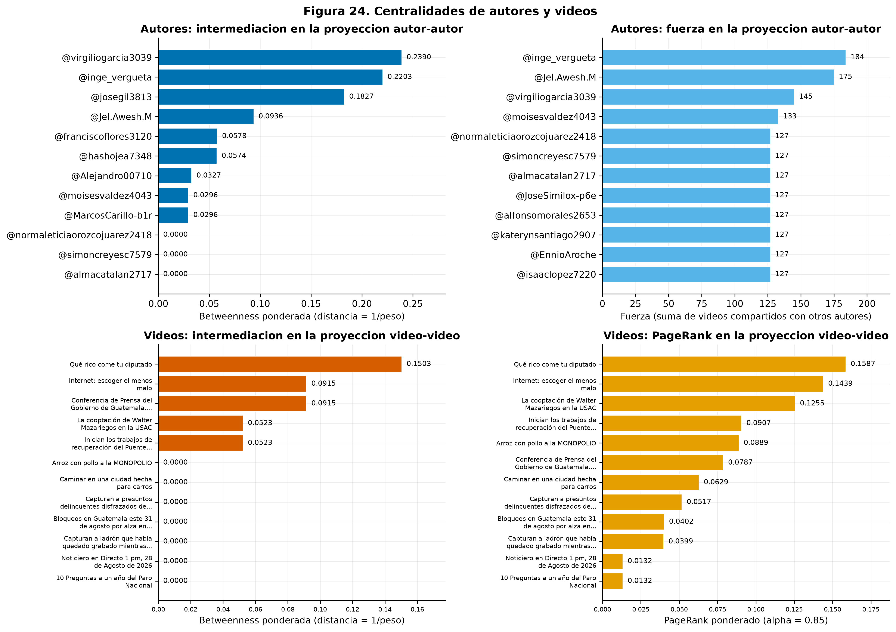

*Solo 9 de 332 autores tienen betweenness > 0: la inmensa mayoria no intermedia nada porque pertenece a una sola clique de video. Fuerza y betweenness ordenan distinto, lo que confirma que un ranking de grado no basta para llamar 'puente' a un nodo.*

Para los autores conviene separar cuatro cosas que suelen confundirse en un solo concepto de «usuario activo»:

**Tabla 54. Cuatro dimensiones distintas de la participacion de un autor**

| Dimension | Como se mide | Valor en estos datos |
|---|---|---|
| Recurrencia | Numero de comentarios publicados | 46 autores con mas de uno; maximo 6 |
| Amplitud de contenido | Numero de videos distintos comentados | 9 autores en mas de un video; maximo 3 |
| Diversidad de emisores | Numero de canales distintos comentados | 4 autores en mas de un canal; maximo 2 |
| Papel estructural | Betweenness y condicion de puente verificado | 9 con betweenness > 0 (2.7%); 7 puentes verificados |

**Las cuatro dimensiones no coinciden**, y ahi esta el hallazgo. Un autor puede ser muy recurrente y estructuralmente irrelevante: el mas activo del conjunto publico 6 comentarios, todos en el mismo video, y tiene betweenness 0. A la inversa, un autor con 2 comentarios en 2 videos de canales distintos puede ser el unico vinculo entre dos bloques de contenido. **Actividad y centralidad estructural son propiedades independientes en esta muestra.**

**Tabla 55. Top 10 autores por betweenness ponderada**

| # | Handle | Com. | Videos | Canales | Grado | Fuerza | Betweenness | PageRank | Articulacion |
|---|---|---|---|---|---|---|---|---|---|
| 1 | @virgiliogarcia3039 | 3 | 2 | 2 | 145 | 145 | 0.23902 | 0.00524 | si |
| 2 | @inge_vergueta | 3 | 3 | 1 | 183 | 184 | 0.22028 | 0.00733 | si |
| 3 | @josegil3813 | 2 | 2 | 1 | 49 | 49 | 0.18266 | 0.00510 | si |
| 4 | @Jel.Awesh.M | 3 | 2 | 1 | 174 | 175 | 0.09365 | 0.00573 | no |
| 5 | @franciscoflores3120 | 2 | 2 | 2 | 43 | 43 | 0.05779 | 0.00532 | si |
| 6 | @hashojea7348 | 4 | 3 | 1 | 28 | 29 | 0.05740 | 0.00619 | si |
| 7 | @Alejandro00710 | 2 | 2 | 1 | 23 | 24 | 0.03268 | 0.00454 | no |
| 8 | @moisesvaldez4043 | 2 | 2 | 2 | 133 | 133 | 0.02955 | 0.00468 | si |
| 9 | @MarcosCarillo-b1r | 2 | 2 | 2 | 54 | 54 | 0.02955 | 0.00442 | si |
| 10 | @normaleticiaorozcojuarez2418 | 1 | 1 | 1 | 127 | 127 | 0.00000 | 0.00327 | no |

**Tabla 56. Top 10 autores por recurrencia (numero de comentarios)**

| # | Handle | Com. | Videos | Canales | Betweenness |
|---|---|---|---|---|---|
| 1 | @Murmullodelbarrio | 6 | 1 | 1 | 0.00000 |
| 2 | @eugeneramirez4405 | 6 | 1 | 1 | 0.00000 |
| 3 | @ManuelEdran | 5 | 1 | 1 | 0.00000 |
| 4 | @albertoshernandez5251 | 5 | 1 | 1 | 0.00000 |
| 5 | @hashojea7348 | 4 | 3 | 1 | 0.05740 |
| 6 | @ErvinLeonardoCarreraLatín | 4 | 1 | 1 | 0.00000 |
| 7 | @virgiliogarcia3039 | 3 | 2 | 2 | 0.23902 |
| 8 | @inge_vergueta | 3 | 3 | 1 | 0.22028 |
| 9 | @Jel.Awesh.M | 3 | 2 | 1 | 0.09365 |
| 10 | @marioajset4283 | 3 | 1 | 1 | 0.00000 |

El contraste entre las tablas 55 y 56 es directo: casi ninguno de los autores mas recurrentes aparece entre los de mayor intermediacion, y varios de los intermediadores tienen apenas 2 o 3 comentarios. La fuerza en la proyeccion de autores tampoco sirve como proxy: esta dominada por el tamano de la audiencia del video comentado, no por el papel del autor (quien comento el video de 128 comentaristas tiene fuerza altisima por el simple hecho de estar en esa clique).


### 12.3 Autores puente: identificacion y verificacion

Un autor se declara puente **solo si pasa una prueba de eliminacion**: se lo retira de la red bipartita, se recalcula la proyeccion video-video y se cuenta si aumento el numero de componentes conexas. De los 9 autores con mas de un video, **7 superan la prueba**.

**Tabla 57. Todos los autores con participacion en mas de un video**

| Handle | Com. | Videos | Canales | Com.-dades | Puente verificado | Δ componentes | Videos que conecta |
|---|---|---|---|---|---|---|---|
| @hashojea7348 | 4 | 3 | 1 | 1 | SI | +1 | Arroz con pollo a la MONOPOLIO \|\| Caminar en una ci… |
| @inge_vergueta | 3 | 3 | 1 | 2 | SI | +1 | Internet: escoger el menos malo \|\| La cooptación de… |
| @virgiliogarcia3039 | 3 | 2 | 2 | 2 | SI | +1 | Conferencia de Prensa del Gobierno de Guatemala. #L… |
| @MarcosCarillo-b1r | 2 | 2 | 2 | 1 | SI | +1 | Capturan a ladrón que había quedado grabado mientra… |
| @franciscoflores3120 | 2 | 2 | 2 | 1 | SI | +1 | Capturan a presuntos delincuentes disfrazados de mu… |
| @moisesvaldez4043 | 2 | 2 | 2 | 1 | SI | +1 | Bloqueos en Guatemala este 31 de agosto por alza en… |
| @josegil3813 | 2 | 2 | 1 | 1 | SI | +1 | Conferencia de Prensa del Gobierno de Guatemala. #L… |
| @Jel.Awesh.M | 3 | 2 | 1 | 1 | no | 0 | La cooptación de Walter Mazariegos en la USAC \|\| Qu… |
| @Alejandro00710 | 2 | 2 | 1 | 1 | no | 0 | Arroz con pollo a la MONOPOLIO \|\| Internet: escoger… |

Dos de los nueve autores multivideo **no** son puentes: su conexion entre videos esta duplicada por otro autor, de modo que retirarlos no parte nada. Es exactamente la distincion que la prueba de eliminacion permite hacer y que un ranking de grado no. Los siete restantes son, en el sentido estricto del enunciado, los participantes cuya eliminacion segmenta la red.


### 12.4 Videos: alcance y capacidad de conectar audiencias

**Tabla 58. Centralidad de los videos en la proyeccion video-video**

| Video | Canal | Com. obs. | Vistas | Grado | Fuerza | Betweenness | PageRank | Articulacion |
|---|---|---|---|---|---|---|---|---|
| Qué rico come tu diputado | Quorum | 161 | 11 775 | 4 | 5 | 0.1503 | 0.1587 | si |
| Internet: escoger el menos malo | Quorum | 12 | 717 | 4 | 5 | 0.0915 | 0.1439 | si |
| Conferencia de Prensa del Gobiern… | Gobierno de la Re… | 25 | 3 628 | 2 | 2 | 0.0915 | 0.0787 | si |
| La cooptación de Walter Mazariego… | Quorum | 50 | 10 156 | 3 | 4 | 0.0523 | 0.1255 | si |
| Inician los trabajos de recuperac… | Gobierno de la Re… | 45 | 11 670 | 2 | 2 | 0.0523 | 0.0907 | si |
| Arroz con pollo a la MONOPOLIO | Quorum | 16 | 1 954 | 2 | 3 | 0.0000 | 0.0889 | no |
| Caminar en una ciudad hecha para … | Quorum | 6 | 422 | 2 | 2 | 0.0000 | 0.0629 | no |
| Capturan a presuntos delincuentes… | Noti7 | 14 | 6 692 | 1 | 1 | 0.0000 | 0.0517 | no |
| Bloqueos en Guatemala este 31 de … | PrensaLibreOficial | 7 | 5 469 | 1 | 1 | 0.0000 | 0.0402 | no |
| Capturan a ladrón que había queda… | TN23 Guatemala | 7 | 4 616 | 1 | 1 | 0.0000 | 0.0399 | no |

El alcance de un video dentro de la red **no se deriva de su popularidad**. Como se cuantifico en la pregunta 7.5, la correlacion entre visualizaciones y grado en la proyeccion no es significativa, mientras que la correlacion con el numero de comentarios observados si lo es. El video mas visto de la muestra («Plan 2032 Ciudad de Guatemala», 304 089 vistas) tiene grado 0 y betweenness 0: no conecta con nada. El mas central es «Que rico come tu diputado», que tiene 26 veces menos visualizaciones pero 161 comentarios recolectados.


### 12.5 Videos articuladores

Igual que con los autores, la condicion de articulador se verifica eliminando el nodo y recontando componentes. La tabla registra el estado antes y despues para que la afirmacion sea auditable:

**Tabla 59. Nodos articuladores verificados por red**

| Red | Nodo | Canal | Grado | Comp. antes | Comp. tras | Delta | Mayor antes | Mayor tras | Aislados tras |
|---|---|---|---|---|---|---|---|---|---|
| Proy. video-video | Qué rico come tu diputado | Quorum | 4 | 10 | 12 | +2 | 10 | 5 | 10 |
| Proy. video-video | Internet: escoger el menos … | Quorum | 4 | 10 | 11 | +1 | 10 | 7 | 9 |
| Proy. video-video | La cooptación de Walter Maz… | Quorum | 3 | 10 | 11 | +1 | 10 | 8 | 10 |
| Proy. video-video | Inician los trabajos de rec… | Gobierno de la … | 2 | 10 | 11 | +1 | 10 | 8 | 10 |
| Proy. video-video | Conferencia de Prensa del G… | Gobierno de la … | 2 | 10 | 11 | +1 | 10 | 7 | 9 |

En la proyeccion video-video hay 5 videos articuladores de 19. El de mayor impacto es «Que rico come tu diputado»: al eliminarlo, la componente mayor pasa de 10 a 4 videos y se generan nodos aislados nuevos. Ese video es el punto de paso de la mayor parte de la audiencia compartida del corpus, y no por su alcance publicitario sino porque es donde mas gente recolectada comento.

**Tabla 60. Numero de articuladores verificados por red**

| Red | Articuladores verificados | Nodos totales |
|---|---|---|
| Bipartita | 22 | 351 |
| Proy. autor-autor | 7 | 332 |
| Proy. video-video | 5 | 19 |

La red bipartita tiene 22 nodos articuladores, que incluyen tanto videos como los autores puente. Es coherente con κ = 1 en su componente mayor: la conectividad de esta red depende de nodos individuales, no de redundancia estructural.

> **Advertencia sobre la fragilidad de estos resultados.** Que un nodo sea articulador es una propiedad exacta *del grafo observado*, no una propiedad robusta del fenomeno. Todos los articuladores identificados lo son porque una unica persona sostiene una unica conexion. Con una recoleccion de comentarios mas completa, casi con certeza aparecerian conexiones alternativas y varios de estos nodos dejarian de ser criticos. Se reportan porque responden a lo que el enunciado pide y porque estan correctamente verificados, no porque describan una vulnerabilidad estructural de YouTube.

---


## 13. Analisis de contenido


### 13.1 Enfoque elegido y por que no un modelo de topicos

La caracterizacion de contenido se hace con **TF-IDF por comunidad, frecuencias, bigramas y las keywords del contenido publicado**, no con un modelo de topicos probabilistico. La decision es de adecuacion al tamano del corpus: hay 406 comentarios con una mediana de 9.4 tokens utiles tras la limpieza, repartidos en comunidades de entre 6 y 225 documentos. Un LDA o un BERTopic estarian estimando muchos parametros sobre muy pocos datos, sus topicos no serian estables entre corridas y su interpretacion exigiria mas supuestos de los que los datos sostienen.

TF-IDF, en cambio, responde exactamente la pregunta pertinente —**que terminos distinguen a esta comunidad del resto del corpus**— con una sola decision de diseno explicita: el IDF se calcula tomando cada comunidad como un documento, de modo que un termino frecuente en todas ellas (como «guatemala») queda penalizado y emergen los terminos diferenciadores. Se complementa con las keywords y titulos de los videos, que provienen del emisor y no del comentarista, lo que permite cruzar dos fuentes independientes de senal tematica.


### 13.2 Terminos distintivos por comunidad

**Tabla 61. Terminos TF-IDF de los comentarios por comunidad (top 6)**

| Comunidad | 1.º | 2.º | 3.º | 4.º | 5.º | 6.º |
|---|---|---|---|---|---|---|
| C0 | diputado | pueblo | sueldo | almuerzo | corrupto | ganar |
| C1 | presidente | presidente bernardo | terminar | puente | bernardo arevalo | senor |
| C2 | empresa | internet | tigo | libre | competencia | cliente |
| C3 | semiya | semiya perder | recuerdo | recuerdo dejar | reduse | problema recuerdo |
| C4 | semilla | semilla bernardo | saliera | saliera corrupcion | oportunidad | oportunidad guatemala |
| C5 | entrar | deportar | crimar | entrar ilegalmente | pertenesen | familia |
| C6 | iniciativa | juego | excelente iniciativa | excelente | tradicion | trasfondo juego |
| C7 | video importante | tipo espacio | espacio | importante tipo | importante | tipo |
| C8 | telefono | telefono colocado | telguo | telguo whatsapp | subscribir | subscribir boletin |
| C9 | ciudad | ciudad guatemala | saludos | guatemala | cuidad | guatemala saludos |
| C10 | woow |  |  |  |  |  |

**Tabla 62. Keywords y titulos TF-IDF del contenido publicado (top 5)**

| Comunidad | 1.º | 2.º | 3.º | 4.º | 5.º |
|---|---|---|---|---|---|
| C0 | usac | noticias guatemala | mazariegos | noticias | combustibles |
| C1 | disfrazados | noticias | del | de | belice |
| C2 | internet | arroz | caminar | arroz con | telefonía |
| C3 | noticiero | guatevision | directo | en directo | emisión |
| C4 | nacional | paro | paro nacional | 10 | año |
| C5 | telemundo | mexicanos | noticias | noticias telemundo | telemundo noticias |
| C6 | únicamente por | únicamente | at | at el | por mujeres |
| C7 | wa la | wa | vecina queer | shai | shai wa |
| C8 | transmetro | zona18 centrasur | zona18 | transmetro ciudaddeguatemala | puro |
| C9 | plan 2032 | plan | público | movilidad | 2032 |
| C10 | impuestos | rica | quiénes | rica panamá | regresivas |
| C11 | antigua | antigua super | super | super episodio | salud |

Las dos tablas convergen en las tres comunidades no triviales, y esa convergencia es lo que autoriza a ponerles una etiqueta tematica. En C0 los comentarios hablan de *diputado, pueblo, sueldo, almuerzo, corrupto* y las keywords del contenido dicen *usac, mazariegos, combustibles*: el mismo campo de fiscalizacion del poder publico visto desde los dos lados. En C1 los comentarios dicen *presidente, bernardo arevalo, puente* y las keywords *belice, disfrazados*. En C2 los comentarios dicen *empresa, internet, tigo, competencia* y las keywords *internet, telefonia, caminar*.

> **Cuando la convergencia no existe, no se pone etiqueta.** Los nueve singletons no reciben nombre tematico de comunidad: con un solo video no hay forma de distinguir el tema del video del tema de una supuesta comunidad. Se describen por su contenido individual en la tabla 52.


### 13.3 Vocabulario global de los comentarios

**Tabla 63. 20 palabras, 15 bigramas y 10 trigramas mas frecuentes**

| # | Palabra | Frec. | Bigrama | Frec. | Trigrama | Frec. |
|---|---|---|---|---|---|---|
| 1 | pueblo | 56 | bernardo arevalo | 10 | presidente bernardo arevalo | 9 |
| 2 | guatemala | 51 | presidente bernardo | 9 | morir el hambre | 3 |
| 3 | diputado | 50 | ciudad guatemala | 6 | diputado nery roda | 3 |
| 4 | el | 46 | buscar trabajo | 5 | apoyo presidente bernardo | 3 |
| 5 | pagar | 39 | dar el | 5 | sueldo buscar trabajo | 2 |
| 6 | dinero | 34 | nery roda | 5 | pueblo morir el | 2 |
| 7 | presidente | 32 | pueblo pagar | 5 | vivo presidente bernardo | 2 |
| 8 | corrupto | 30 | bla bla | 5 | ley competencia seguir | 2 |
| 9 | trabajo | 29 | pagar sueldo | 5 | destapo corrupcion existia | 2 |
| 10 | seguir | 23 | pacto corrupto | 5 | corrupcion existia contamino | 2 |
| 11 | excelente | 22 | vivo guatemala | 4 | existia contamino ampliacion | 2 |
| 12 | sueldo | 20 | diputado alcanzar | 4 | contamino ampliacion deuda | 2 |
| 13 | trabajar | 20 | morir el | 4 | ampliacion deuda comunidad | 2 |
| 14 | empresa | 19 | gastar dinero | 4 | deuda comunidad internacional | 2 |
| 15 | proyecto | 19 | pagar dinero | 4 | comunidad internacional prestar | 2 |
| 16 | almuerzo | 17 | canasta basico | 4 | internacional prestar carretero | 2 |
| 17 | senor | 17 | dinero pueblo | 4 | prestar carretero concesion | 2 |
| 18 | dejar | 15 | excelente video | 4 | carretero concesion aeropuerto | 2 |
| 19 | persona | 15 | senor presidente | 4 | concesion aeropuerto puerto | 2 |
| 20 | arevalo | 15 | pagar comida | 4 | aeropuerto puerto carretero | 2 |

La caida de frecuencias entre los tres niveles de n-grama es la firma de un corpus sin coordinacion: la palabra mas frecuente aparece 56 veces, el bigrama mas frecuente 10 y el trigrama mas frecuente 9. Si hubiera consignas repetidas, campanas coordinadas o texto copiado, los trigramas mantendrian frecuencias altas. No lo hacen: cada comentario es una redaccion individual. Esto es relevante para descartar automatizacion como explicacion de la concentracion documentada en la seccion 5.2.


### 13.4 Contenido desde el lado del emisor

**Tabla 64. 15 keywords mas frecuentes en el catalogo de videos**

| # | Keyword | Frecuencia |
|---|---|---|
| 1 | guatemala | 89 |
| 2 | noticias | 28 |
| 3 | noticias guatemala | 20 |
| 4 | municipalidad | 19 |
| 5 | muni | 18 |
| 6 | servir | 16 |
| 7 | administración | 16 |
| 8 | alcalde | 16 |
| 9 | cumple | 16 |
| 10 | equipo | 16 |
| 11 | transparencia | 16 |
| 12 | pasión | 16 |
| 13 | todos | 16 |
| 14 | somos | 16 |
| 15 | ciudad | 16 |

Las keywords las escribe el canal para posicionar su contenido, no la audiencia. Su comparacion con el vocabulario de los comentarios muestra un desajuste sistematico: los canales etiquetan con terminos de identificacion institucional y geografica, mientras que los comentaristas escriben sobre personas concretas y dinero. Es una diferencia entre el marco que propone el emisor y el marco con el que responde la audiencia.


### 13.5 Emojis

**Tabla 65. 12 emojis mas frecuentes en los comentarios**

| Emoji (descripcion) | Frecuencia |
|---|---|
| cara llorando de risa (U+1F602) | 29 |
| bandera guatemala (U+1F1EC U+1F1F9) | 19 |
| manos aplaudiendo (U+1F44F) | 17 |
| cañón de confeti (U+1F389) | 15 |
| pulgar hacia arriba (U+1F44D) | 14 |
| cara cabreada (U+1F621) | 8 |
| cara con la boca abierta (U+1F62E) | 8 |
| cara sonriendo con sudor frío (U+1F605) | 7 |
| cara llorando (U+1F622) | 7 |
| demonio japonés oni (U+1F479) | 6 |
| bandera estados unidos (U+1F1FA U+1F1F8) | 6 |
| caca con ojos (U+1F4A9) | 5 |

Hay 199 emojis en 61 de 406 comentarios (15.0%). Se eliminan de `texto_limpio` porque en una bolsa de palabras no son terminos, pero **se conservan y se traducen a texto en la entrada del modelo de sentimiento**, donde si aportan senal. La tabla se incluye porque el uso de emojis resulta ser informativo por si mismo: como se ve en la seccion 14, la proporcion de comentarios con emoji es el doble en los positivos que en los negativos.

---


## 14. Modelo y analisis de sentimiento


### 14.1 Modelo utilizado y justificacion

**Tabla 66. Identificacion del modelo**

| Campo | Valor |
|---|---|
| Identificador | pysentimiento/robertuito-sentiment-analysis |
| Arquitectura | RobertaForSequenceClassification (`roberta`) |
| Parametros | 108 791 043 |
| Capas / hidden size | 12 / 768 |
| Tokenizer | TokenizersBackend, 30 000 tokens |
| Framework | PyTorch via HuggingFace transformers, transformers 5.16.1, torch 2.14.0+cu130 |
| Clases | NEG / NEU / POS |
| max_length / truncation / batch | 128 / True / 32 |
| Dispositivo | cpu (Linux 6.18.33.2-microsoft-standard-WSL2 (x86_64)) |
| Semilla | 42 |
| Fecha de ejecucion (UTC) | 2026-09-07T03:42:35+00:00 |
| Tiempo de inferencia | 25.58 s (15.9 com./s) |

**Por que este modelo y no un lexico.** RoBERTuito es un RoBERTa preentrenado desde cero sobre aproximadamente 500 millones de tweets en espanol y afinado para polaridad con el corpus TASS 2020. Cumple tres condiciones que los comentarios de este conjunto exigen: es un modelo **de espanol**, no multilingue, de modo que su vocabulario no compite con otras cien lenguas; su dominio de preentrenamiento es **texto informal de redes sociales**, que comparte con los comentarios de YouTube la brevedad, los emojis y la ortografia libre; y devuelve **tres clases con probabilidades**, lo que permite reportar distribucion y confianza sin inventar umbrales.

**Por que se descartaron TextBlob y VADER.** Los dos son herramientas razonables para ingles y las dos fallarian aqui por la misma razon: sus lexicos son de ingles. Aplicados a texto espanol, la mayoria de los tokens quedaria fuera de diccionario y el resultado seria una masa de polaridad cero producida por ausencia de vocabulario, no por neutralidad de los textos. Eso no es una medicion con sesgo: es una no-medicion. Un lexico de sentimiento en espanol seria mejor, pero seguiria sin modelar la negacion («no me gusta») ni el contexto de la oracion, que un transformer si captura.


### 14.2 Texto de entrada y preprocesamiento

**La inferencia se hace sobre `texto_original`, no sobre `texto_limpio`.** La razon es que la version tematica elimina precisamente lo que porta polaridad: mayusculas, signos de exclamacion, emojis y stopwords. «NO me gusta» y «me gusta» son identicos tras quitar stopwords, y opuestos en sentimiento.

Sobre el texto original se aplica la normalizacion que el modelo vio en entrenamiento (menciones a `@usuario`, URL a `url`, hashtags sin `#`, emojis traducidos a su descripcion en espanol entre delimitadores, repeticiones acortadas y risa normalizada). El detalle completo esta en la seccion 4 del reporte del modelo (`results/model/sentiment_model_report.md`).


### 14.3 Resultados globales

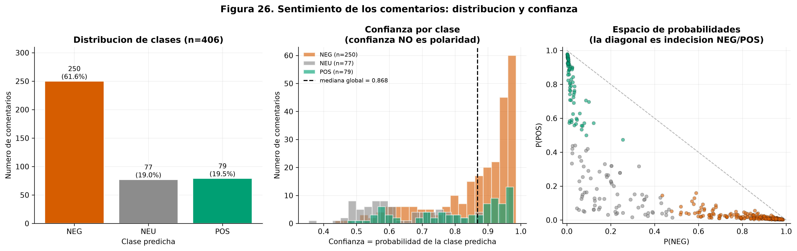

*El 61.58% de los comentarios se clasifica como negativo, 18.97% neutro y 19.46% positivo. La confianza mediana es 0.8685, y 3.94% de las predicciones tiene confianza < 0.5, casos que deben leerse como indecision del modelo y no como neutralidad del autor.*

**Tabla 67. Distribucion de clases y confianza**

| Clase | Significado | n | % | Confianza media | Confianza mediana |
|---|---|---|---|---|---|
| NEG | polaridad negativa (critica, queja, rechazo, insulto) | 250 | 61.6% | 0.8638 | 0.9148 |
| NEU | polaridad neutra (informativo, pregunta, sin carga afectiva clara) | 77 | 19.0% | 0.6285 | 0.5893 |
| POS | polaridad positiva (aprobacion, agradecimiento, elogio, apoyo) | 79 | 19.5% | 0.8083 | 0.8579 |

**61.6% de los comentarios se clasifica como negativo**, frente a 19.0% neutro y 19.5% positivo, lo que da una polaridad neta de -42.1 puntos porcentuales. La cobertura es total: los 406 comentarios recibieron prediccion (100.0%), sin fallos ni exclusiones.

La confianza mediana es 0.8685 y solo 16 predicciones (3.9%) quedan por debajo de 0,5. Es un perfil de confianza alto, aunque 40 predicciones (9.8%) tienen un margen menor a 0,2 entre la primera y la segunda clase, es decir, son casos donde el modelo esta dividido.

> **Confianza no es polaridad.** La confianza es la probabilidad de la clase mas probable, no una medida de intensidad de polaridad. Una prediccion NEG con confianza 0.95 no es 'mas negativa' que una con 0.60: es una clasificacion mas segura.


### 14.4 Comparaciones por grupo

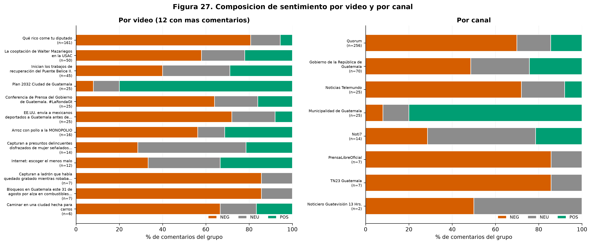

*El n de cada grupo aparece en su etiqueta: los grupos pequenos no son comparables. Restringido a canales con n>=10, la prueba chi-cuadrado da chi2=82.0701 (gl=8, p=0.0), significativa al 5%: V de Cramer = 0.3244.*

Las comparaciones formales se limitan a los grupos con n ≥ 10 y el n de cada uno aparece siempre visible. De 19 videos, 9 son comparables; de 8 canales, 5; de 12 comunidades, 5.

**Tabla 68. Pruebas de independencia entre grupo y clase de sentimiento**

| Agrupacion | Grupos incl. | n | chi-cuadrado | gl | p | V de Cramer | Signif. 5 % |
|---|---|---|---|---|---|---|---|
| Por canal | 5 | 390 | 82.0701 | 8 | 0.0 | 0.3244 | si |
| Por video | 9 | 373 | 115.2920 | 16 | 0.0 | 0.3931 | si |
| Por comunidad | 5 | 393 | 100.3471 | 8 | 0.0 | 0.3573 | si |
| Por categoria | 2 | 405 | 6.5293 | 2 | 0.03821 | 0.1270 | si |

**Tabla 69. Composicion de sentimiento por canal (n ≥ 10)**

| Canal | n | % NEG | % NEU | % POS | Polaridad neta | Mayoritaria |
|---|---|---|---|---|---|---|
| Quorum | 256 | 69.9% | 15.6% | 14.4% | -55.5 | NEG |
| Gobierno de la República de Guate… | 70 | 48.6% | 27.1% | 24.3% | -24.3 | NEG |
| Noticias Telemundo | 25 | 72.0% | 20.0% | 8.0% | -64.0 | NEG |
| Municipalidad de Guatemala | 25 | 8.0% | 12.0% | 80.0% | +72.0 | POS |
| Noti7 | 14 | 28.6% | 50.0% | 21.4% | -7.1 | NEU |

La composicion difiere entre canales de forma significativa (chi-cuadrado = 82.0701, gl = 8, p = 0.0, V de Cramer = 0.3244), y la direccion del efecto es clara: **el contraste mas fuerte del conjunto no es entre temas sino entre tipos de emisor**. La Municipalidad de Guatemala es el unico canal con mayoria de comentarios positivos (80,0 %), mientras que el periodismo de investigacion y los noticieros concentran entre 50 % y 86 % de comentarios negativos.

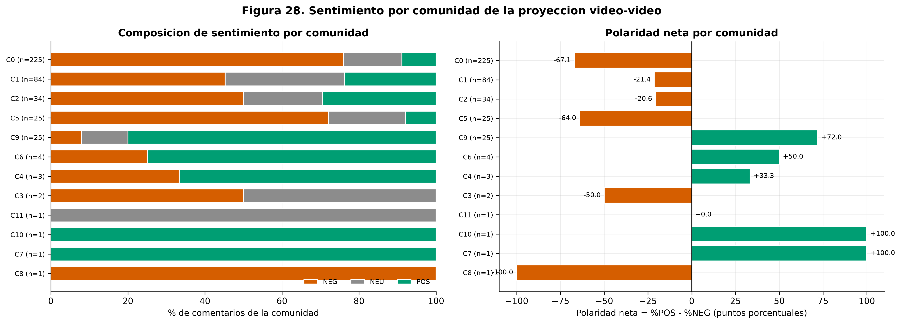

*Las comunidades difieren en polaridad neta, pero la comparacion formal solo incluye las de n>=10. Chi-cuadrado: chi2=100.3471, p=0.0. La direccion del signo es el hallazgo interpretable; su magnitud exacta depende de muestras pequenas.*

**Tabla 70. Composicion de sentimiento por comunidad**

| Comunidad | Videos | n comentarios | % NEG | % NEU | % POS | Polaridad neta | Comparable |
|---|---|---|---|---|---|---|---|
| C0 | 4 | 225 | 76.0% | 15.1% | 8.9% | -67.1 | si |
| C1 | 3 | 84 | 45.2% | 30.9% | 23.8% | -21.4 | si |
| C2 | 3 | 34 | 50.0% | 20.6% | 29.4% | -20.6 | si |
| C5 | 1 | 25 | 72.0% | 20.0% | 8.0% | -64.0 | si |
| C9 | 1 | 25 | 8.0% | 12.0% | 80.0% | +72.0 | si |
| C6 | 1 | 4 | 25.0% | 0.0% | 75.0% | +50.0 | NO |
| C4 | 1 | 3 | 33.3% | 0.0% | 66.7% | +33.3 | NO |
| C3 | 1 | 2 | 50.0% | 50.0% | 0.0% | -50.0 | NO |
| C7 | 1 | 1 | 0.0% | 0.0% | 100.0% | +100.0 | NO |
| C8 | 1 | 1 | 100.0% | 0.0% | 0.0% | -100.0 | NO |
| C10 | 1 | 1 | 0.0% | 0.0% | 100.0% | +100.0 | NO |
| C11 | 1 | 1 | 0.0% | 100.0% | 0.0% | +0.0 | NO |

Entre comunidades la diferencia tambien es significativa (chi-cuadrado = 100.3471, p = 0.0, V de Cramer = 0.3573). El orden es el descrito en la seccion 11: C0 (fiscalizacion del poder publico) es la mas negativa, C1 (comunicacion del Ejecutivo) la mas mixta, y C2 (regulacion economica) la de mayor proporcion positiva. Siete de las doce comunidades tienen n < 10 y se marcan como no comparables.


### 14.5 Sentimiento y metricas de interaccion

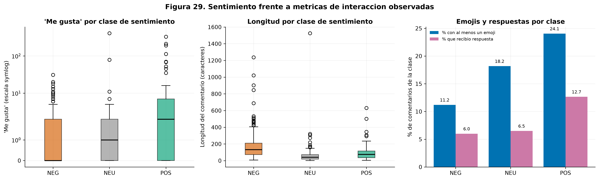

*Los comentarios negativos tienen una mediana de 0.0 'me gusta' frente a 2.0 de los positivos. Es una asociacion descriptiva sobre conteos parciales al momento de la recoleccion, no evidencia de que la negatividad genere aprobacion.*

**Tabla 71. Asociacion entre clase de sentimiento y metricas observadas**

| Clase | «Me gusta» mediana | «Me gusta» media | Longitud mediana (car.) | % con emoji |
|---|---|---|---|---|
| NEG | 0 | 1.66 | 132 | 11.2% |
| NEU | 1 | 7.40 | 41 | 18.2% |
| POS | 2 | 16.97 | 76 | 24.1% |

El patron es consistente y se cuantifico formalmente en la pregunta 7.4: los comentarios negativos son los **mas largos** (mediana 132 caracteres frente a 76 de los positivos) y los que reciben **menos aprobacion** (mediana 0 «me gusta» frente a 2), y los positivos son los que mas usan emojis (24.1% frente a 11.2%). En esta muestra la critica se argumenta mas y se premia menos.

> Esta asociacion es **descriptiva**. No permite concluir que la negatividad reduzca los «me gusta»: los conteos son parciales y tomados en un momento, los comentarios positivos podrian ser mas breves por ser formulas de apoyo faciles de aprobar, y la seleccion de videos condiciona ambos lados de la relacion.


### 14.6 Ejemplos y casos ambiguos

Los ejemplos se eligen por posicion en la distribucion de confianza (maxima, mediana y minima de cada clase), no a mano. Dos por clase:

- «Que indignante saber como se artan estos coches y finalmente el pueblo esta ciendo dañado» — predicho **NEG** con confianza 0.986
- «Me pregunto si antes de ser diputados les alcanzaba su dinero para comer esos almuercitos y en esos lugares? Pero como don pueblo paga....vengase el almuercito. La historia ni él se la cree…» — predicho **NEG** con confianza 0.915
- «Pregúntenle si se acuerda de la marca del vino que se toma todos los días» — predicho **NEU** con confianza 0.885
- «Así metan los al tambo con minifaldas allí no les ba a faltar la moronga.» — predicho **NEU** con confianza 0.589
- «Es un proyecto extraordinario , vamos adelante mi guate hermosa!» — predicho **POS** con confianza 0.978
- «Guatemala nunca se tube que llamar guatemala dino guatebella guatehermosa guatelinda la eterna primavera es guatebella abrazos hnos de un salvadoreno que viva el amor y la armonia» — predicho **POS** con confianza 0.858

Los seis comentarios de menor confianza de todo el corpus:

- «Este hombre esta loco» — predicho **NEU** con confianza 0.355
- «Ay ricos shucos en la calle jajaja» — predicho **NEG** con confianza 0.435
- «" Ayudanos a luchar contra el racismo y los malos tratos; vete de regreso a tu pais"                                               Someone.» — predicho **NEU** con confianza 0.442
- «Mantenidos» — predicho **NEU** con confianza 0.470
- «Pero hay que ver el lado bueno si los deportan por la Frontera los carteles los secuestran para sacar dinero a los familiares en USA» — predicho **NEU** con confianza 0.473
- «Despues de tanta corrpcion y desfalco por los anteriores gobiernos ladrones que esperaba Rolando? ahora si se puede ver que los fondos de nuestros impuestos se estan usando en lo que deberi…» — predicho **POS** con confianza 0.473

La inspeccion de estos casos muestra exactamente donde falla el modelo: la ironia («Ay ricos shucos en la calle jajaja» es una burla y recibe NEG con 0,435 de confianza), el sarcasmo citado entre comillas, las expresiones de una palabra sin contexto («Mantenidos») y el lexico guatemalteco ausente del corpus de entrenamiento («shucos», «tambo», «moronga»). El reporte completo del modelo, con las dieciseis limitaciones documentadas y la referencia a la model card, esta en `results/model/sentiment_model_report.md`.

> **La etiqueta del modelo es una prediccion estadistica sobre la superficie del texto. NO equivale a la intencion real del autor ni a su estado emocional.** Ademas, no se dispone de un conjunto etiquetado a mano de este dominio, por lo que **no se puede reportar exactitud ni F1 sobre estos datos**. Las cifras de esta seccion describen la distribucion de las predicciones, no su correccion.

---


## 15. Interpretacion integrada

Esta seccion cruza los tres bloques de resultados —estructura de red, contenido y sentimiento— para responder que se observo sobre la participacion y el consumo de contenido en esta muestra de YouTube. Cada afirmacion se etiqueta segun su estatus epistemico, siguiendo la distincion que el inciso 10.3 exige.


### 15.1 Hallazgo 1: consumo paralelo, no conversacion

**Descripcion.** El 93.2% de los nodos de la red bipartita tiene grado 1. 286 de 332 autores (86.1%) publicaron un unico comentario y solo 9 (2.7%) comentaron en mas de un video. La asortatividad de grado es -0.428 y la transitividad es 0 por construccion; el clustering bipartito de Latapy es 0.892. Solo 30 comentarios (7.4%) recibieron alguna respuesta.

**Que significa en esta muestra.** La estructura observada es la de audiencias paralelas: videos-hub rodeados de comentaristas que aparecen una sola vez y no vuelven. El acto tipico no es participar en una discusion sino dejar una opinion y salir. Es coherente con el analisis de contenido: la caida abrupta de frecuencias entre palabras, bigramas y trigramas indica redacciones individuales sin consignas repetidas ni coordinacion.

**Que no puede concluirse.** No puede concluirse que los usuarios de YouTube no conversen. Los datos contienen **solo comentarios principales**: las respuestas existen (se sabe que hubo 51) pero no estan en el conjunto, y sin ellas cualquier medida de conversacion esta truncada por construccion. Tampoco puede concluirse que un autor «solo comento una vez»: comento una vez *en los videos recolectados*.


### 15.2 Hallazgo 2: la concentracion es de atencion, no de voz

**Descripcion.** Gini de 0.6596 por video y 0.6644 por canal, frente a un Gini de solo 0.1643 por autor. Los tres videos mas comentados acumulan 63.0% de los comentarios y el canal lider 63.0%; el autor mas activo, 1.5%.

**Que significa.** Unos pocos contenidos capturan casi toda la participacion, pero dentro de ellos la palabra se reparte entre cientos de personas distintas. No hay un grupo reducido de usuarios dominando la conversacion —el escenario que suele preocupar en analisis de redes sociales— sino un grupo reducido de videos que concentra la atencion. Es una asimetria de agenda, no de voz.

**Que no puede concluirse.** Parte de esta concentracion es artefacto del muestreo: el canal lider fue objeto de un barrido especifico (`@quorumgt/videos`, que aporta 231 de 406 comentarios), lo que garantiza su peso independientemente de su volumen real de conversacion.


### 15.3 Hallazgo 3: la audiencia compartida es minima y fragil

**Descripcion.** La proyeccion video-video tiene 11 aristas de 171 posibles (densidad 0.0643), con pesos de 1 o 2, y 9 de 19 videos aislados. κ global es 0 en las tres redes y κ en la componente mayor es 1. De 332 autores, 7 son puentes verificados por prueba de eliminacion y solo 9 (2.7%) tienen betweenness positiva.

**Que significa.** Los contenidos de esta muestra tienen publicos casi disjuntos, y las conexiones que existen las sostienen individuos concretos, no una malla redundante. La asimetria entre κ por nodos (1) y por aristas (5) en la proyeccion de autores lo resume: hay que cortar cinco vinculos para partirla, pero basta retirar a una persona.

**Que no puede concluirse.** Ninguna de estas cifras describe aislamiento real en YouTube. Con comentarios recolectados en solo 19 de 293 videos, la probabilidad de **detectar** solapamiento es estructuralmente baja. El caso ilustrativo es «Plan 2032 Ciudad de Guatemala»: 304 089 visualizaciones, el video mas visto del corpus, y grado 0 en la proyeccion. Su aislamiento es un dato sobre la cobertura del muestreo, no sobre su publico.


### 15.4 Hallazgo 4: la estructura de audiencia coincide con la estructura tematica

**Descripcion.** Louvain sobre la proyeccion video-video devuelve 12 comunidades (Q ponderada = 0.4053), de las cuales 3 son no triviales. La particion coincide exactamente con la de greedy modularity (NMI = 1,0). Las tres comunidades tienen terminos TF-IDF de comentarios y keywords de contenido publicado que convergen en el mismo campo semantico, y difieren en composicion de sentimiento de forma significativa (chi-cuadrado = 100.3471, p = 0.0, V de Cramer = 0.3573).

**Que significa.** Las comunidades detectadas por **audiencia compartida** resultan interpretables por **tema** y por **polaridad**, aunque ni el tema ni la polaridad entraron en el algoritmo: Louvain solo vio numeros de autores compartidos. Que tres senales independientes converjan es lo que autoriza a poner una etiqueta tematica a cada comunidad. Y el eje que las ordena es reconocible: la relacion del comentarista con el poder institucional, de la fiscalizacion (C0, la mas negativa) a la comunicacion gubernamental (C1, mixta) y a la regulacion economica (C2, la mas positiva).

**Que no puede concluirse.** La modularidad de 0.4053 no debe leerse como evidencia de estructura comunitaria fuerte: en un grafo de 11 aristas y 10 componentes, un valor asi se obtiene con facilidad. Ademas 9 de las 12 comunidades son singletons, de modo que la particion cubre solo el 52.6% de los videos. La correspondencia con la consulta de recoleccion, medida con ARI corregido por azar, es baja (0,083), lo que descarta que las comunidades sean una relectura del muestreo, pero el muestreo si determina que agrupamientos pueden llegar a observarse.


### 15.5 Hallazgo 5: la critica se argumenta mas y se premia menos

**Descripcion.** 61.6% de los comentarios se clasifica como negativo (polaridad neta -42.1 p. p.). Los negativos tienen la longitud mediana mas alta (132 caracteres frente a 76 de los positivos; Kruskal-Wallis p < 0,001) y la mediana de «me gusta» mas baja (0 frente a 2; p ≈ 1e-06). Los positivos usan emojis con el doble de frecuencia (24.1% frente a 11.2%).

**Que significa.** Hay dos registros distintos de participacion en la misma muestra: uno critico, extenso y argumentado, y otro de apoyo, breve y con emojis. El primero es mayoritario en volumen y el segundo en aprobacion recibida por comentario. El contraste mas fuerte no se da entre temas sino entre **tipos de emisor**: el unico canal con mayoria de comentarios positivos es una institucion municipal presentando un plan urbano, mientras que el periodismo de investigacion y los noticieros concentran la critica.

**Que no puede concluirse.** Nada causal. No se puede afirmar que la negatividad reduzca los «me gusta»: los conteos son parciales y de un momento dado, y los comentarios de apoyo podrian ser breves precisamente por ser formulas faciles de aprobar. Tampoco se puede afirmar que el publico guatemalteco sea mayoritariamente critico: el corpus esta dominado por videos de politica y de sucesos recuperados por consultas como `guatemala politica` y `guatemala seguridad`, que atraen ese registro por construccion. Y las etiquetas son predicciones de un modelo, no la intencion de los autores.


### 15.6 Hallazgo 6: la visibilidad ordena la participacion pero no la determina

**Descripcion.** Entre los 19 videos con comentarios recolectados, rho de Spearman entre visualizaciones y comentarios observados es 0.8115 (p = 2e-05). Pero el video mas visto (304 089 vistas) tiene 25 comentarios observados y grado 0 en la red, mientras que el mas comentado (161 comentarios, 11 775 vistas) es el nodo mas central. La correlacion entre visualizaciones y grado en la proyeccion no es significativa (rho = 0,289, p = 0,231), mientras que la de comentarios observados con grado si (rho = 0,678, p = 0,001).

**Que significa.** La visibilidad y la participacion se ordenan de forma parecida, pero el **papel estructural** de un video en la red de audiencia compartida depende de la participacion recolectada y no de su alcance. Ser muy visto no convierte a un video en punto de encuentro de publicos distintos.

**Que no puede concluirse.** Ni causalidad ni generalizacion. La direccion causal es ambigua en ambos sentidos (mas vistas dan mas oportunidades de comentar, pero mas discusion tambien atrae mas recomendaciones del algoritmo). El eje de comentarios mide cobertura de recoleccion tanto como participacion. Y las visualizaciones son un corte temporal: dos videos publicados en fechas distintas no son comparables sin ajustar por antiguedad, correccion imposible con fechas relativas. Ademas los videos observados no son los mas vistos del catalogo (Mann-Whitney p = 0.20265), asi que la relacion se estima sobre un subconjunto no elegido por popularidad.

---


## 16. Limitaciones

Las limitaciones se ordenan por su capacidad de invalidar conclusiones, de mayor a menor, y cada una indica **que afirmacion concreta de este informe restringe**.


### 16.1 Cobertura incompleta de comentarios

Solo 19 de 293 videos (6.5%) tienen comentarios en el conjunto, y no hay garantia de que se hayan recolectado todos los comentarios de esos 19. **Restringe:** toda cifra de volumen de participacion, la densidad y la fragmentacion de las redes, el numero de componentes, la identidad de los puentes y los articuladores, y la existencia de videos aislados. Es la limitacion dominante del trabajo.


### 16.2 Seleccion de videos por consultas de busqueda

El catalogo se construyo con 21 consultas que mezclan busquedas tematicas (`guatemala lluvias`, `guatemala noticias`), canales oficiales de gobierno y barridos de canales especificos. En los comentarios solo sobreviven 6 consultas y una sola (`@quorumgt/videos`) aporta 231 de 406 comentarios (56.9%). **Restringe:** la composicion tematica observada, el predominio de News & Politics, la identidad de las comunidades y la distribucion global de sentimiento. Un corpus construido con consultas sobre deporte o musica daria un retrato distinto.


### 16.3 Fechas relativas y sin resolucion

`published_text` (comentarios) y `published_time` (videos) son tiempos relativos al momento de recoleccion («hace 2 años»), redondeados por YouTube. No hay ninguna fecha absoluta de comentario en el conjunto. **Restringe:** cualquier analisis temporal, de evolucion o de causalidad temporal; la comparacion de acumulados entre videos de distinta antiguedad; y la posibilidad de normalizar visualizaciones o «me gusta» por tiempo de exposicion.


### 16.4 Conteos observados en el momento de la recoleccion

`view_count`, `like_count_text` y `reply_count` son cortes temporales, no totales finales. Un video de hace dos años y uno de hace dos dias no son comparables sin normalizar, y esa normalizacion es imposible por la limitacion anterior. **Restringe:** la comparacion de popularidad entre videos, la correlacion entre visualizaciones y participacion, y la asociacion entre sentimiento y «me gusta».


### 16.5 Ausencia de relaciones explicitas entre autores

El conjunto contiene unicamente comentarios principales: reply_count indica que hubo 51 respuestas en total, pero ninguna de ellas esta en los datos ni se sabe quien las escribio. `reply_count` indica el volumen de respuestas pero no su autoria, de modo que **no existe ninguna relacion autor-autor observable en los datos**. **Restringe:** toda la interpretacion de la red. Las aristas son de co-participacion, no de interaccion. No se puede reconstruir ningun hilo, medir reciprocidad, detectar discusiones ni identificar influencia. Es la limitacion que fija el marco conceptual de todo el laboratorio.


### 16.6 Solo comentarios principales

Los 51 comentarios de respuesta que se sabe que existen no estan en el conjunto. **Restringe:** cualquier medida de conversacion, de profundidad de hilo o de participacion sostenida. Un usuario que respondio activamente a otros aparece en estos datos como si no hubiera participado.


### 16.7 Concentracion de comentarios en muy pocos videos

Dos videos concentran la mitad de los comentarios y el video lider el 39.7%. **Restringe:** la estabilidad de todos los agregados globales, que estan dominados por unos pocos hilos. La distribucion global de sentimiento, por ejemplo, esta determinada en un 40 % por un unico video sobre gastos de diputados. Por eso todas las comparaciones de esta seccion se hacen por grupo y con el n visible, en lugar de confiar en el promedio global.


### 16.8 Limites del sentimiento automatico

El modelo se entreno con tweets de 2020 (TASS) y se aplica a comentarios de YouTube de Guatemala: hay salto de dominio, de plataforma y de variedad dialectal. Falla sistematicamente en ironia, sarcasmo, slang guatemalteco («shucos», «tambo», «moronga»), ortografia no normativa y comentarios muy cortos; 40 predicciones (9.8%) tienen margen menor a 0,2 entre las dos clases principales. **No existe un conjunto etiquetado a mano de este dominio, por lo que no se puede reportar exactitud ni F1.** **Restringe:** toda interpretacion de polaridad. Las cifras describen lo que el modelo predijo, no lo que los autores quisieron decir. El detalle completo, con dieciseis limitaciones documentadas, esta en `results/model/sentiment_model_report.md`.


### 16.9 Posible sesgo por seleccion de videos y canales

Los canales presentes en los comentarios son 8 de 97 (8.2%) y estan sesgados hacia periodismo de investigacion, noticieros y comunicacion institucional. **Restringe:** la comparacion de sentimiento entre tipos de emisor, que se estima sobre ocho canales y podria invertirse con otra seleccion.


### 16.10 Los datos no representan a los usuarios de YouTube

Los 332 autores son quienes **comentaron** y cuyos comentarios **fueron recolectados**. Quien ve videos sin comentar —la inmensa mayoria— no aparece. Los comentaristas son un grupo autoseleccionado que no es representativo ni de la audiencia de esos videos. **Restringe:** cualquier afirmacion sobre «los usuarios de YouTube» o «la audiencia».


### 16.11 Los datos no representan a la poblacion de Guatemala

No hay marco muestral, ni ponderaciones, ni informacion demografica, ni verificacion de que los autores esten en Guatemala. La muestra es de conveniencia. **Restringe:** toda inferencia poblacional. Frases como «los guatemaltecos opinan…» no tienen sustento en estos datos y no aparecen en este informe.


### 16.12 Descripcion, asociacion e inferencia

**Tabla 72. Los tres niveles de afirmacion y como se usan en este informe**

| Nivel | Formulacion | Ejemplo de este informe | Que autoriza |
|---|---|---|---|
| **Descripcion** | «En los datos observados…» | «El 61,6 % de los comentarios se clasifico como negativo.» | Afirmar el hecho sobre la muestra. Es el nivel de la mayoria de este informe. |
| **Asociacion** | «Se observa una relacion / correlacion…» | «Visualizaciones y comentarios observados correlacionan con rho = 0,81 (p = 2e-05).» | Afirmar que dos cantidades covarian en la muestra. **No** autoriza a hablar de efecto, causa ni mecanismo. |
| **Inferencia** | «No puede inferirse…» | «No puede inferirse que la negatividad reduzca los «me gusta», ni que estos resultados describan a la poblacion de Guatemala.» | Nada, en este trabajo. No hay diseno muestral que sostenga inferencia poblacional ni diseno experimental que sostenga inferencia causal. |

> La consecuencia practica es que **todas las conclusiones de este informe son descriptivas o asociativas y estan acotadas a los 406 comentarios recolectados de 19 videos**. Cuando aparece una relacion entre variables se reporta su magnitud, su valor p y su n, y se declara explicitamente que no implica causalidad.

---


## 17. Conclusiones

Las conclusiones integran los tres bloques del analisis en lugar de resumirlos por separado, porque el resultado principal solo aparece al cruzarlos.


### 17.1 Conclusion integrada

**Lo que estos datos describen no es una red social sino un patron de consumo de contenido con opinion adjunta.** Las tres fuentes de evidencia convergen en ese punto. La *estructura* muestra estrellas casi disjuntas: 93.2% de los nodos con grado 1, asortatividad -0.428, κ = 1 en la componente mayor y 11 aristas entre 19 videos. El *contenido* muestra redacciones individuales sin coordinacion: el trigrama mas frecuente aparece 3 veces en 406 comentarios. Y el *sentimiento* muestra opinion evaluativa densa —61.6% de critica— pero dirigida al contenido y a sus protagonistas, no a otros comentaristas: no hay interpelacion mutua porque casi nadie coincide dos veces con nadie.

El mecanismo que articula las tres observaciones es la **falta de reincidencia**. Solo 9 de 332 autores (2.7%) comentaron en mas de un video. Ese unico numero explica por que la red esta fragmentada en 10 componentes, por que la audiencia compartida es minima, por que basta retirar a una persona para partir la componente principal, y por que solo 7 personas califican como puentes. La topologia no es una propiedad emergente compleja: es la consecuencia directa de que comentar en YouTube sea, en esta muestra, un acto puntual.


### 17.2 Lo que si permite afirmar el analisis

- **La concentracion observada es de atencion, no de voz.** Gini de 0.6596 por video y 0.6644 por canal frente a solo 0.1643 por autor. Pocos contenidos capturan casi toda la participacion; dentro de ellos, cientos de personas hablan una sola vez.
- **La red de co-participacion es real pero tenue y fragil.** 11 conexiones entre videos, pesos de 1 o 2, 9 videos aislados, κ global 0 y κ = 1 en la componente mayor. Las conexiones las sostienen 7 personas verificadas por prueba de eliminacion, no una malla redundante.
- **La estructura de audiencia coincide con la estructura tematica sin haberla usado.** Louvain vio solo numeros de autores compartidos y devolvio 3 comunidades cuyos terminos TF-IDF, keywords del emisor y distribucion de sentimiento convergen en tres campos distintos, ordenados por la relacion del comentarista con el poder institucional.
- **El sentimiento distingue tipos de emisor mas que temas.** Diferencia significativa entre canales (V de Cramer = 0.3244): el unico canal con mayoria positiva es una institucion municipal presentando un plan urbano; el periodismo de investigacion y los noticieros concentran la critica.
- **Existen dos registros de participacion.** Los comentarios negativos son mas largos (132 vs 76 caracteres de mediana) y reciben menos aprobacion (0 vs 2 «me gusta»); los positivos usan el doble de emojis.
- **La visibilidad ordena la participacion pero no el papel estructural.** rho = 0.8115 entre vistas y comentarios observados, pero el video mas visto del corpus (304 089 vistas) tiene grado 0 en la red de audiencia compartida.


### 17.3 Lo que el analisis no permite afirmar

- **Nada sobre interaccion entre usuarios.** Los datos no identifican quien respondio a quien. Toda arista es co-participacion.
- **Nada sobre aislamiento real.** Un video sin audiencia compartida en estos datos puede tenerla en YouTube; con comentarios en solo 6.5% de los videos, la no-deteccion es el resultado esperado.
- **Nada causal.** Ni entre visibilidad y participacion, ni entre sentimiento y aprobacion, ni entre tema y polaridad. No hay diseno que lo sostenga.
- **Nada poblacional.** Ni sobre los usuarios de YouTube, ni sobre la audiencia de estos videos, ni sobre la poblacion de Guatemala. La muestra es de conveniencia, sin marco muestral ni informacion demografica.
- **Nada sobre la intencion de los autores.** Las etiquetas de sentimiento son predicciones de un modelo entrenado en otro corpus, sin acceso al video, al hilo ni al contexto cultural.
- **Nada temporal.** Sin fechas absolutas de comentario no hay evolucion, tendencia ni normalizacion por antiguedad.


### 17.4 Que haria falta para ir mas alla

- **Comentarios de respuesta con su autoria** (`parentId` y `authorChannelId` de la API de YouTube). Es el unico dato que convertiria una red de co-participacion en una red de interaccion, y sin el ninguna cantidad de comentarios principales alcanza.
- **Cobertura completa de comentarios en un subconjunto de videos**, incluso si es pequeno. Es preferible el censo de comentarios de 20 videos a una muestra parcial de 200: solo asi el aislamiento observado seria interpretable.
- **Marcas temporales absolutas** (`publishedAt` de la API) para normalizar acumulados por antiguedad y estudiar evolucion.
- **Un conjunto de validacion etiquetado a mano** de unos 300 comentarios de este dominio, para reportar exactitud y F1 del clasificador de sentimiento en lugar de describir solo su distribucion de salida.
- **Un diseno de muestreo declarado** (probabilistico o al menos documentado en sus criterios de inclusion) que permitiera acotar el sesgo de seleccion en lugar de solo diagnosticarlo.

---


## 18. Reproducibilidad


### 18.1 Como reproducir el analisis completo

Todo el analisis se reconstruye desde cero con un unico comando desde la raiz del proyecto:

```bash
git clone <repositorio> && cd cc3084-lab6-youtube
uv sync
uv run python -m spacy download es_core_news_sm
uv run python -m src.run_all
```

Alternativamente, `./scripts/run_analysis.sh` encapsula los mismos pasos, incluida la descarga de los recursos de NLTK y del modelo de spaCy, y verifica el resultado. El pipeline ejecuta en orden: validacion de los datos, limpieza y preprocesamiento, analisis exploratorio, construccion de las redes, calculo de metricas topologicas, deteccion de comunidades, centralidades y articulaciones, analisis de sentimiento, generacion de todas las tablas y figuras, y produccion de este informe en Markdown y PDF. Al terminar valida que existan todos los entregables obligatorios y devuelve codigo de salida distinto de cero si falta alguno.


### 18.2 Semillas y determinismo

**Tabla 73. Fuentes de aleatoriedad y su control**

| Componente | Semilla / configuracion | Efecto |
|---|---|---|
| Global (`random`, `numpy`, `PYTHONHASHSEED`) | 42 | Fijada en `src/config.py::set_seeds`, invocada al inicio de cada etapa |
| Louvain | `seed=42`, `resolution=1.0` | El resultado de Louvain depende del orden de recorrido; con semilla fija la particion es identica entre corridas |
| Betweenness | `seed=42` | networkx acepta semilla para el muestreo de pivotes; aqui se calcula exacto |
| Label propagation (control de robustez) | `seed=42` | Comparacion reproducible |
| Trazado de las redes | `spring_layout(seed=42)` y trazados deterministas | Las figuras de red son identicas entre corridas. Los trazados de las dos proyecciones son construcciones deterministas propias (ver secciones 9.4 y 10) |
| Nube de palabras | `random_state=42` | Imagen identica entre corridas |
| Inferencia de sentimiento | `torch.manual_seed(42)`, `model.eval()` | La inferencia es determinista por naturaleza (sin dropout ni muestreo); la semilla se fija de todos modos |
| TF-IDF | sin aleatoriedad | Determinista |


### 18.3 Entorno y versiones

**Tabla 74. Entorno de ejecucion**

| Componente | Version / valor |
|---|---|
| Python | 3.13.14 |
| Plataforma | Linux 6.18.33.2-microsoft-standard-WSL2 (x86_64) |
| Gestor de dependencias | uv (pyproject.toml + uv.lock) |
| pandas / numpy / scipy | 3.0.5 / 2.5.3 / 1.18.1 |
| networkx | 3.6.1 |
| scikit-learn | 1.9.0 |
| matplotlib | 3.11.1 |
| spaCy + modelo | 3.8.16 + es_core_news_sm 3.8.0 |
| NLTK | 3.10.3 |
| transformers / torch | 5.16.1 / 2.14.0+cu130 |
| reportlab (generacion del PDF) | 5.0.1 |
| Modelo de sentimiento | pysentimiento/robertuito-sentiment-analysis |
| Dispositivo de inferencia | cpu |


### 18.4 Integridad de los datos de entrada

Los archivos de `data/raw/` son inmutables durante el analisis y se versionan sin conversion de fin de linea (via `.gitattributes`) para que sus sumas MD5 sigan coincidiendo tras clonar en cualquier sistema operativo: `d338be279d181215295037b0c938862b` (youtube_videos.csv) y `c45c1dcc72e33971106845e6a9674b9e` (youtube_comments.csv). El pipeline recalcula y registra ambas sumas en cada corrida.


### 18.5 Inventario de salidas

**Tabla 75. Salidas generadas por el pipeline**

| Ubicacion | Contenido | Cantidad |
|---|---|---|
| `results/figures/` | Figuras en PNG a 300 dpi | 29 archivos |
| `results/tables/` | Tablas completas en CSV | 36 archivos |
| `results/networks/` | Tablas de nodos y aristas + GraphML | 10 archivos |
| `results/metrics/` | Bloques de metricas en JSON que alimentan el informe | 19 archivos |
| `results/model/` | Reporte y metadatos del modelo de sentimiento | 2 archivos |
| `data/processed/` | Datos limpios y conjunto integrado | 3 archivos |
| `report/` | Informe en Markdown y en PDF | 2 archivos |
| `docs/` | Enunciado, metodologia, checklist de rubrica y de entrega | 4 archivos |


### 18.6 Trazabilidad de las cifras del informe

Ninguna cifra de este documento esta escrita a mano. El informe se genera a partir de los 19 bloques de metricas de `results/metrics/*.json` y de las tablas de `results/tables/*.csv`, que a su vez producen los scripts de analisis. Los pies de figura tambien se calculan en el momento de generar cada grafico y se persisten en `results/figures/_captions.jsonl`. La consecuencia practica es que si cambiaran los datos de entrada, el texto del informe cambiaria con ellos y no podria quedar inconsistente con los resultados.


### 18.7 Validaciones automaticas

El proyecto incluye una bateria de pruebas (`uv run pytest`) que valida los puntos criticos sobre los resultados **calculados**, no sobre valores fijados a mano: dimensiones de los dos archivos, unicidad de las llaves primarias, ausencia de identificadores vacios, integridad del join, comportamiento del parser numerico caso por caso, que la suma de pesos de la red bipartita sea igual al numero de comentarios, que exista una sola arista por par autor-video, que todos los extremos de las aristas existan en la tabla de nodos, que los pesos de las dos proyecciones coincidan con un recalculo independiente por interseccion de conjuntos, que `reply_count` no se haya usado para crear aristas, que ninguna metrica sea NaN sin explicacion, que cada comentario tenga salida de sentimiento y que existan todos los archivos obligatorios.

Ademas, el propio pipeline aborta con `AssertionError` si alguna de las nueve invariantes de la red bipartita o alguna de las verificaciones de pesos de proyeccion falla, de modo que no es posible generar el informe sobre una red mal construida.


## Referencias

- Blondel, V. D., Guillaume, J.-L., Lambiotte, R. y Lefebvre, E. (2008). *Fast unfolding of communities in large networks*. Journal of Statistical Mechanics: Theory and Experiment, 2008(10), P10008.
- Clauset, A., Newman, M. E. J. y Moore, C. (2004). *Finding community structure in very large networks*. Physical Review E, 70(6), 066111.
- Freeman, L. C. (1977). *A set of measures of centrality based on betweenness*. Sociometry, 40(1), 35-41.
- Hagberg, A., Schult, D. y Swart, P. (2008). *Exploring network structure, dynamics, and function using NetworkX*. Proceedings of the 7th Python in Science Conference (SciPy2008), 11-15. Documentacion: <https://networkx.org/documentation/stable/>
- Latapy, M., Magnien, C. y Del Vecchio, N. (2008). *Basic notions for the analysis of large two-mode networks*. Social Networks, 30(1), 31-48.
- Menger, K. (1927). *Zur allgemeinen Kurventheorie*. Fundamenta Mathematicae, 10, 96-115. (Teorema que relaciona conectividad por nodos y caminos disjuntos.)
- Newman, M. E. J. (2003). *Mixing patterns in networks*. Physical Review E, 67(2), 026126. (Asortatividad de grado.)
- Newman, M. E. J. (2004). *Analysis of weighted networks*. Physical Review E, 70(5), 056131.
- Newman, M. E. J. y Girvan, M. (2004). *Finding and evaluating community structure in networks*. Physical Review E, 69(2), 026113. (Modularidad.)
- Perez, J. M., Furman, D. A., Alonso Alemany, L. y Luque, F. (2022). *RoBERTuito: a pre-trained language model for social media text in Spanish*. Proceedings of LREC 2022, 7235-7243. <https://aclanthology.org/2022.lrec-1.785/>
- Perez, J. M., Giudici, J. C. y Luque, F. (2021). *pysentimiento: A Python Toolkit for Sentiment Analysis and SocialNLP tasks*. <https://arxiv.org/abs/2106.09462>
- Model card del modelo utilizado: `pysentimiento/robertuito-sentiment-analysis`. <https://huggingface.co/pysentimiento/robertuito-sentiment-analysis>
- TASS: Taller de Analisis Semantico de la SEPLN. Corpus de afinado del modelo de sentimiento (TASS 2020, Task 1). <http://tass.sepln.org/>
- Wasserman, S. y Faust, K. (1994). *Social Network Analysis: Methods and Applications*. Cambridge University Press. (Correccion de closeness en grafos desconectados; nociones de cohesion.)
- Honnibal, M. y Montani, I. (2017). *spaCy 2: Natural language understanding with Bloom embeddings, convolutional neural networks and incremental parsing*. Modelo `es_core_news_sm`. <https://spacy.io/models/es>
- Bird, S., Klein, E. y Loper, E. (2009). *Natural Language Processing with Python*. O'Reilly. (Lista de stopwords de espanol de NLTK.)
- Universidad del Valle de Guatemala, Departamento de Ciencias de la Computacion. *CC3084 Data Science. Laboratorio 6: Analisis de redes sociales*. Semestre II, 2026. (Enunciado en `docs/`.)


## Apendice A. Trazabilidad con los incisos del enunciado

Correspondencia entre cada inciso del enunciado del laboratorio y la seccion de este informe donde se resuelve. La auditoria completa contra la rubrica, con evidencia y estado por requisito, esta en `docs/rubric_checklist.md`.

**Tabla A1. Inciso del enunciado y seccion del informe**

| Inciso del enunciado | Seccion de este informe |
|---|---|
| 1.1-1.4 Carga, comprension e integracion | 1, 2, 3 |
| 2.1 Diagnostico inicial de calidad | 4.1 |
| 2.2 Variables problematicas | 4.2 |
| 2.3 Normalizacion de IDs y nombres | 4.3 |
| 2.4 Conversion de conteos en texto | 4.4 |
| 2.5 texto_original y texto_limpio | 4.5 |
| 2.6 Decisiones de limpieza documentadas | 4.5.1 |
| 2.7 Efecto cuantificado de la limpieza | 4.6 |
| 3.1 Descriptivos minimos | 5.1 |
| 3.2 Concentracion de la participacion | 5.2 |
| 3.3 Popularidad frente a participacion | 5.3 |
| 3.4 Visualizaciones pertinentes | 5 (figuras 1-14), 11, 13, 14 |
| 3.5 Seis preguntas obligatorias | 6.1-6.6 |
| 3.6 Tres o mas preguntas adicionales | 7.1-7.5 (cinco preguntas) |
| 4.1-4.2 Red bipartita y definicion del peso | 8.1 |
| 4.3 Tablas de nodos y aristas | 8.4 |
| 4.4 Visualizacion de la red completa | 8.5 |
| 4.5 Significado preciso de la arista | 8.2 |
| 5.1 Proyeccion autor-autor | 9.1-9.2 |
| 5.2 Proyeccion video-video | 9.1-9.2 |
| 5.3 Comparacion de las proyecciones | 9.3 |
| 5.4 Visualizacion de ambas proyecciones | 9.4 |
| 6.1 Nodos, aristas, densidad, grados, componentes | 10.1, 10.3, 10.4 |
| 6.2 Cohesion y transitividad | 10.1, 10.2 |
| 6.3 Perifericos y aislados; aislamiento observado vs ausencia de datos | 10.4 |
| 6.4 Explicacion de los hallazgos estructurales | 10.5 |
| 7.1 Eleccion de la red y justificacion | 11.1 |
| 7.2 Algoritmo, supuestos y pesos | 11.2 |
| 7.3 Numero, tamanos y modularidad | 11.3 |
| 7.4 Visualizacion de todas las comunidades y analisis de tres | 11.4-11.5 |
| 7.5 Caracterizacion por videos, canales, autores, temas y sentimiento | 11.5, 13.2, 14.4 |
| 8.1 Medidas de centralidad y justificacion | 12.1 |
| 8.2 Interpretacion separada de autores y videos | 12.2, 12.4 |
| 8.3 Recurrentes, puentes y videos articuladores | 12.3, 12.5 |
| 9.1 Sentimiento en espanol y justificacion del modelo | 14.1-14.3 |
| 9.2 Comparacion por video, canal, tema o comunidad | 14.4 |
| 9.3 Explicacion de los hallazgos | 14.5-14.6, 15.5 |
| 10.1 Hallazgos en contexto de participacion y consumo | 15 |
| 10.2 Limitaciones minimas exigidas | 16.1-16.11 |
| 10.3 Descripcion, asociacion e inferencia | 16.12 |
| 10.4 Conclusiones integradas | 17 |

---


## Apendice B. Inventario de figuras

**Tabla B1. Figuras generadas, con su archivo y su interpretacion**

| Archivo | Interpretacion (generada por el pipeline) |
|---|---|
| 01_missing_values.png | Solo 4 variables de videos tienen faltantes (<9%). En comentarios, viewer_rating esta vacia al 100% y like_count_text aparece en blanco en 189 registros (46.6%), que se interpretan como 0 me gusta. |
| 02_comments_by_video.png | Los 19 videos con comentarios recolectados concentran los 406 comentarios. El video mas comentado acumula 161 comentarios (39.7% del total). La cercania entre barras indica que casi cada comentario proviene de un autor distinto. |
| 03_comments_by_channel.png | Solo 8 de 97 canales del catalogo tienen comentarios recolectados. El canal lider aporta 256 comentarios (63.1%) distribuidos en 11 videos. |
| 04_category_distribution.png | El catalogo esta dominado por News & Politics (138/293 = 47.1%), pero los comentarios observados lo estan aun mas: la cobertura de comentarios no es proporcional al catalogo, es un submuestreo sesgado hacia unos pocos canales. |
| 05_source_queries.png | Las 21 consultas del catalogo se reducen a 6 en los comentarios. La consulta '@quorumgt/videos' aporta 231 comentarios (56.9%): la cobertura de comentarios responde al procedimiento de recoleccion, no a la popularidad del contenido. |
| 05_top_hashtags.png | Los hashtags viven en el contenido publicado por los canales (588 usos) y practicamente no en los comentarios (1 usos en 1 hashtags unicos sobre 406 comentarios). El etiquetado tematico es una practica del emisor, no de la audiencia en esta muestra. |
| 06_top_words.png | Vocabulario politico-institucional: el termino mas frecuente aparece 56 veces en 10.3% de los comentarios. Ningun termino domina, lo que indica una conversacion tematicamente dispersa dentro de un mismo marco de referencia. |
| 07_top_bigrams.png | El bigrama mas frecuente ('bernardo arevalo') aparece 10 veces. Las frecuencias bajas de los bigramas confirman que no existen consignas repetidas ni copy-paste masivo: los comentarios son redacciones individuales. |
| 08_views_distribution.png | Cola derecha pesada: mediana 1,175 vistas frente a un maximo de 8,190,449 (ratio 6970x). La mediana de los videos con comentarios recolectados (1,954) frente a los que no los tienen (1,149) no difiere de forma significativa (Mann-Whitney U=2147.5, p=0.20265): la muestra de comentarios no es simplemente 'los videos mas vistos'. |
| 09_views_vs_comments.png | Con n=19 videos, la correlacion de rangos entre visualizaciones y comentarios observados es rho=0.8115 (p=2e-05), significativa al 5%: una asociacion monotona fuerte y positiva. Aun asi el video mas visto (304,089 vistas) no es el mas comentado (161 comentarios con 11,775 vistas). Ambos ejes son conteos parciales y la asociacion no implica causalidad. |
| 10_participation_concentration.png | La participacion esta muy concentrada por video (Gini=0.6596) y por canal (Gini=0.6644), pero muy repartida por autor (Gini=0.1643): pocos videos reciben casi todo, y casi cada comentario proviene de una persona distinta. |
| 11_wordcloud.png | Figura complementaria. No sustituye a los rankings cuantitativos de las figuras 7 y 8: el tamano de la nube no es comparable entre terminos con precision y no permite leer frecuencias. |
| 12_engagement_distributions.png | El 46.6% de los comentarios no muestra 'me gusta' y solo 30 recibieron respuesta. 286 de 332 autores (86.1%) comentaron una unica vez: la participacion es mayoritariamente puntual, no conversacional. |
| 13_degree_distribution_bipartite.png | Distribucion muy asimetrica: mediana 1 frente a maximo 3, y 99.4% de los nodos con grado <= 2. La conectividad no esta repartida: se concentra en unos pocos nodos. |
| 13_videos_per_channel.png | 65 de 97 canales aportan un unico video. El catalogo se construyo mezclando busquedas por tema con barridos de canales especificos, lo que produce esta mezcla de canales muy representados y canales con un solo video. |
| 14_bipartite_network.png | Red completa: no se elimino ningun nodo ni arista. La estructura dominante es de estrellas casi disjuntas (un video rodeado de autores de grado 1) unidas por unos pocos autores que comentaron en mas de un video. Una arista significa unicamente que el autor publico comentarios observados en ese video: no es amistad, respuesta, conversacion ni aprobacion. |
| 15_bipartite_core_zoom.png | Vista ampliada COMPLEMENTARIA de la figura 15 (no la sustituye). Estos 9 autores son el unico mecanismo por el que los videos de la muestra quedan conectados entre si: el resto de autores tiene grado 1 y no aporta conexion entre contenidos. |
| 16_author_projection.png | Red completa. Los 10732 vinculos forman una clique por cada video observado: cada bloque denso es la audiencia de un video, no un grupo de amigos. Los 9 autores resaltados son los unicos que pertenecen a mas de un bloque y por tanto los unicos que pueden unir audiencias distintas. |
| 17_video_projection.png | Red completa, incluidos los 9 videos aislados. El numero sobre cada arista es el numero de autores compartidos. Los pesos son 1 o 2: la audiencia comun entre videos es minima. Un video aislado lo esta EN LA MUESTRA, no necesariamente en YouTube. |
| 18_degree_distribution_authors.png | Distribucion muy asimetrica: mediana 48 frente a maximo 183, y 2.7% de los nodos con grado <= 2. La conectividad no esta repartida: se concentra en unos pocos nodos. |
| 19_degree_distribution_videos.png | Distribucion muy asimetrica: mediana 1 frente a maximo 4, y 84.2% de los nodos con grado <= 2. La conectividad no esta repartida: se concentra en unos pocos nodos. |
| 20_video_communities.png | Se muestran las 12 comunidades, incluidos los 9 singletons (videos sin audiencia compartida observada). Q = 0.4053 indica una particion mejor que el azar, pero sobre una red muy dispersa: la modularidad de un grafo casi desconectado se obtiene facilmente y no debe leerse como comunidades tematicas robustas. |
| 21_community_sizes.png | El tamano de una comunidad en numero de videos no predice su intensidad de participacion: la comunidad con mas comentarios (225) tiene 4 videos, mientras que otras con mas videos acumulan mucho menos. |
| 22_centrality.png | Solo 9 de 332 autores tienen betweenness > 0: la inmensa mayoria no intermedia nada porque pertenece a una sola clique de video. Fuerza y betweenness ordenan distinto, lo que confirma que un ranking de grado no basta para llamar 'puente' a un nodo. |
| 23_centrality_correlation.png | Correlacion de rangos entre medidas. Grado, fuerza, PageRank y eigenvector miden casi lo mismo en estas redes, mientras que betweenness se separa: identifica una propiedad distinta (estar en el camino entre grupos) y es la medida pertinente para detectar puentes. |
| 24_sentiment_distribution.png | El 61.58% de los comentarios se clasifica como negativo, 18.97% neutro y 19.46% positivo. La confianza mediana es 0.8685, y 3.94% de las predicciones tiene confianza < 0.5, casos que deben leerse como indecision del modelo y no como neutralidad del autor. |
| 25_sentiment_by_video_channel.png | El n de cada grupo aparece en su etiqueta: los grupos pequenos no son comparables. Restringido a canales con n>=10, la prueba chi-cuadrado da chi2=82.0701 (gl=8, p=0.0), significativa al 5%: V de Cramer = 0.3244. |
| 26_sentiment_by_community.png | Las comunidades difieren en polaridad neta, pero la comparacion formal solo incluye las de n>=10. Chi-cuadrado: chi2=100.3471, p=0.0. La direccion del signo es el hallazgo interpretable; su magnitud exacta depende de muestras pequenas. |
| 27_sentiment_vs_engagement.png | Los comentarios negativos tienen una mediana de 0.0 'me gusta' frente a 2.0 de los positivos. Es una asociacion descriptiva sobre conteos parciales al momento de la recoleccion, no evidencia de que la negatividad genere aprobacion. |

---


## Apendice C. Inventario de tablas exportadas

Las tablas del cuerpo del informe muestran top-N y resumenes. Las versiones completas estan en CSV:

**Tabla C1. Tablas completas en results/**

| Archivo | Contenido | Filas |
|---|---|---|
| results/.../data_quality_videos.csv | Perfil de calidad por variable del catalogo de videos | 20 |
| results/.../data_quality_comments.csv | Perfil de calidad por variable de los comentarios | 17 |
| results/.../consistency_checks.csv | Chequeos de consistencia de IDs, nombres y handles | 17 |
| results/.../problematic_variables.csv | Variables problematicas y su tratamiento | 15 |
| results/.../outlier_diagnostics.csv | Diagnostico de atipicos por variable cuantitativa | 10 |
| results/.../cleaning_effect.csv | Efecto cuantificado de la limpieza de texto | 28 |
| results/.../videos_summary.csv | Un registro por video con metadatos y participacion observada | 293 |
| results/.../comments_by_video.csv | Agregados de participacion por video | 19 |
| results/.../comments_by_channel.csv | Agregados de participacion por canal | 8 |
| results/.../authors_summary.csv | Un registro por autor con recurrencia y diversidad | 332 |
| results/.../eda_descriptives.csv | Descriptivos del analisis exploratorio | 43 |
| results/.../concentration_metrics.csv | Metricas de concentracion (Gini, top-k, Lorenz) | 7 |
| results/.../top_words.csv | Palabras mas frecuentes en texto_limpio | 60 |
| results/.../top_bigrams.csv | Bigramas mas frecuentes | 60 |
| results/.../top_trigrams.csv | Trigramas mas frecuentes | 30 |
| results/.../top_hashtags.csv | Hashtags de videos y de comentarios | 339 |
| results/.../top_video_keywords.csv | Keywords mas frecuentes del catalogo de videos | 120 |
| results/.../top_emojis.csv | Emojis mas frecuentes en los comentarios | 44 |
| results/.../bipartite_nodes.csv | Tabla de nodos de la red bipartita con atributos | 351 |
| results/.../bipartite_edges.csv | Tabla de aristas de la red bipartita con pesos | 343 |
| results/.../author_projection_edges.csv | Aristas de la proyeccion autor-autor | 10 732 |
| results/.../video_projection_edges.csv | Aristas de la proyeccion video-video | 11 |
| results/.../network_metrics.csv | Metricas topologicas de las tres redes (formato largo) | 52 |
| results/.../network_metrics_wide.csv | Metricas topologicas de las tres redes (una fila por red) | 3 |
| results/.../author_centrality.csv | Todas las centralidades de los 332 autores | 332 |
| results/.../video_centrality.csv | Todas las centralidades de los 19 videos | 19 |
| results/.../articulation_points.csv | Puntos de articulacion con prueba de eliminacion | 34 |
| results/.../bridge_authors.csv | Todos los autores con su evaluacion como puente | 332 |
| results/.../communities.csv | Asignacion de comunidad por video con atributos | 19 |
| results/.../community_summary.csv | Perfil completo por comunidad (tema y sentimiento) | 12 |
| results/.../community_tfidf_terms.csv | Terminos TF-IDF de los comentarios por comunidad | 116 |
| results/.../community_tfidf_keywords.csv | Keywords TF-IDF del contenido por comunidad | 120 |
| results/.../sentiment_predictions.csv | Prediccion y probabilidades por comentario | 406 |
| results/.../sentiment_summary.csv | Distribucion de sentimiento por video, canal, comunidad, categoria y consulta | 48 |
| results/.../sentiment_global_distribution.csv | Distribucion global de clases | 3 |
| results/.../questions_answers.csv | Preguntas 3.5 y 3.6 con su respuesta | 11 |
